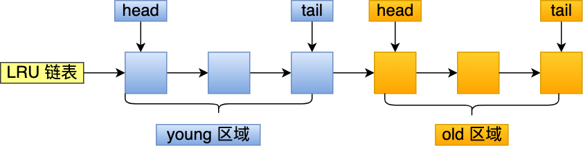

## MySQL

### [MySQL 自增主键一定是连续的吗？](https://mp.weixin.qq.com/s/HvA4zdF4VOYrs2DQ93rfYg)

总结下自增值不连续的四个场景：

- 自增初始值和自增步长设置不为 1
- 唯一键冲突
- 事务回滚
- 批量插入（如 insert...select 语句）

### Mysql主从复制

#### 主从复制搭建步骤

##### ① 配置并重启主服务器

在主服务器的配置文件（my.cnf）中添加以下参数：

> “
>
> [mysqld] server-id = 1 # 设置服务器 ID，每个主服务器和从服务器都必须有唯一的 ID 
>
> log_bin = /var/log/mysql/mysql-bin.log # 开启二进制日志，记录数据修改操作
>
> ”

以上配置完成之后，重启 MySQL 服务器，因为重启了 MySQL 服务才能让配置生效。

##### ② 创建用于主从复制的用户

登录到主服务器上，执行以下命令：

```sql
CREATE USER 'repl'@'%' IDENTIFIED BY 'password';    -- 替换为实际的用户名和密码
GRANT REPLICATION SLAVE ON *.* TO 'repl'@'%';
```

##### ③ 查看主服务器状态

在 MySQL 主服务器中，执行以下命令，记录下 File 和 Position 的值，后续用于配置从服务器：

```sql
SHOW MASTER STATUS;
```

##### ④ 配置并重启从服务器

在从服务器的配置文件（my.cnf）中添加以下参数：

> “
>
> [mysqld] server-id = 2 # 设置服务器 ID，每个主服务器和从服务器都必须有唯一的 ID
>
> ”

重启从服务器，让以上配置生效。

##### ⑤ 在从服务器上设置主服务器信息

登录到从服务器的 MySQL 中，执行以下命令（将 MASTER_HOST、MASTER_USER、MASTER_PASSWORD、MASTER_LOG_FILE 和 MASTER_LOG_POS 替换为对应的值）：

```sql
CHANGE MASTER TO MASTER_HOST='master_ip', MASTER_USER='repl', 
MASTER_PASSWORD='password', MASTER_LOG_FILE='binlog_file', 
MASTER_LOG_POS=log_file_position;
```

##### ⑥ 启动从服务器的复制进程

执行以下命令启动从服务器的复制进程：

```sql
START SLAVE;
```

##### ⑦ 检查从服务器的复制状态

执行以下命令，确保 Slave_IO_Running 和 Slave_SQL_Running 的值都为 "YES"：

```sql
SHOW SLAVE STATUS \G;
```

#### **主从复制原理**

1. 主库的更新SQL(update、insert、delete)被写到binlog
2. 从库发起连接，连接到主库。
3. 此时主库创建一个 `binlog dump thread`，把 `bin log`的内容发送到从库。
4. 从库启动之后，创建一个 `I/O`线程，读取主库传过来的 `bin log`内容并写入到 `relay log`
5. 从库还会创建一个SQL线程，从 `relay log`里面读取内容，再执行一次这些sql语句

#### 如何保证主从一致

1. 当主库和从库数据同步时，突然中断怎么办？因为主库与从库之间维持了一个长链接，主库内部有一个线程，专门服务于从库的这个长链接。
2. 在 binlog = statement 格式时，主库在执行这条 SQL 时，使用的是索引 a，而从库在执行这条 SQL 时，使用了索引 create_time，最后主从数据不一致了。**那么我们该如何解决呢？**可以把 binlog 格式修改为 row。

##### Mysql的binlog有几种录入格式？分别有什么区别？

有三种格式哈，statement，row和mixed。

* statement，每一条会修改数据的sql都会记录在binlog中，即**SQL的原文**。不需要记录每一行的变化，减少了binlog日志量，节约了IO，提高性能。由于sql的执行是有上下文的，因此在保存的时候需要保存相关的信息，同时还有一些使用了函数之类的语句无法被记录复制。

* row，不记录sql语句上下文相关信息，仅保存哪条记录被修改（记录Row event，Table_id，insert记录具体数据，update记录更新前后数据）。记录单元为每一行的改动，基本是可以全部记下来但是由于很多操作，会导致大量行的改动(比如alter table)，因此这种模式的文件保存的信息太多，日志量太大。

  **插入（INSERT）操作** ：
  SQL 语句如下：

  ```sql
  INSERT INTO orders (order_id, customer_name, total_amount) VALUES (1001, 'John Doe', 250.00);
  ```

  Row-based binlog 记录将包含实际插入的数据行的内容，如下所示：

  ```
  # at 12345
  # Table_id: 102
  # Row event: INSERT
  # Flags: STMT_END_F
  # Columns: 3
  #   order_id: 1001
  #   customer_name: 'John Doe'
  #   total_amount: 250.00
  ```

  这个记录表明了一个 INSERT 事件，它插入了一行数据，包括 `order_id`、`customer_name` 和 `total_amount` 列的值。

  **更新（UPDATE）操作** ：
  SQL 语句如下：

  ```sql
  UPDATE orders SET total_amount = 275.00 WHERE order_id = 1001;
  ```

  Row-based binlog 记录将包含实际受影响的数据行的内容，以及更改前后的值，如下所示：

  ```
  # at 12346
  # Table_id: 102
  # Row event: UPDATE
  # Flags: STMT_END_F
  # Columns: 3
  #   order_id: 1001
  #   customer_name: 'John Doe'
  #   total_amount: 275.00
  #   Old columns: 3
  #     order_id: 1001
  #     customer_name: 'John Doe'
  #     total_amount: 250.00
  ```

  这个记录表明了一个 UPDATE 事件，它更新了 `total_amount` 列的值，并包含了更改前后的值。

* mixed，一种折中的方案，普通操作使用statement记录，当无法使用statement的时候使用row。

#### 主从延迟的来源

主库和从库在执行同一个事务的时候出现时间差的问题，主要原因包括但不限于以下几种情况：

* 有些部署条件下， **从库所在机器的性能要比主库性能差** 。
* **从库的压力较大** ，即从库承受了大量的请求。
* **执行大事务** 。因为主库上必须等事务执行完成才会写入 binlog，再传给备库。如果一个主库上语句执行 10 分钟，那么这个事务可能会导致从库延迟 10 分钟。
* **从库的并行复制能力** 。

#### 主从延迟的解决方案[【1】](https://worktile.com/kb/p/26544)

解决主从延迟主要有以下方案：

1. **配合 semi-sync 半同步复制** ；
2. **一主多从** ，分摊从库压力；
3. **强制走主库方案** （强一致性）；
4. sleep 方案：主库更新后，读从库之前先 sleep 一下；
5. 判断主备无延迟方案（例如判断 `seconds_behind_master` 参数是否已经等于 0、对比位点）；
6. **并行复制** — 解决从库复制延迟的问题；

这里主要介绍我在项目中使用的几种方案，分别是 **半同步复制、实时性操作强制走主库、并行复制** 。

##### **semi-sync 半同步复制**

MySQL 有三种同步模式，分别是：

 **「异步复制」** ：MySQL 默认的复制即是异步的，主库在执行完客户端提交的事务后会立即将结果返给客户端，并不关心从库是否已经接收并处理。这样就会有一个问题，一旦主库宕机，此时主库上已经提交的事务可能因为网络原因并没有传到从库上，如果此时执行故障转移，强行将从提升为主，可能导致新主上的数据不完整。

 **「全同步复制」** ：指当主库执行完一个事务，并且所有的从库都执行了该事务，主库才提交事务并返回结果给客户端。因为需要等待所有从库执行完该事务才能返回，所以全同步复制的性能必然会收到严重的影响。

 **「半同步复制」** ：是介于全同步复制与全异步复制之间的一种，主库只需要等待至少一个从库接收到并写到 Relay Log 文件即可，主库不需要等待所有从库给主库返回 ACK。主库收到这个 ACK 以后，才能给客户端返回 “事务完成” 的确认。

 **MySQL 默认的复制是异步的，所以主库和从库的数据会有一定的延迟，更重要的是异步复制可能会引起数据的丢失** 。但是全同步复制又会使得完成一个事务的时间被拉长，带来性能的降低。因此我把目光转向半同步复制。 **从 MySQL 5.5 开始，MySQL 以插件的形式支持 semi-sync 半同步复制** 。

相对于异步复制，半同步复制提高了数据的安全性，减少了主从延迟，当然它也还是有一定程度的延迟，这个延迟最少是一个 TCP/IP 往返的时间。所以， **半同步复制最好在低延时的网络中使用** 。

> 需要注意的是：
>
> * 主库和从库都要启用半同步复制才会进行半同步复制功能，否则主库会还原为默认的异步复制。
> * 如果在等待过程中，等待时间已经超过了配置的超时时间，没有收到任何一个从库的 ACK，那么此时主库会自动转换为异步复制。当至少一个半同步从节点赶上来时，主库便会自动转换为半同步复制。

##### 一主多从

如果从库承担了大量查询请求，那么从库上的查询操作将耗费大量的 CPU 资源，从而影响了同步速度，造成主从延迟。那么我们可以多接几个从库，让这些从库来共同分担读的压力。

简而言之，就是加机器，方法简单粗暴，但也会带来一定成本。

##### **强制走主库方案**

如果某些操作对数据的实时性要求比较苛刻，需要反映实时最新的数据，比如说涉及金钱的金融类系统、在线实时系统、又或者是写入之后马上又读的业务，这时我们就得放弃读写分离，让此类的读请求也走主库，这就不存延迟问题了。

当然这也失去了读写分离带给我们的性能提升，需要适当取舍。

##### **并行复制**

一般 MySQL 主从复制有三个线程参与，都是单线程：Binlog Dump 线程、IO 线程、SQL 线程。复制出现延迟一般出在两个地方：

* SQL 线程忙不过来（主要原因）；
* 网络抖动导致 IO 线程复制延迟（次要原因）。

日志在备库上的执行，就是备库上 SQL 线程执行中继日志（relay log）更新数据的逻辑。

在 MySQL 5.6 版本之前，MySQL 只支持单线程复制，由此在主库并发高、TPS 高时就会出现严重的主备延迟问题。 **从 MySQL 5.6 开始有了多个 SQL 线程的概念，可以并发还原数据，即并行复制技术** 。这可以很好的解决 MySQL 主从延迟问题。

 **coordinator 就是原来的 sql_thread，不过现在它不再直接更新数据了，只负责读取中转日志和分发事务。真正更新日志的，变成了 worker 线程** 。而 worker 线程的个数，就是由参数 `slave_parallel_workers` 决定的。

由于 worker 线程是并发运行的，为了保证事务的隔离性以及不会出现更新覆盖问题，coordinator 在分发的时候，需要满足以下这两个基本要求：

1. **更新同一行的两个事务，必须被分发到同一个 worker 中（避免更新覆盖）** 。
2. **同一个事务不能被拆开，必须放到同一个 worker 中（保证事务隔离性）** 。

###### MySQL 5.7 的并行复制策略

 **MySQL 5.7 引入了基于组提交的并行复制** ，参数 `slave_parallel_workers` 设置并行线程数，由参数 `slave-parallel-type` 来控制并行复制策略：

* 配置为 DATABASE，表示使用 MySQL 5.6 版本的按库并行策略；
* 配置为 LOGICAL_CLOCK，表示使用基于组提交的并行复制策略；

利用 binlog 的组提交 (group commit) 机制，可以得出一个组提交的事务都是可以并行执行的，原因是： **能够在同一组里提交的事务，一定不会修改同一行（由于 MySQL 的锁机制），因为事务已经通过锁冲突的检验了** 。

 **基于组提交的并行复制具体流程如下** ：

1. 在一组里面一起提交的事务，有一个相同的 commit_id，下一组就是 commit_id+1；commit_id 直接写到 binlog 里面；
2. 传到备库应用的时候，相同 commit_id 的事务分发到多个 worker 执行；
3. 这一组全部执行完成后，coordinator 再去取下一批执行。

 **所有处于 prepare 和 commit 状态的事务都是可以在备库上并行执行的** 。

### MySQL数据同步ES

#### 1.同步双写

这是能想到的最直接的方式，在写入MySQL，直接也同步往ES里写一份数据。

对于这种方式：

* 优点：实现简单
* 缺点：
* 业务耦合，商品的管理中耦合大量数据同步代码
* 影响性能，写入两个存储，响应时间变长
* 不便扩展：搜索可能有一些个性化需求，需要对数据进行聚合，这种方式不便实现

#### 2.异步双写

我们也很容易想到异步双写的办法，上架商品的时候，先把商品数据丢进MQ，搜索服务订阅MQ执行同步ES的逻辑。为了解耦合，我们一般会拆分一个搜索服务，由搜索服务去订阅商品变动的消息，来完成同步。

这种方式：

* 优点：
* 解耦合，商品服务无需关注数据同步
* 实时性较好，使用MQ，正常情况下，同步完成在秒级
* 缺点：
* 引入了新的组件和服务，增加了复杂度

#### 3.定时任务

定时任务，最麻烦的一点是频率不好选，频率高的话，会非自然地形成业务的波峰，导致存储的CPU、内存占用波峰式上升，频率低的话实时性比较差，而且也有波峰的情况。

这种方式：

* 优点：实现比较简单
* 缺点：
* 实时性难以保证
* 对存储压力较大

#### 4.数据订阅

MySQL通过binlog订阅实现主从同步，各路数据订阅框架比如canal就依据这个原理，将client组件伪装成从库，来实现数据订阅。

以应用最广泛的canal为例，canal通过 `canal-adapter`，支持多种适配器，其中就有ES适配器，通过一些配置，启动之后，就可以直接把MySQL数据同步到ES。

* 优点：
* 业务入侵较少
* 实时性较好

### 慢SQL优化思路[1](https://mp.weixin.qq.com/s?__biz=Mzg3NzU5NTIwNg==&mid=2247501985&idx=1&sn=6771e8f761b6e45131f77459dbab55e0&chksm=cf221788f8559e9e19fc6b3b0a8ec6e35101523c7e1ee755cca85ec57f74f972050efca5a0e5&token=1627163936&lang=zh_CN&scene=21#wechat_redirect)

1. 慢查询日志记录慢SQL
2. explain分析SQL的执行计划
3. profile 分析执行耗时
4. Optimizer Trace分析详情
5. 确定问题并采用相应的措施

### RC 和 RR 隔离级别下 MVCC 的差异[【1】](https://github.com/Snailclimb/JavaGuide/blob/main/docs/database/mysql/innodb-implementation-of-mvcc.md)

在事务隔离级别 `RC` 和 `RR` （InnoDB 存储引擎的默认事务隔离级别）下，`InnoDB` 存储引擎使用 `MVCC`（非锁定一致性读），但它们生成 `Read View` 的时机却不同

* 在 RC 隔离级别下的 **`每次select`** 查询前都生成一个 `Read View` (m_ids 列表)
* 在 RR 隔离级别下只在事务开始后 **`第一次select`** 数据前生成一个 `Read View`（m_ids 列表）

#### MVCC➕Next-key-Lock 防止幻读

`InnoDB`存储引擎在 RR 级别下通过 `MVCC`和 `Next-key Lock` 来解决幻读问题：

**1、执行普通 `select`，此时会以 `MVCC` 快照读的方式读取数据**

在快照读的情况下，RR 隔离级别只会在事务开启后的第一次查询生成 `Read View` ，并使用至事务提交。所以在生成 `Read View` 之后其它事务所做的更新、插入记录版本对当前事务并不可见，实现了可重复读和防止快照读下的 “幻读”

**2、执行 select...for update/lock in share mode、insert、update、delete 等当前读**

在当前读下，读取的都是最新的数据，如果其它事务有插入新的记录，并且刚好在当前事务查询范围内，就会产生幻读！`InnoDB` 使用 [Next-key Lock](https://dev.mysql.com/doc/refman/5.7/en/innodb-locking.html#innodb-next-key-locks) 来防止这种情况。当执行当前读时，会锁定读取到的记录的同时，锁定它们的间隙，防止其它事务在查询范围内插入数据。只要我不让你插入，就不会发生幻读

### MySQL如何实现无数据插入，有数据更新？

#### **INSERT语句和ON DUPLICATE KEY UPDATE语句实现**

如果指定了ON DUPLICATE KEY UPDATE，并且插入行后会导致在一个UNIQUE索引或PRIMARY KEY中出现重复值，则执行UPDATE。例如，如果列a被定义为UNIQUE，并且包含值1，则以下两个语句具有相同的效果：

```sql
INSERT INTO table (a,b,c) VALUES (1,2,3)  ON DUPLICATE KEY UPDATE c=c+1; 
UPDATE table SET c=c+1 WHERE a=1; 
```

如果行作为新记录被插入，则受影响行的值为1；如果原有的记录被更新，则受影响行的值为2。

#### **REPLACE语句实现**

使用REPLACE的最大好处就是可以将DELETE和INSERT合二为一，形成一个原子操作。这样就可以不必考虑在同时使用DELETE和INSERT时添加事务等复杂操作了。在使用REPLACE时，表中必须有唯一索引，而且这个索引所在的字段不能允许空值，否则REPLACE就和INSERT完全一样的。在执行REPLACE后，系统返回了所影响的行数，如果返回1，说明在表中并没有重复的记录，如果返回2，说明有一条重复记录，系统自动先调用了DELETE删除这条记录，然后再记录用INSERT来插入这条记录。

语法和INSERT非常的相似，如下面的REPLACE语句是插入或更新一条记录。

```sql
REPLACE INTO users (id,name,age) VALUES(1, 'binghe', 18); 
```

### 一条Sql的执行顺序？


### Explain执行计划[[1]](https://mp.weixin.qq.com/s?__biz=MzkyMzU5Mzk1NQ==&mid=2247505905&idx=1&sn=bc59bee5570b8c1da4209e94f1cfd46d&source=41#wechat_redirect)

### [解决深分页问题](https://mp.weixin.qq.com/s?__biz=MzkyMzU5Mzk1NQ==&mid=2247506247&idx=1&sn=70f6d8eff0df9687f8ddc31e69d1d69c&source=41#wechat_redirect)

 **SQL变慢原因有两个** ：

1. limit语句会先扫描offset+n行，然后再丢弃掉前offset行，返回后n行数据。也就是说 `limit 100000,10`，就会扫描100010行，而 `limit 0,10`，只扫描10行。
2. `limit 100000,10` 扫描更多的行数，也意味着**回表**更多的次数。

我们可以通过减少回表次数来优化。一般有 **标签记录法和延迟关联法** 。

**标签记录法**

> 就是标记一下上次查询到哪一条了，下次再来查的时候，从该条开始往下扫描。就好像看书一样，上次看到哪里了，你就折叠一下或者夹个书签，下次来看的时候，直接就翻到啦。

假设上一次记录到 `100000`，则SQL可以修改为：

```sql
select  id,name,balance FROM account where id > 100000 limit 10;
```

这样的话，后面无论翻多少页，性能都会不错的，因为命中了 `id索引`。但是这种方式有局限性：`需要一种类似连续自增的字段`。

**延迟关联法**

延迟关联法，就是把条件转移到 **主键索引树** ，然后减少回表。如下：

```sql
select  acct1.id,acct1.name,acct1.balance FROM account acct1 INNER JOIN (SELECT a.id FROM account a WHERE a.create_time > '2020-09-19' limit 100000, 10) AS acct2 on acct1.id= acct2.id;
```

**优化思路**就是，先通过 `idx_create_time`二级索引树查询到满足条件的 `主键ID`，再与原表通过 `主键ID`内连接，这样后面直接走了主键索引了，同时也减少了回表。

### Buffer Pool[[1]](https://mp.weixin.qq.com/s?__biz=MzUxODAzNDg4NQ==&mid=2247507629&idx=1&sn=ed9bc5efb0faef11c59a74e579129158&chksm=f98d9a07cefa1311a0d7d840e36b3d414295c0c0fcd76997df1aec320d0b04e131d4f85fa3c4&scene=178&cur_album_id=1955634887135199237#rd)

#### 为什么要有 Buffer Pool？

虽然说 MySQL 的数据是存储在磁盘里的，但是也不能每次都从磁盘里面读取数据，这样性能是极差的。所以，当数据从磁盘中取出后，缓存内存中，下次查询同样的数据的时候，直接从内存中读取。为此，Innodb 存储引擎设计了一个 **缓冲池（ *Buffer Pool* ）** ，来提高数据库的读写性能。

有了缓冲池后：

* 当读取数据时，如果数据存在于  Buffer Pool 中，客户端就会直接读取  Buffer Pool 中的数据，否则再去磁盘中读取。
* 当修改数据时，首先是修改  Buffer Pool  中数据所在的页，然后将其页设置为脏页，最后由后台线程将脏页写入到磁盘。

#### Buffer Pool 有多大？

Buffer Pool 是在 MySQL 启动的时候，向操作系统申请的一片连续的内存空间，默认配置下 Buffer Pool 只有 `128MB` 。

可以通过调整 `innodb_buffer_pool_size` 参数来设置 Buffer Pool 的大小，一般建议设置成可用物理内存的 60%~80%。

#### Buffer Pool 缓存什么？

InnoDB 会把存储的数据划分为若干个「页」，以页作为磁盘和内存交互的基本单位，一个页的默认大小为 16KB。因此，Buffer Pool  同样需要按「页」来划分。

在 MySQL 启动的时候， **InnoDB 会为 Buffer Pool 申请一片连续的内存空间，然后按照默认的 `16KB`的大小划分出一个个的页， Buffer Pool 中的页就叫做缓存页** 。此时这些缓存页都是空闲的，之后随着程序的运行，才会有磁盘上的页被缓存到 Buffer Pool 中。

#### 如何管理空闲页？

当启动 Mysql 服务器的时候，需要完成对 Buffer Pool 的初始化过程，即分配 Buffer Pool 的内存空间，把它划分为若干对控制块和缓存页。

但是此时并没有真正的磁盘页被缓存到 Buffer Pool 中，之后随着程序的运行，会不断的有磁盘上的页被缓存到 Buffer Pool 中。

为了标记哪些页是空闲页，就使用了链表结构，将空闲缓存页的「控制块」作为链表的节点，一个一个串起来，这个链表称为  **Free 链表** （空闲链表）。


Free 链表上除了有控制块，还有一个头节点，该头节点包含链表的头节点地址，尾节点地址，以及当前链表中节点的数量等信息。

Free 链表节点是一个一个的控制块，而每个控制块包含着对应缓存页的地址，所以相当于 Free 链表节点都对应一个空闲的缓存页。

有了 Free 链表后，每当需要从磁盘中加载一个页到 Buffer Pool 中时，就从 Free 链表中取一个空闲的缓存页，并且把该缓存页对应的控制块的信息填上，然后把该缓存页对应的控制块从 Free 链表中移除。

#### 如何管理脏页？

设计 Buffer Pool 除了能提高读性能，还能提高写性能，也就是更新数据的时候，不需要每次都要写入磁盘，而是将 Buffer Pool 对应的缓存页标记为 **脏页** ，然后再由后台线程将脏页写入到磁盘。

那为了能快速知道哪些缓存页是脏的，于是就设计出  **Flush 链表** ，它跟 Free 链表类似的，链表的节点也是控制块，区别在于 Flush 链表的元素都是脏页。


有了 Flush 链表后，后台线程就可以遍历 Flush 链表，将脏页写入到磁盘。

到这里我们可以知道，Buffer Pool 里有三种页和链表来管理数据。


图中：

* Free Page（空闲页），表示此页未被使用，位于 Free 链表；
* Clean Page（干净页），表示此页已被使用，但是页面未发生修改，位于LRU 链表。
* Dirty Page（脏页），表示此页「已被使用」且「已经被修改」，其数据和磁盘上的数据已经不一致。当脏页上的数据写入磁盘后，内存数据和磁盘数据一致，那么该页就变成了干净页。脏页同时存在于 LRU 链表和 Flush 链表。

简单的 LRU 算法并没有被  MySQL 使用，因为简单的 LRU 算法无法避免下面这两个问题：

* 预读失效；
* Buffer Pool  污染；

##### **预读失效**

MySQL改进了 LRU 算法，将 LRU 划分了 2 个区域： **old 区域 和 young 区域** 。通过划分 old 区域 和 young 区域避免了预读失效带来的影响。

young 区域在 LRU 链表的前半部分，old 区域则是在后半部分，如下图：



old 区域占整个 LRU 链表长度的比例可以通过 `innodb_old_blocks_pc` 参数来设置，默认是 37，代表整个 LRU 链表中 young 区域与 old 区域比例是 63:37。

**划分这两个区域后，预读的页就只需要加入到 old 区域的头部，当页被真正访问的时候，才将页插入 young 区域的头部** 。如果预读的页一直没有被访问，就会从 old 区域移除，这样就不会影响 young 区域中的热点数据。

##### **Buffer Pool  污染**

全表扫描的查询，很多缓冲页其实只会被访问一次，但是它却只因为被访问了一次而进入到 young 区域，从而导致热点数据被替换了。LRU 链表中 young 区域就是热点数据，只要我们提高进入到 young 区域的门槛，就能有效地保证 young 区域里的热点数据不会被替换掉。

MySQL 是这样做的，进入到 young 区域条件增加了一个 **停留在 old 区域的时间判断** 。

具体是这样做的，在对某个处在 old 区域的缓存页进行第一次访问时，就在它对应的控制块中记录下来这个访问时间：

* 如果后续的访问时间与第一次访问的时间 **在某个时间间隔内** ，那么 **该缓存页就不会被从 old 区域移动到 young 区域的头部** ；
* 如果后续的访问时间与第一次访问的时间 **不在某个时间间隔内** ，那么 **该缓存页移动到 young 区域的头部** ；

这个间隔时间是由 `innodb_old_blocks_time` 控制的，默认是 1000 ms。

也就说， **只有同时满足「被访问」与「在 old 区域停留时间超过 1 秒」两个条件，才会被插入到 young 区域头部** ，这样就解决了 Buffer Pool  污染的问题 。

另外，MySQL 针对 young 区域其实做了一个优化，为了防止 young 区域节点频繁移动到头部。young 区域前面 1/4 被访问不会移动到链表头部，只有后面的 3/4被访问了才会。

#### 脏页什么时候会被刷入磁盘？

引入了 Buffer Pool  后，当修改数据时，首先是修改  Buffer Pool  中数据所在的页，然后将其页设置为脏页，但是磁盘中还是原数据。因此，脏页需要被刷入磁盘，保证缓存和磁盘数据一致，但是若每次修改数据都刷入磁盘，则性能会很差，因此一般都会在一定时机进行批量刷盘。

可能大家担心，如果在脏页还没有来得及刷入到磁盘时，MySQL 宕机了，不就丢失数据了吗？这个不用担心，InnoDB 的更新操作采用的是 Write Ahead Log 策略，即先写日志，再写入磁盘，通过 redo log 日志让 MySQL 拥有了崩溃恢复能力。

下面几种情况会触发脏页的刷新：

* 当 redo log 日志满了的情况下，会主动触发脏页刷新到磁盘；
* Buffer Pool 空间不足时，需要将一部分数据页淘汰掉，如果淘汰的是脏页，需要先将脏页同步到磁盘；
* MySQL 认为空闲时，后台线程回定期将适量的脏页刷入到磁盘；
* MySQL 正常关闭之前，会把所有的脏页刷入到磁盘；

在我们开启了慢 SQL 监控后，如果你发现 **「偶尔」会出现一些用时稍长的 SQL** ，这可能是因为脏页在刷新到磁盘时可能会给数据库带来性能开销，导致数据库操作抖动。

如果间断出现这种现象，就需要调大 Buffer Pool 空间或 redo log 日志的大小。

#### **redo log 什么时候刷盘？**

主要有下面几个时机：

- MySQL 正常关闭时；
- 当 redo log buffer 中记录的写入量大于 redo log buffer 内存空间的一半时，会触发落盘；
- InnoDB 的后台线程每隔 1 秒，将 redo log buffer 持久化到磁盘。
- 每次事务提交时都将缓存在 redo log buffer 里的 redo log 直接持久化到磁盘（这个策略可由 innodb_flush_log_at_trx_commit 参数控制）

> redo log buffer写入到redo log file，是经过OS buffer中转的。可以通过参数`innodb_flush_log_at_trx_commit`进行配置，参数值含义如下：
>
> - 0：称为**延迟写**，事务提交时不会将redo log buffer中日志写入到OS buffer，而是每秒写入OS buffer并调用写入到redo log file中。
> - 1：称为**实时写**，实时刷”，事务每次提交都会将redo log buffer中的日志写入OS buffer并保存到redo log file中。
> - 2：称为**实时写，延迟刷**。每次事务提交写入到OS buffer，然后是每秒将日志写入到redo log file。

### 数据库“抖”了一下

平时的工作中，不知道你有没有遇到过这样的场景，一条SQL语句，正常执行的时候特别快，但是有时也不知道怎么回事，它就会变得特别慢，并且这样的场景很难复现，它不只随机，而且持续时间还很短。

平时执行很快的更新操作，其实就是在写内存和日志，而MySQL偶尔“抖”一下的那个瞬间，可能就是在刷脏页（flush）。

#### 什么情况会引发数据库的flush过程呢？

1. InnoDB的redo log写满了。这时候系统会停止所有更新操作，把checkpoint往前推进，redo log留出空间可以继续写。
   1. 这种情况是InnoDB要尽量避免的。因为出现这种情况的时候，整个系统就不能再接受更新了，所有的更新都必须堵住。如果你从监控上看，这时候更新数会跌为0。
2. 系统内存不足。当需要新的内存页，而内存不够用的时候，就要淘汰一些数据页，空出内存给别的数据页使用。如果淘汰的是“脏页”，就要先将脏页写到磁盘。
3. MySQL认为系统“空闲”的时候。

### binlog

#### 刷盘机制

所有未提交的事务产生的binlog，都会被先记录到binlog的缓存中。等该事务提交时，再将缓存中的数据写入binlog日志文件中。缓存的大小由参数`binlog_chache_size`控制。

binlog什么时候刷新到磁盘呢？由参数`sync_binlog`控制

- 当`sync_binlog`为0时，表示MySQL不控制binlog的刷新，而是由系统自行判断何时写入磁盘。选这种策略，一旦操作系统宕机，缓存中的binlog就会丢失。
- `sync_binlog`为N时，每N个事务，才会将binlog写入磁盘。。
- 当`sync_binlog`为1时，则表示每次commit，都将binlog 写入磁盘。

#### 查看binlog日志恢复数据

```sql
#简单查看
show binlog events in 'master.000001';
#使用mysqlbinlog工具，用start-position参数来指定从8900这个位置的日志开始解析
#-vv参数是为了把内容都解析出来，所以从结果里面可以看到各个字段的值（比如，@1=4、 @2=4这些值）
mysqlbinlog  -vv data/master.000001 --start-position=8900;
```

row格式的日志：


用binlog来恢复数据的标准做法是，用 mysqlbinlog工具解析出来，然后把解析结果整个发给MySQL执行。类似下面的命令：

```sql
mysqlbinlog master.000001  --start-position=2738 --stop-position=2973 | mysql -h127.0.0.1 -P13000 -u$user -p$pwd;
```

这个命令的意思是，将 master.000001 文件里面从第2738字节到第2973字节中间这段内容解析出来，放到MySQL去执行。

### [select...for update加锁的情况](https://mp.weixin.qq.com/s?__biz=MzUxODAzNDg4NQ==&mid=2247497197&idx=1&sn=9f82f73d876636944fb75348ef568c01&chksm=f98db147cefa38511139de2122cb9192c37b9a02891c35ed143d86fcbe6eb621b2323519d285&scene=178&cur_album_id=1955634887135199237#rd)

总结如下规律：

唯一索引等值查询：

- 当查询的记录是存在的，next-key lock 会退化成「记录锁」。
- 当查询的记录是不存在的，next-key lock 会退化成「间隙锁」。

非唯一索引等值查询：

- 当查询的记录存在时，除了会加 next-key lock 外，还额外加间隙锁（`规则是向下遍历到第一个不符合条件的值才能停止`），也就是会加两把锁。
- 当查询的记录不存在时，只会加 next-key lock，然后会退化为间隙锁，也就是只会加一把锁。

非唯一索引和主键索引的范围查询的加锁规则不同之处在于：

- 唯一索引在满足一些条件的时候，next-key lock 退化为间隙锁和记录锁。
- 非唯一索引范围查询，next-key lock 不会退化为间隙锁和记录锁。

#### 加锁规则

普及 3 个概念：

- Record Lock：行锁
- Gap Lock：间隙锁，锁定一个范围，但不包含记录本身
- Next-Key Lock：行锁 + 间隙锁，左开右闭，比如(1,5]

其实 MySQL 大佬林晓斌在极客时间讲过，后来也有很多博主转发过他的加锁规则，我直接把这套规则贴一下，这个规则只限于截止到现在的最新版本，即5.x系列<=5.7.24，8.0系列 <=8.0.13。

**两个“原则”：**

- 原则 1：加锁的基本单位是 next-key lock，其中 next-key lock 是前开后闭区间；
- 原则 2：查找过程中访问到的对象才会加锁。

**两个“优化”：**

- 优化 1：索引上的等值查询，给唯一索引加锁的时候，next-key lock退化为行锁；
- 优化 2：索引上的等值查询，向右遍历时且最后一个值不满足等值条件的时候，next-key lock 退化为间隙锁。

**一个bug:**

- 唯一索引上的范围查询会访问到不满足条件的第一个值为止

### 计算b+树能存多少条数据

**假设B+树的深度为2**

这棵B+树的存储总记录数 = `根节点指针数 * 单个叶子节点记录条数`

**那么指针数如何计算？**

如果一行记录的数据大小为1k，那么单个叶子节点可以存的记录数  =16k/1k =16。

假设主键ID为`bigint`类型，长度为`8字节`，而指针大小在InnoDB源码中设置为`6字节`，这样一共`14字节`。

那么一个页中能存放多少这样的组合，就代表有多少指针，即 `16384 / 14 = 1170`。那么可以算出一棵高度为2 的B+树，能存放 `1170 * 16 = 18720` 条这样的数据记录。

同理：

高度为3的B+树可以存放的行数 =  `1170 * 1170 * 16 = 21902400`

> 千万级的数据存储只需要约3层B+树，查询数据时，每加载一页（page）代表一次IO。所以说，根据主键id索引查询约3次IO便可以找到目标结果。

### 根页面位置万年不动

B+树的形成过程是这样的：

- 每当为某个表创建一个B+树索引（聚簇索引不是人为创建的，默认就有）的时候，都会为这个索引创建一个`根节点`页面。最开始表中没有数据的时候，每个B+树索引对应的`根节点页面`中既没有用户记录，也没有目录项记录。
- 随后向表中插入用户记录时，先把用户记录存储到这个`根节点页面`中。
- 当根节点页面中的可用`空间用完时`继续插入记录，此时会将根节点页面中的所有记录复制到一个新分配的页，比如`页a`中，然后添加插入记录数据时，对这个新页进行`页分裂`的操作，得到另一个新页，比如`页b`。这时新插入的记录根据键值（也就是聚簇索引中的主键值，二级索引中对应的索引列的值）的大小就会被分配到`页a`或者`页b`中，而`根节点页面`便升级为存储目录项记录的页。

### [InnoDB 数据页是如何存储数据的？](https://mp.weixin.qq.com/s?__biz=MzUxODAzNDg4NQ==&mid=2247502059&idx=1&sn=ccbee22bda8c3d6a98237be769a7c89c&scene=21#wechat_redirect)

数据页包括七个部分，结构如下图：


在 File Header 中有两个指针，分别指向上一个数据页和下一个数据页，连接起来的页相当于一个双向的链表（数据页与数据页连接为双向链表）

**数据页中的记录按照「主键」顺序组成单向链表**，单向链表的特点就是插入、删除非常方便，但是检索效率不高，最差的情况下需要遍历链表上的所有节点才能完成检索。

因此，数据页中有一个**页目录**，起到记录的索引作用：


从图可以看到，**页目录就是由多个槽组成的，槽相当于分组记录的索引**。然后，因为记录是按照「主键值」从小到大排序的，所以**我们通过槽查找记录时，可以使用二分法快速定位要查询的记录在哪个槽（哪个记录分组），定位到槽后，再遍历槽内的所有记录，找到对应的记录**，无需从最小记录开始遍历整个页中的记录链表。

### [mysql 表删除一半数据，B+树索引文件会不会变小](https://mp.weixin.qq.com/s?__biz=Mzg2NzYyNjQzNg==&mid=2247485055&idx=1&sn=dc8e60292e9233951b948323147849f7&chksm=ceb9fad4f9ce73c2ebf453622fb02a406e7761d46a1706b5bf9e30e636bac0ba8cc6fa01509f&scene=178&cur_album_id=1911852085562703875#rd)

数据表操作有`新增、删除、修改、查询`，其中`查询`属于读操作，并不会修改文件内容。修改文件内容的是`写操作`，具体分为有`删除、新增、修改`三种类型。

delete命令只是把数据页或记录位置标记为`可复用`，表空间并没有被回收，该现象我们称之为”空洞“，故索引文件大小不会变化。

> 新增数据：如果是插入的数据是随机的非主键有序，可能会造成数据页分裂。相反，如果数据是按照索引递增顺序插入的，那么索引是紧凑的，不会出现数据页分裂。
>
> 修改数据：如果修改的是非索引值，那么并不会影响B+树的结构，**但是，如果修改的内容包含了索引，那么操作步骤是先删除一个旧的值，然后再插入一个新值。可能会造成空洞。**

#### 重建表把表中存在的空洞去掉

**使用alter table A engine=InnoDB命令来重建表**

MySQL 5.5版本之前：

1. MySQL会自动创建一个与表A结构相同的临时表B，然后按照主键ID递增的顺序，把数据一行一行地从表A里读出来再插入到表B中。
2. 由于表B是新建的表，所以表A主键索引上的空洞，在表B中就都不存在了。显然地，表B的主键索引更紧凑，数据页的利用率也更高。数据从表A导入表B的操作完成后，用表B替换A，从效果上看，就起到了收缩表A空间的作用。
3. 临时表B不需要你自己创建，MySQL会自动完成转存数据、交换表名、删除旧表的操作。
4. 在整个DDL过程中，表A中不能有更新。

**MySQL 5.6版本开始引入的Online DDL，对这个操作流程做了优化。**

引入了Online DDL之后，重建表的流程：

1. 建立一个临时文件，扫描表A主键的所有数据页；
2. 用数据页中表A的记录生成B+树，存储到临时文件中；
3. 生成临时文件的过程中，将所有对A的操作记录在一个日志文件（row log）中；
4. 临时文件生成后，将日志文件中的操作应用到临时文件，得到一个逻辑数据上与表A相同的数据文件；
5. 用临时文件替换表A的数据文件。

### 锁

**根据加锁的范围，MySQL里面的锁大致可以分成全局锁、表级锁和行锁三类**。

#### 全局锁

MySQL提供了一个加全局读锁的方法，命令是 Flush tables with read lock (FTWRL)。当你需要让整个库处于只读状态的时候，可以使用这个命令，之后其他线程的以下语句会被阻塞：数据更新语句（数据的增删改）、数据定义语句（包括建表、修改表结构等）和更新类事务的提交语句。

**全局锁的典型使用场景是，做全库逻辑备份。**也就是把整库每个表都select出来存成文本。

两种方法：

1. 通过FTWRL确保不会有其他线程对数据库做更新，然后对整个库做备份。注意，在备份过程中整个库完全处于只读状态。

   但是让整库都只读，听上去就很危险：

   - 如果你在主库上备份，那么在备份期间都不能执行更新，业务基本上就得停摆；
   - 如果你在从库上备份，那么备份期间从库不能执行主库同步过来的binlog，会导致主从延迟。

2. 官方自带的逻辑备份工具是mysqldump。当mysqldump使用参数–single-transaction的时候，导数据之前就会启动一个事务，来确保拿到一致性视图。而由于MVCC的支持，这个过程中数据是可以正常更新的。

> **single-transaction方法只适用于所有的表使用事务引擎的库。**如果有的表使用了不支持事务的引擎，那么备份就只能通过FTWRL方法。这往往是DBA要求业务开发人员使用InnoDB替代MyISAM的原因之一。

#### 表级锁

##### 表锁

**表锁的语法是 lock tables … read/write。**

需要注意的是，表锁除了会限制别的线程的读写外，也会限制本线程接下来的读写操作。

也就是说如果本线程对表加了「共享表锁」，那么本线程接下来如果要对表执行写操作的语句，是会被阻塞的，当然其他线程对表进行写操作时也会被阻塞，直到锁被释放。

要释放表锁，可以使用下面这条命令，会释放当前会话的所有表锁：

```sql
unlock tables
```

##### **MDL（metadata lock)**

当对一个表做增删改查操作的时候，加MDL读锁；当要对表做结构变更操作的时候，加MDL写锁。

- 读锁之间不互斥，因此你可以有多个线程同时对一张表增删改查。
- 读写锁之间、写锁之间是互斥的，用来保证变更表结构操作的安全性。因此，如果有两个线程要同时给一个表加字段，其中一个要等另一个执行完才能开始执行。
- MDL 是在事务提交后才会释放，这意味着**事务执行期间，MDL 是一直持有的**。

##### 意向锁

- 在使用 InnoDB 引擎的表里对某些记录加上「共享锁」之前，需要先在表级别加上一个「意向共享锁」；
- 在使用 InnoDB 引擎的表里对某些纪录加上「独占锁」之前，需要先在表级别加上一个「意向独占锁」；

**意向共享锁和意向独占锁是表级锁，不会和行级的共享锁和独占锁发生冲突，而且意向锁之间也不会发生冲突，只会和共享表锁（lock tables … read）和独占表锁（lock tables … write）发生冲突。**

如果没有「意向锁」，那么加「独占表锁」时，就需要遍历表里所有记录，查看是否有记录存在独占锁，这样效率会很慢。

那么有了「意向锁」，由于在对记录加独占锁前，先会加上表级别的意向独占锁，那么在加「独占表锁」时，直接查该表是否有意向独占锁，如果有就意味着表里已经有记录被加了独占锁，这样就不用去遍历表里的记录。

所以，**意向锁的目的是为了快速判断表里是否有记录被加锁**。

##### AUTO-INC 锁

AUTO-INC 锁是特殊的表锁机制，锁**不是再一个事务提交后才释放，而是再执行完插入语句后就会立即释放**。

**在插入数据时，会加一个表级别的 AUTO-INC 锁**，然后为被 `AUTO_INCREMENT` 修饰的字段赋值递增的值，等插入语句执行完成后，才会把 AUTO-INC 锁释放掉。

那么，一个事务在持有 AUTO-INC 锁的过程中，其他事务的如果要向该表插入语句都会被阻塞，从而保证插入数据时，被 `AUTO_INCREMENT` 修饰的字段的值是连续递增的。

但是， AUTO-INC 锁再对大量数据进行插入的时候，会影响插入性能，因为另一个事务中的插入会被阻塞。

#### **行锁**

行级锁的类型主要有三类：

- Record Lock，记录锁，也就是仅仅把一条记录锁上；
- Gap Lock，间隙锁，锁定一个范围，但是不包含记录本身；
- Next-Key Lock：Record Lock + Gap Lock 的组合，锁定一个范围，并且锁定记录本身。

#### 死锁

死锁以后，有两种策略：

- 一种策略是，直接进入等待，直到超时。这个超时时间可以通过参数innodb_lock_wait_timeout来设置，默认值是50s。
- 另一种策略是，发起死锁检测，发现死锁后，主动回滚死锁链条中的某一个事务，让其他事务得以继续执行。将参数innodb_deadlock_detect设置为on，表示开启这个逻辑，默认值本身就是on。

### 普通索引和唯一索引，应该怎么选择（change buffer）

两种索引对查询语句和更新语句的性能影响来进行分析

#### 查询过程

- 对于普通索引来说，查找到满足条件的第一个记录后，需要查找下一个记录，直到碰到第一个不满足条件的记录。
- 对于唯一索引来说，由于索引定义了唯一性，查找到第一个满足条件的记录后，就会停止继续检索。

那么，这个不同带来的性能差距会有多少呢？答案是，微乎其微。因为引擎是按页读写的，所以说，当找到满足条件的记录的时候，它所在的数据页就都在内存里了。那么，对于普通索引来说，要多做的那一次“查找和判断下一条记录”的操作，就只需要一次指针寻找和一次计算。

#### 更新过程

##### [change buffer参考mysql45讲](https://funnylog.gitee.io/mysql45/09%E8%AE%B2%E6%99%AE%E9%80%9A%E7%B4%A2%E5%BC%95%E5%92%8C%E5%94%AF%E4%B8%80%E7%B4%A2%E5%BC%95%EF%BC%8C%E5%BA%94%E8%AF%A5%E6%80%8E%E4%B9%88%E9%80%89%E6%8B%A9.html)

当需要更新一个数据页时，如果数据页在内存中就直接更新，而如果这个数据页还没有在内存中的话，在不影响数据一致性的前提下，InooDB会将这些更新操作缓存在change buffer中，这样就不需要从磁盘中读入这个数据页了。在下次查询需要访问这个数据页的时候，将数据页读入内存，然后执行change buffer中与这个页有关的操作。通过这种方式就能保证这个数据逻辑的正确性。

将change buffer中的操作应用到原数据页，得到最新结果的过程称为merge。除了访问这个数据页会触发merge外，系统有后台线程会定期merge。在数据库正常关闭（shutdown）的过程中，也会执行merge操作。

##### **什么条件下可以使用change buffer呢？**

1. 唯一索引的更新操作都要先判断这个操作是否违反唯一性约束，必须要将数据页读入内存才能判断，没必要使用change buffer，实际上也只有普通索引可以使用change buffer。
2. change buffer用的是buffer pool里的内存，因此不能无限增大。

**如果要在这张表中插入一个新记录(4,400)的话，InnoDB的处理流程是怎样的：**

- **这个记录要更新的目标页在内存中**。这时，InnoDB的处理流程如下：

  - 对于唯一索引来说，找到3和5之间的位置，判断到没有冲突，插入这个值，语句执行结束；

  - 对于普通索引来说，找到3和5之间的位置，插入这个值，语句执行结束。

这样看来，普通索引和唯一索引对更新语句性能影响的差别，只是一个判断，只会耗费微小的CPU时间。

- **这个记录要更新的目标页不在内存中**。这时，InnoDB的处理流程如下：
- 对于唯一索引来说，需要将数据页读入内存，判断到没有冲突，插入这个值，语句执行结束；
  
- 对于普通索引来说，则是将更新记录在change buffer，语句执行就结束了。

将数据从磁盘读入内存涉及随机IO的访问，是数据库里面成本最高的操作之一。change buffer因为减少了随机磁盘访问，所以对更新性能的提升是会很明显的。

##### change buffer的使用场景

1. 对于写多读少的业务来说，页面在写完以后马上被访问到的概率比较小，此时change buffer的使用效果最好。
2. 假设一个业务的更新模式是写入之后马上会做查询，那么即使满足了条件，将更新先记录在change buffer，但之后由于马上要访问这个数据页，会立即触发merge过程。这样随机访问IO的次数不会减少，反而增加了change buffer的维护代价。所以，对于这种业务模式来说，change buffer反而起到了副作用。
3. 如果所有的更新后面，都马上伴随着对这个记录的查询，那么你应该关闭change buffer。而在其他情况下，change buffer都能提升更新性能。

由于唯一索引用不上change buffer的优化机制，因此如果业务可以接受，从性能角度出发建议优先考虑非唯一索引。

> change buffer也会同普通buffer pool更新操作一样持久化到redo log中，保证cash safe的能力。

### 语句原理

#### count(*)的实现方式

count()的语义：count()是一个聚合函数，对于返回的结果集，一行行地判断，如果count函数的参数不是NULL，累计值就加1，否则不加。最后返回累计值。

count(*)、count(主键id)和count(1) 都表示返回满足条件的结果集的总行数；而count(字段），则表示返回满足条件的数据行里面，参数“字段”不为NULL的总个数。

结论是：按照效率排序的话，`count(字段)<count(主键id)<count(1)≈count(*)`，所以我建议你，尽量使用count(*)。

在不同的MySQL引擎中，count(*)有不同的实现方式。

- MyISAM引擎把一个表的总行数存在了磁盘上，因此执行count(*)的时候会直接返回这个数，效率很高；
- 而InnoDB引擎就麻烦了，它执行count(*)的时候，需要把数据一行一行地从引擎里面读出来，然后累积计数。

如果加了where 条件的话，MyISAM表也是不能返回得这么快的。

##### **为什么InnoDB不跟MyISAM一样，也把数字存起来呢？**

这是因为即使是在同一个时刻的多个查询，由于多版本并发控制（MVCC）的原因，InnoDB表“应该返回多少行”也是不确定的。这里，我用一个算count(*)的例子来为你解释一下。

假设表t中现在有10000条记录，我们设计了三个用户并行的会话。


这和InnoDB的事务设计有关系，可重复读是它默认的隔离级别，在代码上就是通过多版本并发控制，也就是MVCC来实现的。每一行记录都要判断自己是否对这个会话可见，因此对于count(*)请求来说，InnoDB只好把数据一行一行地读出依次判断，可见的行才能够用于计算“基于这个查询”的表的总行数。

InnoDB是索引组织表，主键索引树的叶子节点是数据，而普通索引树的叶子节点是主键值。所以，普通索引树比主键索引树小很多。对于count(*)这样的操作，遍历哪个索引树得到的结果逻辑上都是一样的。因此，`MySQL优化器会找到最小的那棵树来遍历`。

#### “orderby”是怎么工作的

```sql
CREATE TABLE `t` (
  `id` int(11) NOT NULL,
  `city` varchar(16) NOT NULL,
  `name` varchar(16) NOT NULL,
  `age` int(11) NOT NULL,
  `addr` varchar(128) DEFAULT NULL,
  PRIMARY KEY (`id`),
  KEY `city` (`city`)
) ENGINE=InnoDB;

select city,name,age from t where city='杭州' order by name limit 1000  ;
```

用explain命令来看看语句的执行情况时，Extra这个字段中的“Using filesort”表示的就是需要排序，MySQL会给每个线程分配一块内存用于排序，称为sort_buffer。

“按name排序”这个动作，可能在内存中完成，也可能需要使用外部排序，这取决于排序所需的内存和参数sort_buffer_size。

sort_buffer_size，就是MySQL为排序开辟的内存（sort_buffer）的大小。如果要排序的数据量小于sort_buffer_size，排序就在内存中完成。但如果排序数据量太大，内存放不下，则不得不利用磁盘临时文件辅助排序。

**全字段排序**

这个语句执行流程如下所示 ：

1. 初始化sort_buffer，确定放入name、city、age这三个字段；
2. 从索引city找到第一个满足city='杭州’条件的主键id；
3. 到主键id索引取出整行，取name、city、age三个字段的值，存入sort_buffer中；
4. 从索引city取下一个记录的主键id；
5. 重复步骤3、4直到city的值不满足查询条件为止，对应的主键id也就是图中的ID_Y；
6. 对sort_buffer中的数据按照字段name做快速排序；
7. 按照排序结果取前1000行返回给客户端。

**rowid排序**

如果查询要返回的字段很多的话，那么sort_buffer里面要放的字段数太多，这样内存里能够同时放下的行数很少，要分成很多个临时文件，排序的性能会很差。

修改一个参数，让MySQL采用另外一种算法。

```sql
SET max_length_for_sort_data = 16;
```

max_length_for_sort_data，它的意思是，如果单行的长度超过这个值，MySQL就认为单行太大，要换一个算法。

新的算法放入sort_buffer的字段，只有要排序的列（即name字段）和主键id。

但这时，排序的结果就因为少了city和age字段的值，不能直接返回了，整个执行流程就变成如下所示的样子：

1. 初始化sort_buffer，确定放入两个字段，即name和id；
2. 从索引city找到第一个满足city='杭州’条件的主键id；
3. 到主键id索引取出整行，取name、id这两个字段，存入sort_buffer中；
4. 从索引city取下一个记录的主键id；
5. 重复步骤3、4直到不满足city='杭州’条件为止，也就是图中的ID_Y；
6. 对sort_buffer中的数据按照字段name进行排序；
7. 遍历排序结果，取前1000行，并按照id的值回到原表中取出city、name和age三个字段返回给客户端。

**全字段排序 VS rowid排序**

1. 简单的说，全字段排序将查询的所有列放入sort_buffer，不需要回表，但是占用内存，且内存不够了会使用临时文件归并排序算法；而rowid排序算法仅将排序字段和主键放入sort_buffer中，排序完后需要回表。
2. 如果MySQL实在是担心排序内存太小，会影响排序效率，才会采用rowid排序算法，这样排序过程中一次可以排序更多行，但是需要再回到原表去取数据。
3. 如果MySQL认为内存足够大，会优先选择全字段排序，把需要的字段都放到sort_buffer中，这样排序后就会直接从内存里面返回查询结果了，不用再回到原表去取数据。

> 如果需要可以建立city和name的联合索引，这样city和name本就是排好序了，不需要使用sort_buffer；还可进一步优化创建一个city、name和age的联合索引，使用覆盖索引。

#### Join

##### Index Nested-Loop Join

我们来看一下这个语句：

***前提：t1 100条数据，t2 1000条数据，都在a上添加普通索引。***

```sql
select * from t1 straight_join t2 on (t1.a=t2.a);
```

如果直接使用join语句，MySQL优化器可能会选择表t1或t2作为驱动表，这样会影响我们分析SQL语句的执行过程。所以，为了便于分析执行过程中的性能问题，我改用straight_join让MySQL使用固定的连接方式执行查询，这样优化器只会按照我们指定的方式去join。在这个语句里，t1 是驱动表，t2是被驱动表。

现在，我们来看一下这条语句的explain结果。


可以看到，在这条语句里，被驱动表t2的字段a上有索引，join过程用上了这个索引，因此这个语句的执行流程是这样的：

1. 从表t1中读入一行数据 R；
2. 从数据行R中，取出a字段到表t2里去查找；
3. 取出表t2中满足条件的行，跟R组成一行，作为结果集的一部分；
4. 重复执行步骤1到3，直到表t1的末尾循环结束。

这个过程是先遍历表t1，然后根据从表t1中取出的每行数据中的a值，去表t2中查找满足条件的记录。在形式上，这个过程就跟我们写程序时的嵌套查询类似，并且可以用上被驱动表的索引，所以我们称之为“Index Nested-Loop Join”，简称NLJ。

两个结论：

1. 使用join语句，性能比强行拆成多个单表执行SQL语句的性能要好；
2. 如果使用join语句的话，需要让小表做驱动表。

这个结论的前提是“可以使用被驱动表的索引”。

##### Simple Nested-Loop Join

现在，我们把SQL语句改成这样：

```sql
select * from t1 straight_join t2 on (t1.a=t2.b);
```

由于表t2的字段b上没有索引，因此再用图2的执行流程时，每次到t2去匹配的时候，就要做一次全表扫描。如果t1和t2都是10万行的表（当然了，这也还是属于小表的范围），就要扫描100亿行，这个算法看上去太“笨重”了。

MySQL也没有使用这个Simple Nested-Loop Join算法，，而是使用了另一个叫作“Block Nested-Loop Join”的算法，简称BNL。

##### Block Nested-Loop Join

被驱动表上没有可用的索引，算法的流程是这样的：

1. 把表t1的数据读入线程内存join_buffer中，由于我们这个语句中写的是select *，因此是把整个表t1放入了内存；
2. 扫描表t2，把表t2中的每一行取出来，跟join_buffer中的数据做对比，满足join条件的，作为结果集的一部分返回。

对应地，这条SQL语句的explain结果如下所示：


可以看到，在这个过程中，对表t1和t2都做了一次全表扫描，因此总的扫描行数是1100。由于join_buffer是以无序数组的方式组织的，因此对表t2中的每一行，都要做100次判断，总共需要在内存中做的判断次数是：100*1000=10万次。

前面我们说过，如果使用Simple Nested-Loop Join算法进行查询，扫描行数也是10万行。因此，从时间复杂度上来说，这两个算法是一样的。但是，Block Nested-Loop Join算法的这10万次判断是内存操作，速度上会快很多，性能也更好。

**这个例子里表t1才100行，要是表t1是一个大表，join_buffer放不下怎么办呢？**

join_buffer的大小是由参数join_buffer_size设定的，默认值是256k。**如果放不下表t1的所有数据话，策略很简单，就是分段放。**我把join_buffer_size改成1200，再执行：

```sql
select * from t1 straight_join t2 on (t1.a=t2.b);
```

执行过程就变成了：

1. 扫描表t1，顺序读取数据行放入join_buffer中，放完第88行join_buffer满了，继续第2步；
2. 扫描表t2，把t2中的每一行取出来，跟join_buffer中的数据做对比，满足join条件的，作为结果集的一部分返回；
3. 清空join_buffer；
4. 继续扫描表t1，顺序读取最后的12行数据放入join_buffer中，继续执行第2步。

这个流程才体现出了这个算法名字中“Block”的由来，表示“分块去join”。

**什么情况下使用join语句？**

1. 如果可以使用Index Nested-Loop Join算法，也就是说可以用上被驱动表上的索引，其实是没问题的；
2. 如果使用Block Nested-Loop Join算法，扫描行数就会过多。尤其是在大表上的join操作，这样可能要扫描被驱动表很多次，会占用大量的系统资源。所以这种join尽量不要用。

所以你在判断要不要使用join语句时，就是看explain结果里面，Extra字段里面有没有出现“Block Nested Loop”字样。

> **在决定哪个表做驱动表的时候，应该是两个表按照各自的条件过滤，过滤完成之后，计算参与join的各个字段的总数据量，数据量小的那个表，就是“小表”，应该作为驱动表。**

### [Adaptive Hash Index自适应哈希索引](https://mp.weixin.qq.com/s/ra4v1XR5pzSWc-qtGO-dBg)

Adaptive Hash Index的概念上：在MySQL运行的过程中，如果InnoDB发现：

- 有很多寻路很长（比如B+树层数太多、回表次数多等情况）的SQL；
- 有很多SQL会命中相同的页面（Page）。

**InnoDB会在自己的内存缓冲区（Buffer Pool）里，开辟一块区域，建立自适应哈希索引（Adaptive Hash Index，AHI），以加速查询**。

- **Hash数据结构都是包含键（Key）、值（Value）的，**在Adaptive Hash Index，Key就是经常访问到的索引键值，Value就是该索引键值匹配的完整记录所在页面（Page）的位置。
- **因为是MySQL InnoDB自己维护创建的，所以称之为“自适应”哈希索引，但系统也有误判的时候，也不能起到加速查询的效果。**
- **Adaptive Hash Index是内存结构，非持久化；**
- **Adaptive Hash Index只能用于等值比较，例如=、<=>、IN、AND等，无法用于排序；**
- **Adaptive Hash Index是MySQL InnoDB自己维护创建的，人为无法干预。初始化为innodb_buffer_pool_size的1/64，会随着InnoDB Buffer Pool动态调整。**

### 分库分表

https://mp.weixin.qq.com/s/W5vbjWMG86zEca3CPvAadg

1. **分表其实主要解决的是数据量大的问题。**
2. **分库主要解决的是并发量大的问题**

常用的分片算法：

- **哈希分片**：根据分片键的哈希值来决定数据应该落到哪个节点上。例如，根据用户 ID 进行哈希分片，将属于同一个用户的数据分配到同一个节点上，便于后续的查询操作。
- **范围分片**：分片键值按区间范围分配到不同的节点上。例如，根据订单创建时间或者地理位置来进行分片。
  - 由于连续分片可能存在`数据热点`，导致数据倾斜，数据库压力分摊不均匀。

- **取模分片**：将分片键值对分片数取模，将结果作为数据应该分配到的节点编号。例如， order_no % 2 将订单数据分到两个节点之一。
  - 取模算法对集群的伸缩支持不太友好

5种分片策略：

- 标准分片策略

  对应StandardShardingStrategy。提供对SQL语句中的=, >, <, >=, <=, IN和BETWEEN AND的分片操作支持。StandardShardingStrategy只支持单分片键，提供PreciseShardingAlgorithm和RangeShardingAlgorithm两个分片算法。PreciseShardingAlgorithm是必选的，用于处理=和IN的分片。RangeShardingAlgorithm是可选的，用于处理BETWEEN AND, >, <, >=, <=分片，如果不配置RangeShardingAlgorithm，SQL中的BETWEEN AND将按照全库路由处理。

- 复合分片策略

  对应ComplexShardingStrategy。复合分片策略。提供对SQL语句中的=, >, <, >=, <=, IN和BETWEEN AND的分片操作支持。ComplexShardingStrategy支持多分片键，由于多分片键之间的关系复杂，因此并未进行过多的封装，而是直接将分片键值组合以及分片操作符透传至分片算法，完全由应用开发者实现，提供最大的灵活度。

- 行表达式分片策略

  对应InlineShardingStrategy。使用Groovy的表达式，提供对SQL语句中的=和IN的分片操作支持，只支持单分片键。对于简单的分片算法，可以通过简单的配置使用，从而避免繁琐的Java代码开发，如: `t_user_$->{u_id % 8}` 表示t_user表根据u_id模8，而分成8张表，表名称为`t_user_0`到`t_user_7`。

- Hint分片策略

  对应HintShardingStrategy。通过Hint指定分片值而非从SQL中提取分片值的方式进行分片的策略。

- 不分片策略

  对应NoneShardingStrategy。不分片的策略。

#### [分库分表会带来哪些问题](https://juejin.cn/post/7168356696975212574)

1. 分布式事务
2. 跨节点关联表
   1. 冗余字段。如果a表只需要关联出b表的一个或者几个字段，可以考虑在a表中冗余这几个字段，这样就不需要关联b表了。
   2. 基础广播表。有的基础数据例如国家、货币等，不同的数据库都要关联它，则在每个数据库中冗余存储这些基础数据。
   3. 冗余业务表。还是”A库的a表需要与B库的b表关联查询“场景，可以在A库中冗余存储B库的b表，通过数据同步机制保持与B库的b表数据一致，这样A库就可以直接关联冗余表了。
   4. 绑定表。需要关联的数据放在一个节点上。
3. 全局主键不唯一，分布式id
4. 数据库扩容、数据迁移问题

## Redis


### [Redis 是单线程吗？](https://mp.weixin.qq.com/s/YoEfaVo8TlKi4vANiTlNZg)

**Redis 单线程指的是「接收客户端请求->解析请求 ->进行数据读写等操作->发送数据给客户端」这个过程是由一个线程（主线程）来完成的**，这也是我们常说 Redis 是单线程的原因。

但是，**Redis 程序并不是单线程的**，Redis 在启动的时候，是会**启动后台线程**（BIO）的。

「关闭文件、AOF 刷盘、释放内存」这些任务创建单独的线程来处理，是因为这些任务的操作都是很耗时的，如果把这些任务都放在主线程来处理，那么 Redis 主线程就很容易发生阻塞，这样就无法处理后续的请求了。

后台线程相当于一个消费者，生产者把耗时任务丢到任务队列中，消费者（BIO）不停轮询这个队列，拿出任务就去执行对应的方法即可。

### Redis 采用单线程为什么还这么快？

- Redis 的大部分操作**都在内存中完成**，并且采用了高效的数据结构，因此 Redis 瓶颈可能是机器的内存或者网络带宽，而并非 CPU，既然 CPU 不是瓶颈，那么自然就采用单线程的解决方案了；
- Redis 采用单线程模型可以**避免了多线程之间的竞争**，省去了多线程切换带来的时间和性能上的开销，而且也不会导致死锁问题。
- Redis 采用了 **I/O 多路复用机制**处理大量的客户端 Socket 请求，IO 多路复用机制是指一个线程处理多个 IO 流，就是我们经常听到的 select/epoll 机制。简单来说，在 Redis 只运行单线程的情况下，该机制允许内核中，同时存在多个监听 Socket 和已连接 Socket。内核会一直监听这些 Socket 上的连接请求或数据请求。一旦有请求到达，就会交给 Redis 线程处理，这就实现了一个 Redis 线程处理多个 IO 流的效果。

#### [什么是IO多路复用？](https://juejin.cn/post/6882984260672847879#heading-0)

- IO 多路复用是一种同步IO模型，实现一个线程可以监视多个文件句柄；
- 一旦某个文件句柄就绪，就能够通知应用程序进行相应的读写操作；
- 没有文件句柄就绪就会阻塞应用程序，交出CPU。

##### select

它仅仅知道了，有I/O事件发生了，却并不知道是哪那几个流（可能有一个，多个，甚至全部），我们只能无差别轮询所有流，找出能读出数据，或者写入数据的流，对他们进行操作。所以**select具有O(n)的无差别轮询复杂度**，同时处理的流越多，无差别轮询时间就越长。

select本质上是通过设置或者检查存放fd标志位的数据结构来进行下一步处理。这样所带来的缺点是：

- 单个进程所打开的FD是有限制的，通过 `FD_SETSIZE` 设置，默认1024 ;
- 每次调用 select，都需要把 fd 集合从用户态拷贝到内核态，这个开销在 fd 很多时会很大；

> 需要维护一个用来存放大量fd的数据结构，这样会使得用户空间和内核空间在传递该结构时复制开销大

- 对 socket 扫描时是线性扫描，采用轮询的方法，效率较低（高并发）

> 当套接字比较多的时候，每次select()都要通过遍历FD_SETSIZE个Socket来完成调度,不管哪个Socket是活跃的,都遍历一遍。这会浪费很多CPU时间。如果能给套接字注册某个回调函数，当他们活跃时，自动完成相关操作，那就避免了轮询，这正是epoll与kqueue做的。

##### poll

poll本质上和select没有区别，它将用户传入的数组拷贝到内核空间，然后查询每个fd对应的设备状态， **但是它没有最大连接数的限制**，原因是它是基于链表来存储的.

**它没有最大连接数的限制**，原因是它是基于链表来存储的，但是同样有缺点：

- 每次调用 poll ，都需要把 fd 集合从用户态拷贝到内核态，这个开销在 fd 很多时会很大；
- 对 socket 扫描是线性扫描，采用轮询的方法，效率较低（高并发时）

##### epoll

**epoll可以理解为event poll**，不同于忙轮询和无差别轮询，epoll会把哪个流发生了怎样的I/O事件通知我们。所以我们说epoll实际上是**事件驱动（每个事件关联上fd）**的，此时我们对这些流的操作都是有意义的。（复杂度降低到了O(1)）。

**epoll的优点**

- 没有最大并发连接的限制，能打开的FD的上限远大于1024（1G的内存上能监听约10万个端口）；
- 效率提升，不是轮询的方式，不会随着FD数目的增加效率下降。只有活跃可用的FD才会调用callback函数；即Epoll最大的优点就在于它只管你“活跃”的连接，而跟连接总数无关，因此在实际的网络环境中，Epoll的效率就会远远高于select和poll；
- 内存拷贝，利用mmap()文件映射内存加速与内核空间的消息传递；即epoll使用mmap减少复制开销。

**epoll缺点**

- epoll只能工作在 linux 下

#### Redis 6.0 之前为什么使用单线程？

**CPU 并不是制约 Redis 性能表现的瓶颈所在**，更多情况下是受到内存大小和网络I/O的限制

#### Redis 6.0 之后为什么引入了多线程？

虽然 Redis 的主要工作（网络 I/O 和执行命令）一直是单线程模型，但是**在 Redis 6.0 版本之后，也采用了多个 I/O 线程来处理网络请求**，**这是因为随着网络硬件的性能提升，Redis 的性能瓶颈有时会出现在网络 I/O 的处理上**。

所以为了提高网络 I/O 的并行度，Redis 6.0 对于网络 I/O 采用多线程来处理。**但是对于命令的执行，Redis 仍然使用单线程来处理，**所以大家**不要误解** Redis 有多线程同时执行命令。

### Redis 持久化

#### AOF

##### AOF 日志是如何实现的？

Redis 在执行完一条写操作命令后，就会把该命令以追加的方式写入到一个文件里，然后 Redis 重启时，会读取该文件记录的命令，然后逐一执行命令的方式来进行数据恢复。


Reids 是`先执行写操作命令后，才将该命令记录到 AOF 日志里`的，这么做其实有两个好处。

- **避免额外的检查开销**：因为如果先将写操作命令记录到 AOF 日志里，再执行该命令的话，如果当前的命令语法有问题，那么如果不进行命令语法检查，该错误的命令记录到 AOF 日志里后，Redis 在使用日志恢复数据时，就可能会出错。
- **不会阻塞当前写操作命令的执行**：因为当写操作命令执行成功后，才会将命令记录到 AOF 日志。

##### AOF 日志过大，会触发什么机制？

提供了 **AOF 重写机制**，当 AOF 文件的大小超过所设定的阈值后，Redis 就会启用 AOF 重写机制，来压缩 AOF 文件。AOF 重写机制是在重写时，读取当前数据库中的所有键值对，然后将每一个键值对用一条命令记录到「新的 AOF 文件」，等到全部记录完后，就将新的 AOF 文件替换掉现有的 AOF 文件。

举个例子，在没有使用重写机制前，假设前后执行了「_set name xiaolin_」和「_set name xiaolincoding_」这两个命令的话，就会将这两个命令记录到 AOF 文件。

但是**在使用重写机制后，就会读取 name 最新的 value（键值对） ，然后用一条 「set name xiaolincoding」命令记录到新的 AOF 文件**，之前的第一个命令就没有必要记录了，因为它属于「历史」命令，没有作用了。这样一来，一个键值对在重写日志中只用一条命令就行了。

重写工作完成后，就会将新的 AOF 文件覆盖现有的 AOF 文件，这就相当于压缩了 AOF 文件，使得 AOF 文件体积变小了。

#### RDB

##### RDB 做快照时会阻塞线程吗？

Redis 提供了两个命令来生成 RDB 文件，分别是 save 和 bgsave，他们的区别就在于是否在「主线程」里执行：

- 执行了 save 命令，就会在主线程生成 RDB 文件，由于和执行操作命令在同一个线程，所以如果写入 RDB 文件的时间太长，**会阻塞主线程**；
- 执行了 bgsave 命令，会创建一个子进程来生成 RDB 文件，这样可以**避免主线程的阻塞**；

Redis 还可以通过配置文件的选项来实现每隔一段时间自动执行一次 bgsave 命令，默认会提供以下配置：

```
save 900 1
save 300 10
save 60 10000
```

别看选项名叫 save，实际上执行的是 bgsave 命令，也就是会创建子进程来生成 RDB 快照文件。 只要满足上面条件的任意一个，就会执行 bgsave，它们的意思分别是：

- 900 秒之内，对数据库进行了至少 1 次修改；
- 300 秒之内，对数据库进行了至少 10 次修改；
- 60 秒之内，对数据库进行了至少 10000 次修改。

这里提一点，Redis 的快照是**全量快照**，也就是说每次执行快照，都是把内存中的「所有数据」都记录到磁盘中。所以执行快照是一个比较重的操作，如果频率太频繁，可能会对 Redis 性能产生影响。如果频率太低，服务器故障时，丢失的数据会更多。

##### RDB 在执行快照的时候，数据能修改吗？

可以的，执行 bgsave 过程中，Redis 依然**可以继续处理操作命令**的，也就是数据是能被修改的，关键的技术就在于**写时复制技术（Copy-On-Write, COW）。**

执行 bgsave 命令的时候，会通过 fork() 创建子进程，此时子进程和父进程是共享同一片内存数据的，因为创建子进程的时候，会复制父进程的页表，但是页表指向的物理内存还是一个，此时如果主线程执行读操作，则主线程和 bgsave 子进程互相不影响。

#### 混合持久化

Redis 4.0 提出了**混合使用 AOF 日志和内存快照**，也叫混合持久化，既保证了 Redis 重启速度，又降低数据丢失风险。

混合持久化工作在 **AOF 日志重写过程**，当开启了混合持久化时，在 AOF 重写日志时，fork 出来的重写子进程会先将与主线程共享的内存数据以 RDB 方式写入到 AOF 文件，然后主线程处理的操作命令会被记录在重写缓冲区里，重写缓冲区里的增量命令会以 AOF 方式写入到 AOF 文件，写入完成后通知主进程将新的含有 RDB 格式和 AOF 格式的 AOF 文件替换旧的的 AOF 文件。

也就是说，使用了混合持久化，AOF 文件的**前半部分是 RDB 格式的全量数据，后半部分是 AOF 格式的增量数据**。这样的好处在于，重启 Redis 加载数据的时候，由于前半部分是 RDB 内容，这样**加载的时候速度会很快**。

加载完 RDB 的内容后，才会加载后半部分的 AOF 内容，这里的内容是 Redis 后台子进程重写 AOF 期间，主线程处理的操作命令，可以使得**数据更少的丢失**。

### [Redis 16 个常见使用场景](https://mp.weixin.qq.com/s/Z6M2uE0mAvMYRfRXTbViyg)

### [Sentinel 哨兵集群原理](https://mp.weixin.qq.com/s/y5sO7lWDM9iRVxFEzaerAQ)

在配置哨兵集群的时候，哨兵配置中只设置了监控的 master IP 和 port，并没有配置其他哨兵的连接信息。哨兵之间是如何知道彼此的？如何知道 slave 并监控他们的？由哪一个「哨兵」执行主从切换呢？

Sentinel在默认情况下，Sentinel 每秒一次的频率向包括 Master、Slave、其他 Sentinel 在内发送 PING 命令，如果 slave 没有在规定时间内响应「哨兵」的 PING 命令，「哨兵」就认为这哥们可能嗝屁了，就会将他记录为「下线状态」；

假如 master 没有在规定时间响应 「哨兵」的 PING 命令，哨兵就判定master下线，开始执行「自动切换 master 」的流程。

PING 命令的回复有两种情况：

1. 有效回复：返回 +PONG、-LOADING、-MASTERDOWN 任何一种；
2. 无效回复：有效回复之外的回复，或者指定时间内返回任何回复。

#### pub/sub 实现哨兵间通信

master 有一个 `__sentinel__:hello` 的专用通道，用于哨兵之间发布和订阅消息。这就好比是 `__sentinel__:hello` 微信群，哨兵利用 master 建立的微信群发布自己的消息，同时关注其他哨兵发布的消息。当多个哨兵实例都在主库上做了发布和订阅操作后，它们之间就能知道彼此的 IP 地址和端口，从而相互发现建立连接。

#### 发现 slave

哨兵向 master 发送 `INFO` 命令， master 自然是知道自己所有的 salve 小弟的。所以 master 接收到命令后，便将 slave 列表告诉哨兵。哨兵根据 master 响应的 slave 名单信息与每一个 salve 建立连接，并且根据这个连接持续监控哨兵。

#### 选择哨兵执行主从切换

任何一个哨兵判断 master “主观下线”后，就会给其他哨兵基友发送 `is-master-down-by-addr` 命令，好基友则根据自己跟 master 之间的连接状况分别响应 `Y` 或者 `N` ，`Y` 表示赞成票， `N` 就是反对。

如果某个哨兵获得了大多数哨兵的“赞成票”之后，就可以标记 master 为 “客观下线”，赞成票数是通过哨兵配置文件中的 quorum 配置项设定。

获得多数赞成票的哨兵可以向其他哨兵发送命令，申明自己想要执行主从切换。并让其他哨兵进行投票，投票过程就叫做 “Leader 选举”。

想要成为 “Leader”没那么简单，得有两把刷子。需要满足以下条件：

1. 获得其他哨兵基友过半的赞成票；
2. 赞成票的数量还要大于等于配置文件的 quorum 的值。

#### 通过 pub/sub 实现客户端事件通知

### 切片集群模式

当 Redis 缓存数据量大到一台服务器无法缓存时，就需要使用 **Redis 切片集群**（Redis Cluster ）方案，它将数据分布在不同的服务器上，以此来降低系统对单主节点的依赖，从而提高 Redis 服务的读写性能。

Redis Cluster 方案采用哈希槽（Hash Slot），来处理数据和节点之间的映射关系。在 Redis Cluster 方案中，**一个切片集群共有 16384 个哈希槽**，这些哈希槽类似于数据分区，每个键值对都会根据它的 key，被映射到一个哈希槽中，具体执行过程分为两大步：

- 根据键值对的 key，按照 CRC16 算法计算一个 16 bit 的值。
- 再用 16bit 值对 16384 取模，得到 0~16383 范围内的模数，每个模数代表一个相应编号的哈希槽。
- HASH_SLOT=CRC16(key) mod 16384

接下来的问题就是，这些哈希槽怎么被映射到具体的 Redis 节点上的呢？有两种方案：

- **平均分配：** 在使用 cluster create 命令创建 Redis 集群时，Redis 会自动把所有哈希槽平均分布到集群节点上。比如集群中有 9 个节点，则每个节点上槽的个数为 16384/9 个。
- **手动分配：** 可以使用 cluster meet 命令手动建立节点间的连接，组成集群，再使用 cluster addslots 命令，指定每个节点上的哈希槽个数。

#### [为什么Redis集群有16384个槽](https://www.cnblogs.com/rjzheng/p/11430592.html)

`CRC16`算法产生的hash值有16bit，该算法可以产生2^16-=65536个值。换句话说，值是分布在0~65535之间。那作者在做`mod`运算的时候，为什么不`mod`65536，而选择`mod`16384？

1、如果槽位为65536，发送心跳信息的消息头达8k，发送的心跳包过于庞大。如上所述，在消息头中，最占空间的是`myslots[CLUSTER_SLOTS/8]`。当槽位为65536时，这块的大小是:`65536÷8÷1024=8kb`因为每秒钟，redis节点需要发送一定数量的ping消息作为心跳包，如果槽位为65536，这个ping消息的消息头太大了，浪费带宽。
2、redis的集群主节点数量基本不可能超过1000个。如上所述，集群节点越多，心跳包的消息体内携带的数据越多。如果节点过1000个，也会导致网络拥堵。因此redis作者，不建议redis cluster节点数量超过1000个。
那么，对于节点数在1000以内的redis cluster集群，16384个槽位够用了。没有必要拓展到65536个。
3、槽位越小，节点少的情况下，压缩比高Redis主节点的配置信息中，它所负责的哈希槽是通过一张bitmap的形式来保存的，在传输过程中，会对bitmap进行压缩，但是如果bitmap的填充率slots / N很高的话(N表示节点数)，bitmap的压缩率就很低。如果节点数很少，而哈希槽数量很多的话，bitmap的压缩率就很低。

`ps`：文件压缩率指的是，文件压缩前后的大小比。

#### 集群脑裂导致数据丢失

##### 什么是脑裂？

在 Redis 主从架构中，部署方式一般是「一主多从」，主节点提供写操作，从节点提供读操作。 如果主节点的网络突然发生了问题，它与所有的从节点都失联了，但是此时的主节点和客户端的网络是正常的，这个客户端并不知道 Redis 内部已经出现了问题，还在照样的向这个失联的主节点写数据（过程A），此时这些数据被旧主节点缓存到了缓冲区里，因为主从节点之间的网络问题，这些数据都是无法同步给从节点的。

这时，哨兵也发现主节点失联了，它就认为主节点挂了（但实际上主节点正常运行，只是网络出问题了），于是哨兵就会在「从节点」中选举出一个 leader 作为主节点，这时集群就有两个主节点了 —— **脑裂出现了**。

然后，网络突然好了，哨兵因为之前已经选举出一个新主节点了，它就会把旧主节点降级为从节点（A），然后从节点（A）会向新主节点请求数据同步，**因为第一次同步是全量同步的方式，此时的从节点（A）会清空掉自己本地的数据，然后再做全量同步。所以，之前客户端在过程 A 写入的数据就会丢失了，也就是集群产生脑裂数据丢失的问题**。

##### 脑裂导致数据丢失怎么办？

当主节点发现从节点下线或者通信超时的总数量小于阈值时，那么禁止主节点进行写数据，直接把错误返回给客户端。

在 Redis 的配置文件中有两个参数我们可以设置：

- min-slaves-to-write x，主节点必须要有至少 x 个从节点连接，如果小于这个数，主节点会禁止写数据。
- min-slaves-max-lag x，主从数据复制和同步的延迟不能超过 x 秒，如果超过，主节点会禁止写数据。

即使原主库是假故障，它在假故障期间也无法响应哨兵心跳，也不能和从库进行同步，自然也就无法和从库进行 ACK 确认了。这样一来，min-slaves-to-write 和 min-slaves-max-lag 的组合要求就无法得到满足，**原主库就会被限制接收客户端写请求，客户端也就不能在原主库中写入新数据了**。

**等到新主库上线时，就只有新主库能接收和处理客户端请求，此时，新写的数据会被直接写到新主库中。而原主库会被哨兵降为从库，即使它的数据被清空了，也不会有新数据丢失。**

### Redis 过期删除与内存淘汰

每当我们对一个 key 设置了过期时间时，Redis 会把该 key 带上过期时间存储到一个**过期字典**（expires dict）中，也就是说「过期字典」保存了数据库中所有 key 的过期时间。

Redis 使用的过期删除策略是「**惰性删除+定期删除**」这两种策略配和使用。

早期版本的 `Redis` 有以下 6 种淘汰策略：

1. **noeviction**：不淘汰任何数据，当内存不足时，新增操作会报错，`Redis` **默认内存淘汰策略**；
2. **allkeys-lru**：淘汰整个键值中最久未使用的键值；
3. **allkeys-random**：随机淘汰任意键值;
4. **volatile-lru**：淘汰所有设置了过期时间的键值中最久未使用的键值；
5. **volatile-random**：随机淘汰设置了过期时间的任意键值；
6. **volatile-ttl**：优先淘汰更早过期的键值。

在 `Redis 4.0` 版本中又新增了 2 种淘汰策略：

1. **volatile-lfu**：淘汰所有设置了过期时间的键值中，最少使用的键值；
2. **allkeys-lfu**：淘汰整个键值中最少使用的键值。

`allkeys-xxx` 表示从所有的键值中淘汰数据，而 `volatile-xxx` 表示从设置了过期键的键值中淘汰数据。

**修改 Redis 内存淘汰策略**

- 方式一：通过 `config set maxmemory-policy 策略` 命令设置。它的优点是设置之后立即生效，不需要重启 `Redis` 服务，缺点是重启 `Redis` 之后，设置就会失效。
- 方式二：通过修改 `Redis` 配置文件修改，设置 `maxmemory-policy 策略`，它的优点是重启 `Redis` 服务后配置不会丢失，缺点是必须重启 `Redis` 服务，设置才能生效。

#### Redis 主从模式中，对过期键会如何处理？

当 Redis 运行在主从模式下时，**从库不会进行过期扫描，从库对过期的处理是被动的**。也就是即使从库中的 key 过期了，如果有客户端访问从库时，依然可以得到 key 对应的值，像未过期的键值对一样返回。

从库的过期键处理依靠主服务器控制，**主库在 key 到期时，会在 AOF 文件里增加一条 del 指令，同步到所有的从库**，从库通过执行这条 del 指令来删除过期的 key。

### [Redis主从复制](https://developer.aliyun.com/article/1046284)

#### 1、主从模式


Redis 中设置主从的方式很简单，通常有两种：

- 通过在配置文件 redis.conf 中设置 slaveof 方式（永久）；
- 直接在客户端执行 slaveof ip port 的方式（临时）；

#### 2、主-从-从模式

****

对于主-从-从的模式来说，配置也与上边的操作类似，在这里就不多赘述了。

1、全量复制

这是第一次同步时所发生的传递关系。看名字就知道，主库第一次就毫无保留的把所有数据都传递给了从库。

我们先来看下它们是如何发生第一次关系的。


2、级联操作

我们再来回顾下整个同步流程，从建立关系，生成 RDB 文件，传输给从节点到最后缓冲区命令发送给从节点。这是一个从节点与主节点同步的完整流程。

那么我们再来思考：当有多个从节点，也就是一主多从时，第一次连接时都要进行全量复制。但是在生成 RDB 文件时，父进程 fork 子进程时可能会出现阻塞，同时在传输 RDB 文件时也会占用带宽，浪费资源。

这种情况我们该如何来解决呢？

不知道你对文章开头的 主-从-从模式是否还有印象。通过对从节点再建立从节点。同步数据时从级联的从节点上进行同步，从而就减轻了主节点的压力。

#### 3、网络开小差了

上面的流程我们已经知道了正常情况下主从节点的复制过程了，但是当网络中断导致主从连接失败等异常情况下，主从同步又是如何来进行的？

在这里要提到一个增量复制的名词，与全量复制不同的是，它是根据主从节点的偏移量来进行数据同步的。

还记得在全量复制里我们所提到过的缓冲区吗？就是用来存储生成 RDB 文件后的写命令的，这里我们称为缓冲区A。主从节点断开连接后，除了会将后续接收到的写命令写入缓冲区A的同时，还会写入到另一个缓冲区B里。

在缓冲区B里，主从节点分别会维护一个偏移量 offset。刚开始时，主节点的写位置与从节点的读位置在同一起点，随着主节点的不断写入，偏移量也会逐渐增大。同样地，从节点复制完后偏移量也在不断增加。


当网络断开连接时，从节点不再进行同步，此时主节点由于不断接收新的写操作的偏移量会大于从节点的偏移量。当连接恢复时，从节点向主节点发送带有偏移量的psync 命令，主节点根据偏移量来进行比较，只需将未同步写命令同步给从节点即可。

> 注意，主从服务器之间的命令复制是**异步**进行的。
>
> 具体来说，在主从服务器命令传播阶段，主服务器收到新的写命令后，会发送给从服务器。但是，主服务器并不会等到从服务器实际执行完命令后，再把结果返回给客户端，而是主服务器自己在本地执行完命令后，就会向客户端返回结果了。如果从服务器还没有执行主服务器同步过来的命令，主从服务器间的数据就不一致了。
>
> 所以，无法实现强一致性保证（主从数据时时刻刻保持一致），数据不一致是难以避免的。

### [Redis大key](https://mp.weixin.qq.com/s/I8arqubl4UBuKE94Iciu2g)

简单来说，如果一个 key 对应的 value 所占用的内存比较大，那这个 key 就可以看作是 bigkey。具体多大才算大呢？有一个不是特别精确的参考标准：

- String 类型的 value 超过 1MB
- 复合类型（List、Hash、Set、Sorted Set 等）的 value 包含的元素超过 5000 个（不过，对于复合类型的 value 来说，不一定包含的元素越多，占用的内存就越多）。

#### bigkey 是怎么产生的？有什么危害？

bigkey 通常是由于下面这些原因产生的：

- 程序设计不当，比如直接使用 String 类型存储较大的文件对应的二进制数据。
- 对于业务的数据规模考虑不周到，比如使用集合类型的时候没有考虑到数据量的快速增长。
- 未及时清理垃圾数据，比如哈希中冗余了大量的无用键值对。

bigkey 除了会消耗更多的内存空间和带宽，还会对性能造成比较大的影响。

大 key 还会造成阻塞问题。具体来说，主要体现在下面三个方面：

1. 客户端超时阻塞：由于 Redis 执行命令是单线程处理，然后在操作大 key 时会比较耗时，那么就会阻塞 Redis，从客户端这一视角看，就是很久很久都没有响应。
2. 网络阻塞：每次获取大 key 产生的网络流量较大，如果一个 key 的大小是 1 MB，每秒访问量为 1000，那么每秒会产生 1000MB 的流量，这对于普通千兆网卡的服务器来说是灾难性的。
3. 工作线程阻塞：如果使用 del 删除大 key 时，会阻塞工作线程，这样就没办法处理后续的命令。

大 key 造成的阻塞问题还会进一步影响到主从同步和集群扩容。

综上，大 key 带来的潜在问题是非常多的，我们应该尽量避免 Redis 中存在 bigkey。

#### 如何发现 bigkey？

**1、使用 Redis 自带的 `--bigkeys` 参数来查找。**

**2、使用 Redis 自带的 SCAN 命令**

**3、借助开源工具分析 RDB 文件。**

#### 如何处理 bigkey？

bigkey 的常见处理以及优化办法如下（这些方法可以配合起来使用）：

- **分割 bigkey**：将一个 bigkey 分割为多个小 key。例如，将一个含有上万字段数量的 Hash 按照一定策略（比如二次哈希）拆分为多个 Hash。
- **手动清理**：Redis 4.0+ 可以使用 `UNLINK` 命令来异步删除一个或多个指定的 key。Redis 4.0 以下可以考虑使用 `SCAN` 命令结合 `DEL` 命令来分批次删除。
- **采用合适的数据结构**：例如，文件二进制数据不使用 String 保存、使用 HyperLogLog 统计页面 UV、Bitmap 保存状态信息（0/1）。
- **开启 lazy-free（惰性删除/延迟释放）** ：lazy-free 特性是 Redis 4.0 开始引入的，指的是让 Redis 采用异步方式延迟释放 key 使用的内存，将该操作交给单独的子线程处理，避免阻塞主线程。

### [Redis 热 key 是什么问题](https://mp.weixin.qq.com/s/Trr_y-UAb99qV-AGFxp-Ig)

一般来说，我们使用的缓存Redis都是多节点的集群版，对某个key进行读写时，会根据该key的hash计算出对应的slot，根据这个slot就能找到与之对应的分片(一个master和多个slave组成的一组redis集群)来存取该K-V。但是在实际应用过程中，对于某些特定业务或者一些特定的时段（比如电商业务的商品秒杀活动），可能会发生大量的请求访问同一个key。

所有的请求（且这类请求读写比例非常高）都会落到同一个redis server上，该redis的负载就会严重加剧，此时整个系统增加新redis实例也没有任何用处，因为根据hash算法，同一个key的请求还是会落到同一台新机器上，该机器依然会成为系统瓶颈2，甚至造成整个集群宕掉，若此热点key的value 也比较大，也会造成网卡达到瓶颈，这种问题称为 “热key” 问题。

#### 热key探测

1. 集群中每个slot的qps监控
2. proxy的代理机制作为整个流量入口统计
3. redis基于LFU的热点key发现机制
   1. redis 4.0以上的版本支持了每个节点上的基于LFU的热点key发现机制，使用redis-cli –hotkeys即可，执行redis-cli时加上–hotkeys选项。可以定时在节点中使用该命令来发现对应热点key。
4. 基于Redis客户端做探测

#### 热key解决

1. 对特定key或slot做限流

   1. 一种最简单粗暴的方式，对于特定的slot或者热key做限流，这个方案明显对于业务来说是有损的，所以建议只用在出现线上问题，需要止损的时候进行特定的限流。
2. 使用二级（本地）缓存

   1. 本地缓存也是一个最常用的解决方案，既然我们的一级缓存扛不住这么大的压力，就再加一个二级缓存吧。由于每个请求都是由service发出的，这个二级缓存加在service端是再合适不过了，因此可以在服务端每次获取到对应热key时，使用本地缓存存储一份，等本地缓存过期后再重新请求，降低redis集群压力
3. 拆key

   1. 我们在放入缓存时就将对应业务的缓存key拆分成多个不同的key。如下图所示，我们首先在更新缓存的一侧，将key拆成N份，比如一个key名字叫做"good_100"，那我们就可以把它拆成四份，“`good_100_copy1`”、“`good_100_copy2`”、“`good_100_copy3`”、“`good_100_copy4`”，每次更新和新增时都需要去改动这N个key，这一步就是拆key。
   2. 对于service端来讲，我们就需要想办法尽量将自己访问的流量足够的均匀，如何给自己即将访问的热key上加入后缀。几种办法，根据本机的ip或mac地址做hash，之后的值与拆key的数量做取余，最终决定拼接成什么样的key后缀，从而打到哪台机器上；服务启动时的一个随机数对拆key的数量做取余。

      

### redis实现分布式锁[(引用)](https://mp.weixin.qq.com/s?__biz=Mzg3NzU5NTIwNg==&mid=2247488142&idx=1&sn=79a304efae7a814b6f71bbbc53810c0c&chksm=cf21cda7f85644b11ff80323defb90193bc1780b45c1c6081f00da85d665fd9eb32cc934b5cf&token=1120875912&lang=zh_CN&scene=21#wechat_redirect)

SET EX PX NX + 校验唯一随机值,再删除（解决了误删问题，还是存在锁过期，业务没执行完的问题）

```java
if（jedis.set(key_resource_id, uni_request_id, "NX", "EX", 100s) == 1）{ //加锁
    try {
        do something  //业务处理
    }catch(){
  }
  finally {
       //判断是不是当前线程加的锁,是才释放
       if (uni_request_id.equals(jedis.get(key_resource_id))) {
        jedis.del(lockKey); //释放锁
        }
    }
}
```

在这里，判断是不是当前线程加的锁和释放锁不是一个原子操作。如果调用jedis.del()释放锁的时候，可能这把锁已经不属于当前客户端，会解除他人加的锁。


一般也是用lua脚本代替。lua脚本如下：

```lua
if redis.call('get',KEYS[1]) == ARGV[1] then 
   return redis.call('del',KEYS[1]) 
else
   return 0
end;
```

### Redis与MySQL双写一致性[[1]](https://juejin.cn/post/6964531365643550751)

常见的缓存更新策略共有3种：

- Cache Aside（旁路缓存）策略；
- Read/Write Through（读穿 / 写穿）策略；
- Write Back（写回）策略；

实际开发中，Redis 和 MySQL 的更新策略用的是 Cache Aside，另外两种策略应用不了。

Cache-Aside Pattern，即 **旁路缓存模式** ，它的提出是为了尽可能地解决缓存与数据库的数据不一致问题。

#### Cache-Aside读流程

**Cache-Aside Pattern**的读请求流程如下：

1. 读的时候，先读缓存，缓存命中的话，直接返回数据
2. 缓存没有命中的话，就去读数据库，从数据库取出数据，放入缓存后，同时返回响应。

#### Cache-Aside 写流程

**Cache-Aside Pattern**的写请求流程如下：

更新的时候，先 **更新数据库，然后再删除缓存** 。

> - 先更新数据库，在删除缓存。缓存不一致的两种处理方式是`消息队列重试机制`和`binlog异步删除`。
>   - 如果删除缓存失败，向消息队列发送消息，把删除失败的key放进去，消费消息队列，获取要删除的key，然后去重试删除。
> - 先删除缓存，再更新数据库。缓存不一致的处理方式是`延时双删`。
>   - 就是在删除缓存，更新数据库之后，休眠一段时间后，再次删除缓存。
> - 兜底的方案——`设置缓存过期时间`

**Cache Aside 存在的最大的问题是当写入比较频繁时，缓存中的数据会被频繁地清理，这样会对缓存的命中率有一些影响**。如果你的业务对缓存命中率有严格的要求，那么可以考虑两种解决方案：

1. 一种做法是在更新数据时也更新缓存，只是在更新缓存前先加一个分布式锁，因为这样在同一时间只允许一个线程更新缓存，就不会产生并发问题了。当然这么做对于写入的性能会有一些影响；
2. 另一种做法同样也是在更新数据时更新缓存，只是给缓存加一个较短的过期时间，这样即使出现缓存不一致的情况，缓存的数据也会很快过期，对业务的影响也是可以接受。

### [一致性Hash与虚拟节点](https://zhuanlan.zhihu.com/p/378056811)

#### **简单hash**的问题

容错性和扩展性的问题。容错性是指当系统中的某个服务出现问题时，不能影响其他系统。扩展性是指当加入新的服务器后，整个系统能正确高效运行。系统中如果有服务器更变，会直接影响到Hash值，大量的key会重定向到其他服务器中，造成缓存命中率降低，而这种情况在分布式系统中是十分糟糕的。

#### 一致性哈希算法

一致性哈希是将整个哈希值空间组织成一个虚拟的圆环，如假设哈希函数H的值空间为0-2^32-1（哈希值是32位无符号整形），把服务器按照IP或主机名作为关键字进行哈希，这样就能确定其在哈希环的位置，再通过定位算法将数据在 Hash环上的位置，`一致性Hash算法规定我们将数据存在定位到的 Hash 环上位置顺时针遇到的第一个节点`

缺点：会产生数据倾斜

##### 引入虚拟节点

即对每个节点计算多个哈希值，每个计算结果位置都放置在对应节点中，这些节点称为虚拟节点。对于数据定位的hash算法仍然不变，只是增加了虚拟节点到实际节点的映射

## Spring

### [Spring 如何解决循环依赖](https://mp.weixin.qq.com/s?__biz=Mzg3OTU5NzQ1Mw==&mid=2247491100&idx=1&sn=c0662cbe9319970d0778f82e553ef693&chksm=cf035cfef874d5e817f5f8cda42a15a2e8fa5d0479f7a7c92c3f23e2b31e6246d7161a0b691e&scene=21#wechat_redirect)

- **第一级缓存**：singletonObjects，用于保存实例化、注入、初始化完成的 bean 实例；
- **第二级缓存**：earlySingletonObjects，用于保存实例化完成的 bean 实例；
- **第三级缓存**：singletonFactories，用于保存 bean 创建工厂，以便后面有机会创建代理对象。

整个执行逻辑如下：

1. 在第一层中，先去获取 A 的 Bean，发现没有就准备去创建一个，然后将 A 的代理工厂放入“三级缓存”（**这个 A 其实是一个半成品，还没有对里面的属性进行注入**），但是 A 依赖 B 的创建，就必须先去创建 B；
2. 在第二层中，准备创建 B，发现 B 又依赖 A，需要先去创建 A；
3. 在第三层中，去创建 A，因为第一层已经创建了 A 的代理工厂，**直接从“三级缓存”中拿到 A 的代理工厂，获取 A 的代理对象，放入“二级缓存”**，并清除“三级缓存”；
4. 回到第二层，现在有了 A 的代理对象，对 A 的依赖完美解决（**这里的 A 仍然是个半成品**），B 初始化成功；
5. 回到第一层，现在 B 初始化成功，完成 A 对象的属性注入，然后再填充 A 的其它属性，以及 A 的其它步骤（包括 AOP），完成对 A 完整的初始化功能（**这里的 A 才是完整的 Bean**）。
6. **将 A 放入“一级缓存”。**

#### **1. 为什么不直接使用一级缓存来解决循环依赖**

一级缓存中预期存放的是一个正常完整的**bean**，而如果只用一级缓存来解决循环依赖，那么一级缓存中会在某个时间段存在不完整的**bean**，这是不安全的。

#### **2. 为什么不直接使用一级缓存和二级缓存解决循环依赖

**场景分析**

1. **Bean 的创建流程**：
   - 创建 `A` 的实例（通过构造函数或工厂方法）。
   - 将未初始化的 `A` 放入二级缓存（`earlySingletonObjects`）。
   - 填充 `A` 的属性时发现依赖 `B`，开始创建 `B`。
   - 创建 `B` 的实例，填充属性时发现需要注入 `A`，从二级缓存中获取未初始化的 `A`。
   - `B` 完成初始化后，`A` 继续完成属性填充和初始化。
2. **AOP 代理的时机**：
   - AOP 代理通常通过 `BeanPostProcessor`（如 `AbstractAutoProxyCreator`）在 Bean **初始化后**生成。
   - 如果 `A` 需要被代理，代理对象的生成发生在 `A` 初始化完成后。
3. **问题所在**：
   - 当 `B` 从二级缓存中获取 `A` 时，`A` **尚未完成初始化**，因此无法生成代理对象。
   - `B` 中注入的是 `A` 的**原始对象**，而不是代理对象。
   - 最终 `A` 完成初始化后生成的代理对象无法替换 `B` 中持有的原始对象，导致 AOP 失效。

**加入三级缓存如何解决问题**

三级缓存（`singletonFactories`）中存储的是生成 Bean 的工厂（`ObjectFactory`），**延迟代理对象的生成时机**：

1. **流程改进**：
   - 创建 `A` 的实例后，将生成 `A` 的工厂（能返回 `A` 的原始对象或代理对象）放入三级缓存。
   - 当 `B` 需要注入 `A` 时，从三级缓存中获取 `A` 的工厂，调用 `getObject()` 方法。
   - 如果 `A` 需要代理，工厂会**提前生成代理对象**（即使 `A` 未完成初始化），并将代理对象存入二级缓存。
   - `B` 中注入的是 `A` 的代理对象。
2. **关键点**：
   - 代理对象的生成被提前到**属性填充阶段**（而不是等待初始化完成）。
   - 通过工厂的延迟生成机制，确保循环依赖时注入的是代理对象。

#### **3. 能干掉第 2 级缓存么 ？**

**假如 A 需要进行 AOP**，因为代理对象每次都是生成不同的对象，如果干掉第二级缓存，只有第一、三级缓存：

- B 找到 A 时，直接通过三级缓存的工厂的代理对象，生成对象 A1。
- C 找到 A 时，直接通过三级缓存的工厂的代理对象，生成对象 A2。

看到问题没？**你通过 A 的工厂的代理对象，生成了两个不同的对象 A1 和 A2**，所以为了避免这种问题的出现，我们搞个二级缓存，把 A1 存下来，下次再获取时，直接从二级缓存获取，无需再生成新的代理对象。

**所以“二级缓存”的目的是为了避免因为 AOP 创建多个对象，其中存储的是半成品的 AOP 的单例 bean。**

### [spring事务失效的12种场景](https://cloud.tencent.com/developer/article/1876768)


#### [大事务问题](https://mp.weixin.qq.com/s?__biz=MzkwNjMwMTgzMQ==&mid=2247490259&idx=1&sn=1dd11c5f49103ca303a61fc82ce406e0&chksm=c0ebc23bf79c4b2db58b28ef752560bd91a1932ceb6713c9b19b821db0f29e1c58275d334076&token=660773166&lang=zh_CN&scene=21#wechat_redirect)


1. `@Transactional`注解一般加在某个业务方法上，会导致整个业务方法都在同一个事务中，粒度太粗，不好控制事务范围，是出现大事务问题的最常见的原因。

   可以使用`编程式事务`，在`spring`项目中使用`TransactionTemplate`类的对象，手动执行事务。

   部分代码如下：

   ```java
      @Autowired
      private TransactionTemplate transactionTemplate;
      
      ...
      
      public void save(final User user) {
            transactionTemplate.execute((status) => {
               doSameThing...
               return Boolean.TRUE;
            })
      }
   ```

   从上面的代码中可以看出，使用`TransactionTemplate`的`编程式事务`功能自己灵活控制事务的范围，是避免大事务问题的首选办法。

2. 将查询(select)方法放到事务外

3. 事务中避免远程调用

4. 事务中避免一次性处理太多数据

### Springboot编程式事务使用方式详解

#### 有返回值的

```java
@Service 
public class UserService { 
     
  @Resource 
  private TransactionTemplate transactionTemplate ; 
  @Resource 
  private UsersRepository usersRepository ; 
     
  public Integer saveUsers(Users users) { 
    this.transactionTemplate.setPropagationBehavior(TransactionDefinition.PROPAGATION_REQUIRES_NEW); 
    Integer result = transactionTemplate.execute(new TransactionCallback<Integer>() { 
      @Override 
      public Integer doInTransaction(TransactionStatus status) { 
        return usersMapper.insertUser(users) ; 
      } 
    }) ; 
    return result ; 
    } 
     
} 
```

#### 无返回值的

当没有返回值时可以使用

TransactionCallbackWithoutResult

```java
public void saveUsers(Users users) { 
  transactionTemplate.execute(new TransactionCallbackWithoutResult() { 
    @Override 
    protected void doInTransactionWithoutResult(TransactionStatus status) { 
      usersMapper.insertUser(users) ; 
    } 
  }) ; 
} 
```

#### 事务回滚

事务的回滚通过

TransactionStatus.setRollbackOnly方法

```java
public Users saveUser(Users users) { 
  return transactionTemplate.execute(new TransactionCallback<Users>() { 
    @Override 
    public Users doInTransaction(TransactionStatus status) { 
      try { 
        return usersMapper.insertUser(users) ; 
      } catch (Exception e) { 
        status.setRollbackOnly() ; 
      } 
      return null ; 
    } 
  }) ; 
} 
```

### 一个 SpringBoot 项目能同时处理多少请求

一个未进行任何特殊配置，全部采用默认设置的 SpringBoot 项目，这个项目同一时刻最多能同时处理多少请求，取决于我们使用的 web 容器，而 SpringBoot 默认使用的是 Tomcat。

Tomcat 的默认核心线程数是 10，最大线程数 200，队列长度是无限长。但是由于其运行机制和 JDK 线程池不一样，在核心线程数满了之后，会直接启用最大线程数。所以，在默认的配置下，同一时刻，可以处理 200 个请求。

在实际使用过程中，应该基于服务实际情况和服务器配置等相关消息，对该参数进行评估设置。

#### SpringBoot 内置了哪些容器呢？

Tomcat、Jetty、Netty、Undertow

### Bean 的生命周期

* 实例化 Instantiation
* 属性赋值 Populate
* 初始化 Initialization
* 销毁 Destruction


* **实例化** ：第 1 步，实例化一个 Bean 对象
* **属性赋值** ：第 2 步，为 Bean 设置相关属性和依赖
* **初始化** ：初始化的阶段的步骤比较多，5、6步是真正的初始化，第 3、4 步为在初始化前执行，第 7 步在初始化后执行，初始化完成之后，Bean就可以被使用了
* **销毁** ：第 8~10步，第8步其实也可以算到销毁阶段，但不是真正意义上的销毁，而是先在使用前注册了销毁的相关调用接口，为了后面第9、10步真正销毁 Bean 时再执行相应的方法

Spring 提供了多种初始化手段，如果同一个 bean声明了 3 个初始化方法，那么它们的执行顺序是：

1. @PostConstruct 标注的初始化方法

2. InitializingBean 接口的初始化方法

   ```java
   public interface InitializingBean {
   	void afterPropertiesSet() throws Exception;
   }
   ```

3. @Bean(initMethod) 指定的初始化方法

> 初始化方法都在BeanPostProcessor前置处理执行完后才执行。
>
> BeanPostProcessor前置处理 > 初始化方法 > BeanPostProcessor后置处理

与初始化类似，Spring 也提供了多种销毁手段，执行顺序为：

1. @PreDestroy 标注的销毁方法

2. DisposableBean 接口的销毁方法

   ```java
   public interface DisposableBean {
   	void destroy() throws Exception;
   }
   ```

3. @Bean(destroyMethod) 指定的销毁方法

> 在多实例bean情况下，Spring不会自动调用bean的销毁方法。

### Bean 后处理器

1. @Autowired 等注解的解析属于 bean 生命周期阶段（依赖注入, 初始化）的扩展功能，这些扩展功能由 bean 后处理器来完成
2. 每个后处理器各自增强什么功能
   * AutowiredAnnotationBeanPostProcessor 解析 @Autowired 与 @Value
   * CommonAnnotationBeanPostProcessor 解析 @Resource、@PostConstruct、@PreDestroy
   * ConfigurationPropertiesBindingPostProcessor 解析 @ConfigurationProperties
3. 另外 ContextAnnotationAutowireCandidateResolver 负责获取 @Value 的值，解析 @Qualifier、泛型、@Lazy 等

### BeanFactory 后处理器

* ConfigurationClassPostProcessor 可以解析
  * @ComponentScan
  * @Bean
  * @Import
  * @ImportResource
* MapperScannerConfigurer 可以解析
  * Mapper 接口，Mapper 接口被 Spring 管理的本质：`实际是被作为 MapperFactoryBean 注册到容器中`

1. @ComponentScan, @Bean, @Mapper 等注解的解析属于核心容器（即 BeanFactory）的扩展功能
2. 这些扩展功能由不同的 BeanFactory 后处理器来完成，其实主要就是补充了一些 bean 定义

### Aware 接口

1. Aware 接口提供了一种【内置】 的注入手段，例如
   * BeanNameAware 注入 bean 的名字
   * BeanFactoryAware 注入 BeanFactory 容器
   * ApplicationContextAware 注入 ApplicationContext 容器
   * EmbeddedValueResolverAware 注入 ${} 解析器
2. InitializingBean 接口提供了一种【内置】的初始化手段
3. 对比
   * 内置的注入和初始化不受扩展功能的影响，总会被执行
   * 而扩展功能受某些情况影响可能会失效
   * 因此 Spring 框架内部的类常用内置注入和初始化

**XxxAware的底层原理是由XxxAwareProcessor类实现的**， 例如，我们这里以ApplicationContextAware接口为例，ApplicationContextAware接口的底层原理就是由ApplicationContextAwareProcessor类实现的。从ApplicationContextAwareProcessor类的源码可以看出，其实现了BeanPostProcessor接口，本质上都是后置处理器。

```java
class ApplicationContextAwareProcessor implements BeanPostProcessor
```

执行ApplicationContextAwareProcessor下的postProcessBeforeInitialization()方法中调用的invokeAwareInterfaces()方法：


### FactoryBean

一般情况下，Spring通过反射机制利用bean的class属性指定实现类来实例化bean 。在某些情况下，实例化bean过程比较复杂，如果按照传统的方式，则需要在标签中提供大量的配置信息，配置方式的灵活性是受限的，这时采用编码的方式可以得到一个更加简单的方案。Spring为此提供了一个org.springframework.bean.factory.FactoryBean的工厂类接口，用户可以通过实现该接口定制实例化bean的逻辑。

- T getObject()：返回由FactoryBean创建的bean实例，如果isSingleton()返回true，则该实例会放到Spring容器中单实例缓存池中。
- boolean isSingleton()：返回由FactoryBean创建的bean实例的作用域是singleton还是prototype。
- Class getObjectType()：返回FactoryBean创建的bean类型。

**这里，需要注意的是：当配置文件中标签的class属性配置的实现类是FactoryBean时，通过 getBean()方法返回的不是FactoryBean本身，而是FactoryBean#getObject()方法所返回的对象，相当于FactoryBean#getObject()代理了getBean()方法。如果就想获取PersonFactoryBean实例， 只需要在获取bean对象时，在id前面加上&符号即可**。

```java
public class PersonFactoryBean implements FactoryBean<Person> {

    //返回一个Person对象，这个对象会被注册到Spring容器中
    @Override
    public Person getObject() throws Exception {
        return new Person();
    }

    @Override
    public Class<?> getObjectType() {
        return Person.class;
    }

    //bean是否为单例;true:是；false:否
    @Override
    public boolean isSingleton() {
        return true;
    }
}
//---------------------------------------------------------------
// FactoryBean注入spring容器中
@Bean
public PersonFactoryBean personFactoryBean(){
    return new PersonFactoryBean();
}

//---------------------------------------------------------------
// 容器中获取
Object personFactoryBean1 = context.getBean("personFactoryBean");
// personFactoryBean1类型：class io.mykit.spring.plugins.register.bean.Person
System.out.println("personFactoryBean1类型：" + personFactoryBean1.getClass());

Object personFactoryBean3 = context.getBean("&personFactoryBean");
// personFactoryBean3类型：class io.mykit.spring.plugins.register.bean.PersonFactoryBean
System.out.println("personFactoryBean3类型：" + personFactoryBean3.getClass());
```

### @Transactional原理

#### 注册事务切面逻辑

1. 解析 `TransactionAutoConfiguration`类里的 `@EnableTransactionManagement`注解，根据该注解上的 `@Import`加载 `TransactionManagementConfigurationSelector`类
2. 通过 `TransactionManagementConfigurationSelector`类的 `selectImports`方法加载 `ProxyTransactionManagementConfiguration`类
3. *`ProxyTransactionManagementConfiguration`类通过 `@Bean`加载 `BeanFactoryTransactionAttributeSourceAdvisor`类，该类实现了 `Pointcut`，并且在该类里注入了实现了 `Advise`接口的 `TransactionInterceptor`类*

到这里，Spring容器加载了需要实现事务相关切面的关键的三个对象，其中 `Pointcut`的匹配逻辑就是看这个方法有没有被 `@Transactional`注解标注，最终会调用到 `SpringTransactionAnnotationParser`类的 `parseTransactionAnnotation`方法里

#### 根据切面逻辑生成代理类

1. 自动配置提到 `@EnableTransactionManagement`还引入了 `AutoProxyRegistrar`，向 `IOC`容器中注入 `InfrastructureAdvisorAutoProxyCreator`
2. `InfrastructureAdvisorAutoProxyCreator实现了BeanPostProcessor接口，具有拦截并处理Bean的能力`
3. 在bean的初始化阶段拦截bean筛选满足advisor切面条件的bean生成其动态代理类

### Spring Boot 中 @Enablexx注解原理

在项目开发的过程中，我们会遇到很多名字为 @Enablexxx 的注解，比如`@EnableApollo-Config`、 `@EnableFeignClients`、 `@EnableAsync` 等。他们的功能都是通过这样的注解实现一个开关，决定了是否开启某个功能模块的所有组件的自动化配置，这极大的降低了我们的使用成本。

#### @Import 原理

@Import注解的三种用法主要包括：

- 直接填class数组方式
- ImportSelector方式【重点】
- ImportBeanDefinitionRegistrar方式

```java
@Configuration
@Import({Department.class, Employee.class})
public class PersonConfig2 {
}
```

结果Department和Employee被导入,使用@Import导入bean时，id默认是组件的`全类名`。

按照默认的习惯，我们会把某个功能模块的开启注解定义为 @Enablexxx，功能的实现和名字格式其实无关，而是其内部实现，这里用 @EnableAsync 来举例子。

```java
@Target(ElementType.TYPE)
@Retention(RetentionPolicy.RUNTIME)
@Documented
@Import(AsyncConfigurationSelector.class)
public @interface EnableAsync {
 ……
}
```

可以看到除了3个通用注解，还有一个`@Import(AsyncConfigurationSelector.class)`注解，显然它真正在这里发挥了关键作用，它可以往容器中注入一个配置类。

在 Spring 容器启动的过程中，执行到调用`invokeBeanFactoryPostProcessors(beanFactory)`方法的时候，会调用所有已经注册的 BeanFactoryPostProcessor，然后会调用实现 `BeanDefinitionRegistryPostProcessor` 接口的后置处理器 `ConfigurationClassPostProcessor` ，调用其 `postProcessBeanDefinitionRegistry()` 方法， 在这里会解析通过注解配置的类，然后调用 `ConfigurationClassParser#doProcessConfigurationClass()` 方法，最终会走到`processImports()`方法，对 @Import 注解进行处理，具体流程如下：


上述代码的核心逻辑无非就是如下几个步骤。

1. 找到被 @Import 修饰的候选类集合，依次循环遍历。
2. 如果该类实现了`ImportSelector`接口，就调用 `ImportSelector` 的 `selectImports()` 方法，这个方法返回的是一批配置类的全限定名，然后递归调用`processImports()`继续解析这些配置类，比如可以 @Import 的类里面有 @Import 注解，在这里可以递归处理。
3. 如果被修饰的类没有实现 `ImportSelector` 接口，而是实现了`ImportBeanDefinitionRegistrar` 接口，则把对应的实例放入`importBeanDefinitionRegistrars` 这个Map中，等到`ConfigurationClassPostProcessor`处理 configClass 的时候，会与其他配置类一同被调用 `ImportBeanDefinitionRegistrar` 的 `registerBeanDefinitions()` 方法，以实现往 Spring 容器中注入一些 BeanDefinition。
4. 如果以上的两个接口都未实现，则进入 else 逻辑，将其作为普通的 @Configuration 配置类进行解析。

所以到这里，你应该明白 @Import 的作用机制了吧。对上述逻辑我总结了一张图，如下：


### Spring的IOC容器中只存放单例Bean吗？

是的，Spring IOC容器中只存放单例Bean。因为IOC容器在初始化时，只会将scope等于singleton（单例）的对象进行实例化，而不会去实例化scope等于prototype的对象。

IOC容器在初始化的时候，会将所有的bean初始化在singletonObjects这个ConcurrentHashMap中，bean是单例的。在获取bean的时候，首先会从singletonObjects去取，如果scope是单例，则可以获取到bean，如果scope是多例，则获取不到bean，需要从一个叫mergedBeanDefinitions的ConcurrentHashMap中去获取bean的定义，然后再根据bean的scope去决定如何创建bean，如果scope为prototype，则每次都会创建一个新的实例。

### HttpServletRequestWrapper常见使用[[1]](https://zhuanlan.zhihu.com/p/621725717)

**背景：使用过滤器来解密请求参数时，request.getInputStream读取了流的信息，后续的过滤器，或者Controller(@RequestBody)都将得到一个“失效”的Request对象**

我们可以使用HttpServletRequestWrapper包装HttpServletRequest，在Wrapper中实现getInputStream()。后续的过滤器，或者Controller（@RequestBody）都会使用Wrapper的getInputStream()方法

1. **HttpServletRequestWrapper**

```java
import javax.servlet.ReadListener;
import javax.servlet.ServletInputStream;
import javax.servlet.http.HttpServletRequest;
import javax.servlet.http.HttpServletRequestWrapper;
import java.io.BufferedReader;
import java.io.ByteArrayInputStream;
import java.io.IOException;
import java.io.InputStreamReader;

public class StreamWrapper extends HttpServletRequestWrapper {

    public String _body;

    public StreamWrapper(HttpServletRequest request) throws IOException {
        super(request);
        StringBuffer sBuffer = new StringBuffer();
        BufferedReader bufferedReader = request.getReader();
        String line;
        while ((line = bufferedReader.readLine()) != null) {
            sBuffer.append(line);
        }
        _body = sBuffer.toString();

    }

    @Override
    public ServletInputStream getInputStream() {
        System.out.println("getInputStream()----->被调用");
        final ByteArrayInputStream byteArrayInputStream = new ByteArrayInputStream(_body.getBytes());
        return new ServletInputStream() {
            @Override
            public int read() {
                return byteArrayInputStream.read();
            }

            @Override
            public boolean isFinished() {
                return false;
            }

            @Override
            public boolean isReady() {
                return false;
            }

            @Override
            public void setReadListener(ReadListener listener) {

            }
        };
    }
    @Override
    public BufferedReader getReader() {
        return new BufferedReader(new InputStreamReader(this.getInputStream()));
    }
}
```

2.**Filter**

```java
@WebFilter(urlPatterns = "/openapi/*",filterName = "multiReadBodyFilter")
public class MultiReadBodyFilter implements Filter {
    @Override
    public void init(FilterConfig filterConfig) throws ServletException {

    }

    @Override
    public void doFilter(ServletRequest servletRequest, ServletResponse servletResponse, FilterChain filterChain) throws IOException, ServletException {
        ServletRequest myHttpServletRequestWrapper = null;
        if (servletRequest instanceof HttpServletRequest) {
            myHttpServletRequestWrapper = new MultiReadHttpServletRequest ((HttpServletRequest) servletRequest);
        }

        if (myHttpServletRequestWrapper == null) {
            filterChain.doFilter(servletRequest, servletResponse);
        } else {
            filterChain.doFilter(myHttpServletRequestWrapper, servletResponse);
        }
    }

    @Override
    public void destroy() {

    }
}
```

### **[SpringBoot 中使用默认线程池](https://www.chenhuazhan.com/ui/details/154)**

在`org.springframework.boot.autoconfigure.task`包的`TaskExecutionAutoConfiguration.java`是SpringBoot默认的任务执行自动配置类。
从`@EnableConfigurationProperties(TaskExecutionProperties.class)`可以知道开启了属性绑定到`TaskExecutionProperties.java`的实体类上


进入到`TaskExecutionProperties.java`类中，看到属性绑定以`spring.task.execution`为前缀。默认线程池的核心线程数`coreSize=8`，最大线程数`maxSize = Integer.MAX_VALUE`，以及任务等待队列`queueCapacity = Integer.MAX_VALUE`。所以默认情况下，一般任务队列就可能把内存给堆满了。

我们真正使用的时候，还需要对异步任务的执行线程池做一些基础配置，以防止出现内存溢出导致服务不可用的问题。

1. 在`application.properties`配置文件中加入默认线程池的自定义信息
2. 通过配置文件自己向容器中注入Executor类覆盖

### Spring MVC 的工作流程？


1. 客户端向服务端发送一次请求，这个请求会先到前端控制器DispatcherServlet(也叫中央控制器)。
2. DispatcherServlet接收到请求后会调用HandlerMapping处理器映射器。由此得知，该请求该由哪个Controller来处理（并未调用Controller，只是得知）
3. DispatcherServlet调用HandlerAdapter处理器适配器，告诉处理器适配器应该要去执行哪个Controller
4. HandlerAdapter处理器适配器去执行Controller并得到ModelAndView(数据和视图)，并层层返回给DispatcherServlet
5. DispatcherServlet将ModelAndView交给ViewReslover视图解析器解析，然后返回真正的视图。
6. DispatcherServlet将模型数据填充到视图中
7. DispatcherServlet将结果响应给客户端

## 微服务

> 参考：https://binghe.gitcode.host/md/microservices/springcloudalibaba/2022-04-02-SpringCloudAlibaba%E4%B8%93%E6%A0%8F%E5%BC%80%E7%AF%87.html

### 常见微服务架构图


### 微服务间的认证授权

微服务网关可以在系统的边缘提供一层额外的安全性，但在内部，每个微服务仍然需要负责自己的认证和授权。

常见微服务间认证授权方式：

1. **共享密钥（Shared Key）：** 微服务之间共享一个密钥，用于签署和验证消息。这可以通过对消息进行哈希或加密，并在接收方使用相同的密钥进行解密或验证来实现（参考[对接鉴权、重放攻击](https://blog.csdn.net/qq_34162294/article/details/113409815)）。
2. **令牌（Token）：** 通过令牌进行认证是一种常见的方式。每个微服务都可以使用令牌进行身份验证和授权。JSON Web Token (JWT) 是一种常见的令牌格式，它包含了有关用户或服务的信息，并使用签名进行验证。

### SpringCloud Gateway

网关主要做了两件事情：**请求转发** + **请求过滤**。我们需要保障网关服务的高可用，避免单点风险。

如下图所示，网关服务外层通过 Nginx（其他负载均衡设备/软件也行） 进⾏负载转发以达到⾼可⽤。Nginx 在部署的时候，尽量也要考虑高可用，避免单点风险。


#### [项目整合SpringCloud Gateway网关](https://mp.weixin.qq.com/s?__biz=Mzg4MjU0OTM1OA==&mid=2247500949&idx=1&sn=b28e5d81159bcda8f0da24bee7547273&chksm=cf567394f821fa82872a33dcd53ffb987824214591e780a179bdc5f3c48e8e9b175caab4b6db&scene=178&cur_album_id=2337104419664084992#rd)

#### 自定义断言

通过服务网关访问用户微服务时，只有在访问的链接后面添加`?name=binghe`参数时才能正确访问用户微服务。

（1）在网关服务shop-gateway中新建`io.binghe.shop.predicate`包，在包下新建NameRoutePredicateConfig类，主要定义一个Spring类型的name成员变量，用来接收配置文件中的参数，源码如下所示。

```java
/**
 * @author binghe
 * @version 1.0.0
 * @description 接收配置文件中的参数
 */
@Data
public class NameRoutePredicateConfig implements Serializable {
    private static final long serialVersionUID = -3289515863427972825L;
    private String name;
}
```

（2）实现自定义断言时，需要新建类继承`org.springframework.cloud.gateway.handler.predicate.AbstractRoutePredicateFactory`类，在`io.binghe.shop.predicate`包下新建NameRoutePredicateFactory类，继承`org.springframework.cloud.gateway.handler.predicate.AbstractRoutePredicateFactory`类，并覆写相关的方法，源码如下所示。

```java
/**
 * @author binghe
 * @version 1.0.0
 * @description 自定义断言功能
 */
@Component
public class NameRoutePredicateFactory extends AbstractRoutePredicateFactory<NameRoutePredicateConfig> {

    public NameRoutePredicateFactory() {
        super(NameRoutePredicateConfig.class);
    }

    @Override
    public Predicate<ServerWebExchange> apply(NameRoutePredicateConfig config) {
        return (serverWebExchange)->{
            String name = serverWebExchange.getRequest().getQueryParams().getFirst("name");
            if (StringUtils.isEmpty(name)){
                name = "";
            }
            return name.equals(config.getName());
        };
    }

    @Override
    public List<String> shortcutFieldOrder() {
        return Arrays.asList("name");
    }
}
```

（3）在服务网关的application.yml文件中的`spring.cloud.gateway.routes`节点下的`- id: user-gateway`下面进行如下配置- Name=binghe。

```yaml
spring:
  cloud:
    gateway:
      routes:
        - id: user-gateway
          uri: http://localhost:8060
          order: 1
          predicates:
            - Path=/server-user/**
            - Name=binghe
          filters:
            - StripPrefix=1
```

在浏览器中输入`http://localhost:10001/server-user/user/get/1001`，无法获取到用户信息。在访问链接后添加`?name=binghe`参数后，能够正确获取到用户信息。

#### 网关过滤器

- 局部过滤器（GatewayFilter）：也可以称为网关过滤器，这种过滤器主要是作用于单一路由或者某个路由分组，需要在配置文件的filters下进行配置才能生效。
- 全局过滤器（GlobalFilter）：这种过滤器主要作用于所有的路由。

##### 自定义局部过滤器

这里，我们基于SpringCloud Gateway自定义局部过滤器实现是否开启灰度发布的功能，整个实现过程如下所示。

（1）在服务网关的application.yml文件中的`spring.cloud.gateway.routes`节点下的`- id: user-gateway`下面进行如下配置- Grayscale=true。

```yaml
spring:
  cloud:
    gateway:
      routes:
        - id: user-gateway
          uri: http://localhost:8060
          order: 1
          predicates:
            - Path=/server-user/**
          filters:
            - StripPrefix=1
            - Grayscale=true
```

（2）在网关服务模块shop-gateway中新建`io.binghe.shop.filter`包，在包下新建GrayscaleGatewayFilterConfig类，用于接收配置中的参数，如下所示。

```java
/**
 * @author binghe
 * @version 1.0.0
 * @description 接收配置参数
 */
@Data
public class GrayscaleGatewayFilterConfig implements Serializable {
    private static final long serialVersionUID = 983019309000445082L;
    private boolean grayscale;
}
```

（3）在`io.binghe.shop.filter`包下GrayscaleGatewayFilterFactory类，继承`org.springframework.cloud.gateway.filter.factory.AbstractGatewayFilterFactory`类，主要是实现自定义过滤器，模拟实现灰度发布。代码如下所示。

```java
/**
 * @author binghe
 * @version 1.0.0
 * @description 自定义过滤器模拟实现灰度发布
 */
@Component
public class GrayscaleGatewayFilterFactory extends AbstractGatewayFilterFactory<GrayscaleGatewayFilterConfig> {

    public GrayscaleGatewayFilterFactory(){
        super(GrayscaleGatewayFilterConfig.class);
    }
    @Override
    public GatewayFilter apply(GrayscaleGatewayFilterConfig config) {
        return (exchange, chain) -> {
            if (config.isGrayscale()){
                System.out.println("开启了灰度发布功能...");
            }else{
                System.out.println("关闭了灰度发布功能...");
            }
            return chain.filter(exchange);
        };
    }

    @Override
    public List<String> shortcutFieldOrder() {
        return Arrays.asList("grayscale");
    }
}
```

（4）分别启动用户微服务和服务网关，在浏览器中输入`http://localhost:10001/server-user/user/get/1001`，查看下服务网关的终端日志，发现已经成功输出`开启了灰度发布功能...`

##### 自定义全局过滤器

这里，我们就模拟实现一个获取客户端访问信息，并统计访问接口时长的全局过滤器。

（1）在网关服务模块shop-order的`io.binghe.shop.filter`包下，新建GlobalGatewayLogFilter类，实现`org.springframework.cloud.gateway.filter.GlobalFilter`接口和`org.springframework.core.Ordered`接口，代码如下所示。

```java
/**
 * @author binghe
 * @version 1.0.0
 * @description 自定义全局过滤器，模拟实现获取客户端信息并统计接口访问时长
 */
@Slf4j
@Component
public class GlobalGatewayLogFilter implements GlobalFilter, Ordered {
    /**
     * 开始访问时间
     */
    private static final String BEGIN_VISIT_TIME = "begin_visit_time";

    @Override
    public Mono<Void> filter(ServerWebExchange exchange, GatewayFilterChain chain) {
        //先记录下访问接口的开始时间
        exchange.getAttributes().put(BEGIN_VISIT_TIME, System.currentTimeMillis());
        return chain.filter(exchange).then(Mono.fromRunnable(()->{
            Long beginVisitTime = exchange.getAttribute(BEGIN_VISIT_TIME);
            if (beginVisitTime != null){
                log.info("访问接口主机: " + exchange.getRequest().getURI().getHost());
                log.info("访问接口端口: " + exchange.getRequest().getURI().getPort());
                log.info("访问接口URL: " + exchange.getRequest().getURI().getPath());
                log.info("访问接口URL参数: " + exchange.getRequest().getURI().getRawQuery());
                log.info("访问接口时长: " + (System.currentTimeMillis() - beginVisitTime) + "ms");
            }
        }));
    }

    @Override
    public int getOrder() {
        return 0;
    }
}
```

### [Nacos](https://mp.weixin.qq.com/s?__biz=MzkwNjMwMTgzMQ==&mid=2247494153&idx=1&sn=804e06cb87e9607bba05dc4cf4580c60&chksm=c0e832e1f79fbbf74440a2976f5cdb85771136b28b59d8d561864ebe3ab66759335ebb8dbea5&token=375542673&lang=zh_CN#rd)

####  Nacos 节点发起注册

Nacos 集群环境，客户端会随机选择一个 Nacos 节点发起注册。

> 在 Client 发起注册之前，会有一个后台线程随机拿到 Nacos 集群服务列表中的一个地址。

**Nacos 为什么会这样设计？**

- 这其实就是一个负载均衡的思想在里面，每个节点都均匀的分摊请求。
- 保证高可用，当某个节点宕机后，重新拿到其他的 Nacos 节点来建立连接。

客户端生成一个随机数，然后通过这个随机数从 Nacos 服务列表中拿到一个 Nacos 服务地址返回给客户端，然后客户端通过这个地址和 Nacos 服务建立连接。Nacos 服务列表中的节点都是平等的，随机拿到的任何一个节点都是可以用来发起调用的。

### [Feign](https://mp.weixin.qq.com/s?__biz=MzAwMjI0ODk0NA==&mid=2451961986&idx=1&sn=f805fc10fd08353f2b1916ae0beec5fd&scene=21#wechat_redirect)

Feign底层其实是基于`JDK动态代理`来的。

1. Feign在构建动态代理的时候，会去解析方法上的注解和参数获取Http请求需要用到基本参数以及和这些参数和方法参数的对应关系。
   1. 比如Http请求的url、请求体是方法中的第几个参数、请求头是方法中的第几个参数等等。
2. 之后在构建Http请求时，就知道请求路径以及方法的第几个参数对应是Http请求的哪部分数据。
3. 当调用动态代理方法的时候，Feign就会将上述解析出来的Http请求基本参数和方法入参组装成一个Http请求。
4. 然后发送Http请求，获取响应，再根据响应的内容的类型将响应体的内容转换成对应的类型。


#### SpringCloud是如何整合Feign的？

1. 将FeignClient接口注册到Spring中

   1. 使用OpenFeign时，必须加上`@EnableFeignClients`。@EnableFeignClients`最后通过`@Import`注解导入了一个`FeignClientsRegistrar。FeignClientsRegistrar实现了ImportBeanDefinitionRegistrar

      所以最终Spring在启动的时候会调用registerBeanDefinitions方法实现。

      

   2. 最终会走到`registerFeignClients`这个方法。这个方法第一件事，扫描`@EnableFeignClients`所在类的包及其子包（如果有指定包就扫指定包），找出所有加了`@FeignClient`注解的接口，生成一堆BeanDefinition。这个BeanDefinition包含了这个接口的信息等信息。第二件事，将扫描到的这些接口注册到Spring容器中。

   3. 在注册的时候，并非直接注册接口类型，而是`FeignClientFactoryBean`类型

2. 由于实现了FactoryBean，所以Spring启动过程中，一定为会调用`getObject`方法获取真正的Bean对象，`getObject`最终会走到`getTarget()`方法，最终还是会通过`Feign.builder()`来创建动态代理对象。

### Ribbon 

般而言，SpringCloud 构建以及使用时，会使用 Ribbon 作为客户端负载均衡工具。但是不会独立使用，而是结合 RestTemplate 以及 Feign 使用，Feign 底层集成了 Ribbon，不用额外的配置，开箱即用

#### 如何获取注册中心服务实例

Ribbon 提供出接口 ServerList，注册中心开发者们谁想和 Ribbon 集成，就实现这个接口，到时候 Ribbon 负责调用 ServerList 实现类中的方法实现

因为我们使用的 Nacos 注册中心，所以 ServerList 的具体实现就是 **NacosServerList**

```java
public interface ServerList<T extends Server> {
    public List<T> getInitialListOfServers();
    public List<T> getUpdatedListOfServers();
}
```

`IPing 接口`负责向 Server 实例发送 ping 请求，判断 Server 是否有响应，以此来判断 Server 是否可用

`IRule 接口`负责根据不用的算法和逻辑处理负载均衡的策略，自带的策略有 7 种，默认 ZoneAvoidanceRule

1. BestAvailableRule：选择服务列表中最小请求量的 Server
2. RandomRule：服务列表中随机选择 Server
3. RetryRule：根据轮询的方式重试 Server
4. ZoneAvoidanceRule：根据 Server 的 Zone 区域和可用性轮询选择 Server
5. ...

具体步骤：

1. 负载均衡客户端在初始化时向 **Nacos 注册中心获取服务注册列表信息**
2. 根据不同的 IPing 实现，向获取到的服务列表 **串行发送 ping**，以此来判断服务的可用性。
3. 如果服务的可用性 **发生了改变或者被人为下线**，那么重新拉取或更新服务列表
4. 当负载均衡客户端有了这些服务注册类列表，自然就可以进行 **IRule 负载均衡策略**
5. **将服务名（ribbon-produce）替换为 Server 中的 IP + Port**，然后生成 HTTP 请求进行调用并返回数据

#### 非健康服务实例如何下线

针对于服务列表的维护，在 Ribbon 中有两种方式，都是通过定时任务的形式维护客户端列表缓存

1. 使用 IPing 的实现类 PingUrl，**每隔 10 秒会去 Ping 服务地址**，如果返回状态不是 200，那么默认该实例下线
2. Ribbon 客户端内置的扫描，**默认每隔 30 秒去拉取 Nacos 也就是注册中心的服务实例**，如果已下线实例会在客户端缓存中剔除

#### @loadBalance原理

第一步：Ribbon 拦截所有标注`@loadBalance`注解的 RestTemplate。RestTemplate 是用来发送 HTTP 请求的。

第二步：将 Ribbon 默认的拦截器 LoadBalancerInterceptor 添加到 RestTemplate 的执行逻辑中，当 RestTemplate 每次发送 HTTP 请求时，都会被 Ribbon 拦截。

第三步：拦截后，Ribbon 会创建一个 ILoadBalancer 实例。

第四步：ILoadBalancer 实例会使用 RibbonClientConfiguration 完成自动配置。就会配置好 IRule，IPing，ServerList。

第五步：Ribbon 会从服务列表中选择一个服务，将请求转发给这个服务。

### [Sentinel](https://mp.weixin.qq.com/s/KtCMxYfYBqN1hh5Mc-SXCA)

Sentinel 以流量为切入点，从**流量控制**、**熔断降级**、**系统负载**保护等多个维度保护服务的稳定性。

#### 流量控制如何配置

**流量控制**（flow control），其原理是监控应用流量的 **QPS** 或**并发线程数**等指标，当达到指定的**阈值**时对流量进行控制，以避免被瞬时的流量高峰冲垮，从而保障应用的**高可用性**。

> **QPS**：每秒请求数，即在不断向服务器发送请求的情况下，服务器每秒能够处理的请求数量。

> **并发线程数**：指的是施压机施加的同时请求的线程数量。

同一个资源可以创建多条限流规则，一条限流规则由以下元素组成：

- **resource**：资源名，即限流规则的作用对象。
- **count**： 限流阈值
- **grade**：限流阈值类型（1：QPS  0：并发线程数），默认值QPS
- **limitApp**：流控针对的调用来源，若为 `default` 则不区分调用来源，默认值default
- **strategy**：判断的根据是资源自身**(0)**，还是根据其它关联资源 \**(1)\**，还是根据链路入口**(2)**，默认值根据资源本身。
- **controlBehavior**： 流控效果（直接拒绝(0) / 排队等待(2) / 预热冷启动(1))，默认值直接拒绝。

以上元素限流元素对应的类是`com.alibaba.csp.sentinel.slots.block.flow.FlowRule`。以上几个元素在sentinel控制台对应规则如下图：


#### 三种流控效果

流控效果总共分为三种，对应元素`controlBehavior`，分别如下：

##### 快速失败

默认的流量控制方式，当QPS超过任意规则的阈值后，新的请求就会被立即拒绝，拒绝方式为抛出`FlowException`。

##### warm up

即**预热/冷启动**方式。当系统长期处于低水位的情况下，当流量突然增加时，直接把系统拉升到高水位可能瞬间把系统压垮。通过"冷启动"，让通过的流量**缓慢增加**，在**一定时间内**逐渐增加到**阈值上限**，给冷系统一个**预热**的时间，避免冷系统被压垮。

> **注意**：这一效果只针对QPS流控，并发线程数流控不支持。

预热底层是根据**令牌桶**算法实现的，源码对应得类在`com.alibaba.csp.sentinel.slots.block.flow.controller.WarmUpController`。

> 算法中有一个**冷却因子**`coldFactor`，默认值是**3**，即请求 QPS 从 **`threshold(阈值) / 3`** 开始，经预热时长逐渐升至设定的 QPS 阈值。

##### 排队等待

匀速排队方式会严格控制请求通过的间隔时间，也即是让请求以均匀的速度通过，对应的是**漏桶算法**。源码对应得类：`com.alibaba.csp.sentinel.slots.block.flow.controller.RateLimiterController`

> **注意**：这一效果只针对QPS流控，并发线程数流控不支持。

**简单举个栗子**：你去大学食堂吃饭，只有一个阿姨在打饭，那么所有人都要排队打饭，每次只有一个人打到饭，其他人都在排队等待。

**不同的是sentinel有个超时等待时间，一旦超过这个预定设置的时间将会被限流。**

该方式作用如下图：


> 这种方式适合用于请求以突刺状来到，这个时候我们不希望一下子把所有的请求都通过，这样可能会把系统压垮；同时我们也期待系统以稳定的速度，逐步处理这些请求，以起到“**削峰填谷**”的效果，而不是拒绝所有请求。

#### 三种流控模式

流控模式总共分为三种，对应元素`strategy`，分别如下：

- 直接拒绝：接口达到限流条件时，直接限流
- 关联：当关联的资源达到阈值时，就限流自己
- 链路：只记录指定链路上的流量（指定资源从入口资源进来的流量，如果达到阈值，就可以限流）

##### 直接拒绝

顾名思义：默认的流量控制方式，当QPS超过任意规则的阈值后，新的请求就会被立即拒绝，拒绝方式为抛出`FlowException`。上面的几个例子都是配置了直接拒绝这个模式，这里不再详细介绍。

##### 关联

**典型的使用场景**：一个是**支付**接口，一个是**下单**接口，此时一旦**支付接口达到了阈值**，那么订单接口就应该被限流，不然这边还在下单，消费者等待或者直接被拒绝支付将会极大的影响用户体验。

> 简而言之：A关联B，一旦B达到阈值，则A被限流

#### 三种熔断策略

Sentinel 提供以下几种熔断策略：

1. **平均响应时间 (`DEGRADE_GRADE_RT`)**：当 1s 内持续进入 5 个请求，对应时刻的平均响应时间（秒级）均超过阈值（`count`，以 ms 为单位），那么在接下的时间窗口（`DegradeRule` 中的 `timeWindow`，以 s 为单位）之内，对这个方法的调用都会自动地熔断（抛出 `DegradeException`）。注意 Sentinel 默认统计的 RT 上限是 4900 ms，**超出此阈值的都会算作 4900 ms**，若需要变更此上限可以通过启动配置项 `-Dcsp.sentinel.statistic.max.rt=xxx` 来配置。
2. **异常比例 (`DEGRADE_GRADE_EXCEPTION_RATIO`)**：当资源的每秒请求量 >= 5，**并且**每秒异常总数占通过量的比值超过阈值（`DegradeRule` 中的 `count`）之后，资源进入降级状态，即在接下的时间窗口（`DegradeRule` 中的 `timeWindow`，以 s 为单位）之内，对这个方法的调用都会自动地返回。异常比率的阈值范围是 `[0.0, 1.0]`，代表 0% - 100%。
3. **异常数 (`DEGRADE_GRADE_EXCEPTION_COUNT`)**：当资源近 1 分钟的**异常数目**超过阈值之后会进行熔断。注意由于统计时间窗口是分钟级别的，若 `timeWindow` 小于 60s，则结束熔断状态后仍可能再进入熔断状态。

#### 热点参数如何限流？

比如秒杀系统中的**商品ID**，对于热点商品那一瞬间的并发量是非常可怕的，因此必须要对其进行限流。

Sentinel 利用 **LRU** 策略统计最近最常访问的热点参数，结合**令牌桶算法**来进行参数级别的流控。

**注意：热点参数限流只针对QPS。**

#### 限流规则如何持久化？

Sentinel默认限流规则是存储在**内存**中，只要服务重启之后对应得限流规则也会消失，sentinel官方文档提供了两种持久化模式，分别如下：


官方推荐使用`Push`模式，下面陈某就Push模式介绍一下持久化限流规则。这里使用Nacos作为配置中心。

盗用官方一张架构图，如下：


### [Gossip 协议](https://github.com/Snailclimb/JavaGuide/blob/main/docs/distributed-system/protocol/gossip-protocl.md)

Gossip 协议，顾名思义，就像流言蜚语一样，利用一种随机、带有传染性的方式，将信息传播到整个网络中，并在一定时间内，使得系统内的所有节点数据一致，实现最终一致性的算法。

Gossip 设计了两种可能的消息传播模式：**反熵（Anti-Entropy）** 和 **传谣（Rumor-Mongering）**。

#### 反熵(Anti-entropy)

具体是如何反熵的呢？集群中的节点，每隔段时间就随机选择某个其他节点，然后通过互相交换自己的所有数据来消除两者之间的差异，实现数据的最终一致性。

在实现反熵的时候，主要有推、拉和推拉三种方式：

- 推方式，就是将自己的所有副本数据，推给对方，修复对方副本中的熵。
- 拉方式，就是拉取对方的所有副本数据，修复自己副本中的熵。
- 推拉就是同时修复自己副本和对方副本中的熵。

#### 谣言传播(Rumor mongering)

谣言传播指的是分布式系统中的一个节点一旦有了新数据之后，就会变为活跃节点，活跃节点会周期性地联系其他节点向其发送新数据，直到所有的节点都存储了该新数据。

谣言传播比较适合节点数量比较多的情况，不过，这种模式下要尽量避免传播的信息包不能太大，避免网络消耗太大。

#### 总结

- 反熵（Anti-Entropy）会传播节点的所有数据，而谣言传播（Rumor-Mongering）只会传播节点新增的数据。
- 我们一般会给反熵设计一个闭环。
- 谣言传播（Rumor-Mongering）比较适合节点数量比较多或者节点动态变化的场景。

## Java基础及ORM

### 泛型的基本概念和好处

##### 基本概念：

- 类型参数：在泛型中，使用类型参数来表示一个未知的类型。类型参数可以用任意标识符来表示，通常使用单个大写字母作为惯例，如`T`、`E`、`K`等。
- 实际类型参数：在使用泛型时，需要指定具体的类型给类型参数，这些具体的类型被称为实际类型参数。例如，在创建一个泛型类的实例时，可以将`Integer`作为实际类型参数传递给类型参数`T`，从而创建一个存储整数的对象。

##### 好处：

- 类型安全性：泛型提供了更严格的类型检查，在编译时就能够发现类型错误。通过指定具体的类型参数，可以在编译期间捕获不兼容的类型操作，避免了在运行时出现类型转换错误和相关的异常。
- 代码重用性：泛型使得我们可以编写通用的代码逻辑，可以在多种类型上进行操作，而无需为每种类型都编写相应的代码。这样可以减少代码的重复，提高代码的可维护性和可读性。
- 高效性：泛型在编译时进行类型擦除，将泛型类型转换为它们的边界类型（通常是Object类型）。这意味着在运行时并不需要保留泛型的类型信息，从而避免了额外的开销，提高了程序的性能。

### [内部类](https://zhuanlan.zhihu.com/p/515524019)

https://blog.csdn.net/liuxiao723846/article/details/108006609

### finally是否一定会执行

尽管finally在大多数情况下都会执行，但仍然有一些特殊情况可能导致finally不被执行：

1. 如果在try或catch块中出现了System.exit()方法，JVM会立即终止程序，导致finally块不被执行。
2. 如果在执行到finally块之前，JVM发生了内部错误或系统崩溃，那么finally块也将不会被执行。
3. 如果程序所运行的线程被强制终止（如使用Thread.stop()方法），那么finally块也可能不会被执行。
4. 如果try或catch块中发生了无限循环，那么finally块将永远无法被执行。

### equals 和 hashCode

https://www.51cto.com/article/694975.html

使用过 HashMap 我们就知道，通过 hash 计算之后，我们就可以直接定位出某个值存储的位置了，那么试想一下，如果你现在要查询某个值是否在集合中？如果不通过 hash 方式直接定位元素（的存储位置），那么就只能按照集合的前后顺序，一个一个的询问比对了，而这种依次比对的效率明显低于 hash 定位的方式。这就是 hash 以及 hashCode 存在的价值。

当我们对比两个对象是否相等时，我们就可以先使用 hashCode 进行比较，如果比较的结果是 true，那么就可以使用 equals 再次确认两个对象是否相等，如果比较的结果是 true，那么这两个对象就是相等的，否则其他情况就认为两个对象不相等。这样就大大的提升了对象比较的效率，这也是为什么 Java 设计使用 hashCode 和 equals 协同的方式，来确认两个对象是否相等的原因。

那为什么不直接使用 hashCode 就确定两个对象是否相等呢？

这是因为不同对象的 hashCode 可能相同；但 hashCode 不同的对象一定不相等，所以使用 hashCode 可以起到快速初次判断对象是否相等的作用。

#### 为什么要重写 equals？

在 Object 类中，equals这个方法将判断两个对象是否具有相同的引用，在大多数情况来说，equals 的判断是没有什么意义的！例如，使用 Object 中的 equals 比较两个自定义的对象是否相等，这就完全没有意义（因为无论对象内容是否相等，结果都是 false）

`因此通常情况下，我们要判断两个对象是否相等，一定要重写 equals 方法，这就是为什么要重写 equals 方法的原因。`

#### 重写 equals 时为什么一定要重写 hashCode？

如果只重写了 equals 方法，那么默认情况下，Set 进行去重操作时，会先判断两个对象的 hashCode 是否相同，此时因为没有重写 hashCode 方法，所以会直接执行 Object 中的 hashCode 方法，而 Object 中的 hashCode 方法对比的是两个不同引用地址的对象，所以结果是 false，那么 equals 方法就不用执行了，直接返回的结果就是 false：两个对象不是相等的，于是就在 Set 集合中插入了两个相同的对象。

### 包装类

Boolean，Character，Byte，Short，Integer，Long，Float，Double

| 基本类型 | 包装类    | 字节(byte) | 位数(bit) | 范围                       |
| -------- | --------- | ---------- | --------- | -------------------------- |
| boolean  | Boolean   | N/A        |           |                            |
| byte     | Byte      | 1 字节     | 8 位      | -128 ~ 127                 |
| char     | Character | 2 字节     | 16 位     | Unicode0 ~ Unicode(2^16)-1 |
| short    | Short     | 2 字节     | 16 位     | -2^15 ~ 2^15 - 1           |
| int      | Integer   | 4 字节     | 32 位     | -2^31 ~ 2^31 - 1           |
| long     | Long      | 8 字节     | 64 位     | -2^63 ~ 2^63 - 1           |
| float    | Float     | 4 字节     | 32 位     | IEEE754 ~ IEEE754          |
| double   | Double    | 8 字节     | 64 位     | IEEE754 ~ IEEE754          |

> 注意： 如果i在[-128,127]集合内，返回指向的是IntegerCache.cache中已经存在的对象的引用，否则创建一个新的Integer对象，源码如下：

#### 包装类缓存机制

包装类是对Java中基本类型的封装，在 JDK5 中引入了包装类的缓存机制，有助于节省内存。实现方式是在类初始化的时，提前创建好会频繁使用的包装类对象，当需要使用某个类的包装类对象时，如果该对象包装的值在缓存的范围内，就返回缓存的对象，否则就创建新的对象并返回。

**使用构造函数创建对象时不使用缓存。**例如：`Integer a = new Integer(123);`

在包装类中，浮点数类型的包装类`Float`,`Double`并没有实现常量池技术。

| 基本数据类型 | 包装类型  | 缓存范围   |
| ------------ | --------- | ---------- |
| byte         | Byte      | -128 ~ 127 |
| short        | Short     | -128 ~ 127 |
| int          | Integer   | -128 ~ 127 |
| long         | Long      | -128 ~ 127 |
| char         | Character | 0 ~ 127    |
| boolean      | Boolean   | true,false |
| float        | Float     | 无         |
| double       | Double    | 无         |

1. 为什么使用整型包装类时，大家多推荐使用使用`valueOf()`方法，少使用`parseXXX()`方法？

> 因为 Integer、Long 这种包装类有缓存机制，valueOf 方法会从缓存中取值，如果命中缓存，会减少资源的开销，parseXXX 方法没有这个机制。

### 异常

我们最常见的异常就是运行时异常（非检查异常）

| 异常                           | 描述                                                         |
| ------------------------------ | ------------------------------------------------------------ |
| ArithmeticException            | 当出现异常的运算条件时，抛出此异常。例如，一个整数"除以零"时，抛出此类的一个实例。 |
| ArrayIndexOutOfBoundsException | 用非法索引访问数组时抛出的异常。如果索引为负或大于等于数组大小，则该索引为非法索引。 |
| ArrayStoreException            | 试图将错误类型的对象存储到一个对象数组时抛出的异常。         |
| ClassCastException             | 当试图将对象强制转换为不是实例的子类时，抛出该异常           |
| IllegalArgumentException       | 抛出的异常表明向方法传递了一个不合法或不正确的参数。         |
| IndexOutOfBoundsException      | 指示某排序索引（例如对数组、字符串或向量的排序）超出范围时抛出。 |
| NullPointerException           | 当应用程序试图在需要对象的地方使用 null 时，抛出该异常       |
| NumberFormatException          | 当应用程序试图将字符串转换成一种数值类型，但该字符串不能转换为适当格式时，抛出该异常。 |

我们常见的检查异常

| 异常                   | 描述                                                         |
| ---------------------- | ------------------------------------------------------------ |
| ClassNotFoundException | 应用程序试图加载类时，找不到相应的类，抛出该异常。           |
| NoSuchFieldException   | 请求的变量不存在                                             |
| NoSuchMethodException  | 请求的方法不存在                                             |
| IOException            | 表示发生某种类型的I / O异常。 此类是由失败或中断的I / O操作产生的一般异常类。 |
| SQLException           | 提供有关数据库访问错误或其他错误的信息的异常。               |
| FileNotFoundException  | 指示尝试打开由指定路径名表示的文件失败。                     |
| EOFException           | 表示在输入过程中意外地到达文件结束或流结束。                 |

### 反射的理解

反射拥有以下四大功能：

- 在运行时（动态编译）获知任意一个对象所属的类。
- 在运行时构造任意一个类的对象。
- 在运行时获知任意一个类所具有的成员变量和方法。
- 在运行时调用任意一个对象的方法和属性。

这种动态获取信息、动态调用对象的方法的功能就称为 Java 语言的反射机制。

**反射的具体原理：**

在通常情况下，一定是先有类然后再 new 一个对象出来的对吧，类的正常加载过程是这样的：

首先 JVM 会将我们的代码编译成一个 `.class` 字节码文件，然后被类加载器（ClassLoader）加载进 JVM 的内存中，同时会创建这个类的 `Class` 对象存到堆中（注意这个不是 new 出来的对象，而是类的类型对象）。JVM 在创建这个类对象前，会先检查其类是否加载，寻找类对应的 `Class` 对象，若加载好，则为其分配内存，然后再进行初始化 `new` 操作。

OK，那么在加载完一个类后，堆内存的方法区就产生了一个 `Class` 对象，并且包含了这个类的完整结构信息，我们可以通过这个 `Class` 对象看到类的结构，就好比一面镜子。所以我们形象的称之为：反射。

通过反射，也就是调用了 `getClass()` 方法后，我们就获得了这个类类对应的 `Class` 对象，看到了这个类的结构，输出了类对象所属的类的完整名称，即找到了对象的出处。当然，获取 `Class` 对象的方式除了调用 `getClass()` 外还有另外三种方法。

**反射也存在很明显的缺点：**

1）性能瓶颈：反射相当于一系列解释操作，通知 JVM 要做的事情，性能比直接的 Java 代码要慢很多。

2）安全问题：反射机制破坏了封装性，因为通过反射可以获取并调用类的私有方法和字段。

反射在我们实际编程中其实并不会直接大量的使用，但是实际上有很多设计都与反射机制有关，比如：

- 动态代理机制
- 使用 JDBC 连接数据库
- Spring / Hibernate 框架（实际上是因为使用了动态代理，所以才和反射机制有关，这个地方可以酌情扩展）

### Cookie和Session[[1]](https://www.51cto.com/article/679219.html)

#### Cookie

HTTP协议是无状态的，一次请求完成，不会持久化请求与相应的信息。

Cookie是客户端保存用户信息的一种机制，将服务器发送到浏览器的数据保存在本地，下次向同一服务器再发起请求时被携带发送。对于Cookie，可以设置过期时间。

通常，Cookie用于告知服务端两个请求是否来自同一浏览器，如保持用户的登录状态。这样就解决了HTTP无状态的问题。

Cookie主要用于以下方面：

* 会话状态管理(如用户登录状态、购物车、游戏分数或其它需要记录的信息)
* 个性化设置(如用户自定义设置、主题等)
* 浏览器行为跟踪(如跟踪分析用户行为等)

Cookie存储在客户端，这就意味着，可以通过一些方式进行修改，欺骗服务器。针对这个问题，怎么解决呢?那就引入了Session。

#### Session

对照Cookie，Session是一种在服务器端保存数据的机制，用来跟踪用户状态的数据结构，可以保存在文件、数据库或者集群中。

当在应用程序的Web页之间跳转时，存储在Session对象中的变量将不会丢失，而会在整个用户会话中一直存在下去。当客户端关闭会话，或者Session超时失效时会话结束。

> 目前大多数的应用都是用Cookie实现Session跟踪的。第一次创建Session时，服务端会通过在HTTP协议中返回给客户端，在Cookie中记录SessionID，后续请求时传递SessionID给服务，以便后续每次请求时都可分辨你是谁。

#### session 的痛点

单机情况没问题，在使用负载均衡时（如nginx）会有问题。假设登录请求打到了 A 机器，A 机器生成了 session 并在 cookie 里添加 sessionId 返回给了浏览器，那么问题来了：下次添加购物车时如果请求打到了 B 或者 C，由于 session 是在 A 机器生成的，此时的 B,C 是找不到 session 的，那么就会发生无法添加购物车的错误，就得重新登录了。

##### session 粘连

这种方式是让每个客户端请求只打到固定的一台机器上，比如浏览器登录请求打到 A 机器后，后续所有的添加购物车请求也都打到 A 机器上，Nginx 的 sticky 模块可以支持这种方式，支持按 ip 或 cookie 粘连等等，如按 ip 粘连方式如下

```
upstream tomcats {
　　ip_hash;
　　server 10.1.1.107:88;
　　server 10.1.1.132:80;
}
```

这样的话每个 client 请求到达 Nginx 后，只要它的 ip 不变，根据 ip hash 算出来的值会打到固定的机器上，也就不存在 session 找不到的问题了。

##### session 共享

这种方式也是目前各大公司普遍采用的方案，将 session 保存在 redis，memcached 等中间件中，请求到来时，各个机器去这些中间件取一下 session 即可。缺点其实也不难发现，就是每个请求都要去 redis 取一下 session，多了一次内部连接，消耗了一点性能，另外为了保证 redis 的高可用，必须做集群。

#### Cookie与Session的区别

关于Cookie与Session的区别，就是在面试中经常回答的问题了。

* 作用范围不同，Cookie 保存在客户端(浏览器)，Session 保存在服务器端。
* 存取方式的不同，Cookie只能保存 ASCII，Session可以存任意数据类型，比如UserId等。
* 有效期不同，Cookie可设置为长时间保持，比如默认登录功能功能，Session一般有效时间较短，客户端关闭或者Session超时都会失效。
* 隐私策略不同，Cookie存储在客户端，信息容易被窃取;Session存储在服务端，相对安全一些。
* 存储大小不同， 单个Cookie 保存的数据不能超过 4K，Session可存储数据远高于Cookie。

### 线程池

**执行流程：**

```java
// java.util.concurrent.AbstractExecutorService#submit(java.lang.Runnable, T)
//submit 方法是定义在 AbstractExecutorService 中，最终调用 ThreadPoolExecutor 的 execute 方法，即是模板方法模式的应用。
public <T> Future<T> submit(Runnable task, T result) {
    if (task == null) throw new NullPointerException();
    // 封装任务和返回结果为 RunnableFuture, 统一交由具体的子类执行
    RunnableFuture<T> ftask = newTaskFor(task, result);
    // execute 将会调用 ThreadPoolExecutor 的实现，是我们讨论的重要核心
    execute(ftask);
    return ftask;
}

public void execute(Runnable command) {
    if (command == null)
        throw new NullPointerException();
    // ctl 是一个重要的控制全局状态的数据结构，定义为一个线程安全的 AtomicInteger
    // ctl = new AtomicInteger(ctlOf(RUNNING, 0));
    int c = ctl.get();
    // 当还没有达到核心线程池的数量时，直接添加1个新线程，然后让其执行任务即可
    if (workerCountOf(c) < corePoolSize) {
        // 2.1. 添加新线程，且执行command任务
        // 添加成功，即不需要后续操作了，添加失败，则说明外部环境变化了
        if (addWorker(command, true))
            return;
        c = ctl.get();
    }
    // 当核心线程达到后，则尝试添加到阻塞队列中，具体添加方法由阻塞队列实现
    // isRunning => c < SHUTDOWN;
    if (isRunning(c) && workQueue.offer(command)) {
        int recheck = ctl.get();
        // 2.2. 添加队列成功后，还要再次检测线程池的运行状态，决定启动线程或者状态过期
        // 2.2.1. 当线程池已关闭，则将刚刚添加的任务移除，走reject策略
        if (! isRunning(recheck) && remove(command))
            reject(command);
        // 2.2.2. 当一个worker都没有时，则添加worker
        else if (workerCountOf(recheck) == 0)
            addWorker(null, false);
    }
    // 当队列满后，则直接再创建新的线程运行，如果不能再创建线程了，则 reject
    else if (!addWorker(command, false))
        // 2.3. 拒绝策略处理
        reject(command);
}

final void reject(Runnable command) {
    // 拒绝策略是在构造方法时传入的，默认为 RejectedExecutionHandler
    // 即用户只需实现 rejectedExecution 方法，即可以自定义拒绝策略了
    handler.rejectedExecution(command, this);
}

整段代码刚好完整描述了线程池的执行流程:
1. 判断核心线程池是否已满，如果不是，则调用addWorker(command, true)方法创建线程执行任务;
2. 如果核心线程池满了，判断队列是否满了（workQueue.offer(command)），如果队列没满，将任务放在队列中;
3. 如果队列满了，则判断线程池是否已满（addWorker(command, false)，为false时，使用最大线程数），如果没满，创建线程执行任务;
4. 如果线程池也满了，则按照拒绝策略对任务进行处理（reject(command)）;
```

#### [线程池如何知道一个线程的任务已经执行完成](https://blog.csdn.net/sufu1065/article/details/124054266)

1. 使用  isTerminated 方法判断：通过判断线程池的完成状态来实现，需要关闭线程池，一般情况下不建议使用。
2. 使用 getCompletedTaskCount 方法判断：通过计划执行总任务量和已经完成总任务量，来判断线程池的任务是否已经全部执行，如果相等则判定为全部执行完成。但因为线程个体和状态都会发生改变，所以得到的是一个大致的值，可能不准确。
3. 使用 CountDownLatch 判断：相当于一个线程安全的单次计数器，使用比较简单，且不需要关闭线程池，是 **比较常用的判断方法** 。
4. 使用 CyclicBarrier 判断：相当于一个线程安全的重复计数器，但使用较为复杂，所以日常项目中使用的较少。

#### [Executors封装线程池](https://mp.weixin.qq.com/s?__biz=MzkwODE5ODM0Ng==&mid=2247488558&idx=1&sn=bfc709db4de986a82a3e16fa4905e8b6&chksm=c0ccfc8bf7bb759dd2fcfde07249a98f0fb8df8f221efecd27e2cc0d57d1739cd32b0197b1b2&scene=178&cur_album_id=2041709347461709827#rd)

- 固定容量线程池FixedThreadPool：LinkedBlockingQueue无界队列

  - `核心线程数`和`最大线程数`相同
  - 使用`LinkedBlockingQueue`作为任务队列
  - 因为使用无界队列`LinkedBlockingQueue`来存储不能执行的任务，所以不会触发拒绝服务策略，可能会导致`OOM`

  ```java
  public static ExecutorService newFixedThreadPool(int nThreads) {
          return new ThreadPoolExecutor(nThreads, nThreads,
                                        0L, TimeUnit.MILLISECONDS,
                                        new LinkedBlockingQueue<Runnable>());
  }
  ```

- 单线程线程池SingleThreadExecutor：LinkedBlockingQueue无界队列

  - `核心线程数`和`最大线程数`都是1
  - 使用`LinkedBlockingQueue`作为任务队列
  - 这里用了无界队列`LinkedBlockingQueue`，同样可能会导致`OOM`。

  ```java
   public static ExecutorService newSingleThreadExecutor() {
          return new FinalizableDelegatedExecutorService
              (new ThreadPoolExecutor(1, 1,
                                      0L, TimeUnit.MILLISECONDS,
                                      new LinkedBlockingQueue<Runnable>()));
  }
  ```

- 定时线程池ScheduledThreadPool：DelayQueue延迟队列

  - 最大线程数是`Integer.MAX_VALUE`，无限大，可以无限创建线程，所以也存在`OOM`的风险
  - 使用`DelayedWorkQueue`作为任务队列
  - DelayQueue（延迟队列）是一个任务定时周期的延迟执行的队列。根据指定的执行时间从小到大排序，否则根据插入到队列的先后排序。

  ```java
  public static ScheduledExecutorService newScheduledThreadPool(int corePoolSize) {
      return new ScheduledThreadPoolExecutor(corePoolSize);
  }
  
  public ScheduledThreadPoolExecutor(int corePoolSize) {
      // 调用父类ThreadPoolExecutor构造器
      super(corePoolSize, Integer.MAX_VALUE, 0, NANOSECONDS,
            new DelayedWorkQueue());
  }
  ```

- 缓存线程池CachedThreadPool：SynchronousQueue同步队列

  - `核心线程数`为0，`最大线程数`是非常大的一个数字`Integer.MAX_VALUE`
  - 使用没有容量的`SynchronousQueue`作为工作队列，SynchronousQueue（同步队列）是一个不存储元素的阻塞队列，每个插入操作必须等到另一个线程调用移除操作，否则插入操作一直处于阻塞状态
  - `keepAliveTime`设置为60L，空闲线程空闲60秒之后就会被终止

  ```java
  public static ExecutorService newCachedThreadPool() {
      return new ThreadPoolExecutor(0, Integer.MAX_VALUE,
                                    60L, TimeUnit.SECONDS,
                                    new SynchronousQueue<Runnable>());
  }
  ```

#### **1000 多个并发线程，10 台机器，每台机器 4 核，设计线程池大小。**

10 个机器，1000 个请求并发，平均每个服务承担 100 个请求。服务器是 4 核的配置。

那么如果是 CPU 密集型的任务，我们应该尽量的减少上下文切换，所以核心线程数可以设置为 5，队列的长度可以设置为 100，最大线程数保持和核心线程数一致。

如果是 IO 密集型的任务，我们可以适当的多分配一点核心线程数，更好的利用 CPU，所以核心线程数可以设置为 8，队列长度还是 100，最大线程池设置为 10。

当然，上面都是理论上的值。

我们也可以从核心线程数等于 5 开始进行系统压测，通过压测结果的对比，从而确定最合适的设置。

1. 线程池设计。

   * CPU密集型的情况。NCP+1
   * IO密集型的情况。2NCP(NCP*(1-阻塞系数)，线程等待时间/线程CPU时间)
   * 通过压测得到合理的参数配置。
2. 负载均衡策略。nginx 的负载均衡策略有如下几种：

   * （加权）轮询负载均衡
   * 随机负载均衡
   * 最少连接数负载均衡
   * 最小响应时间负载均衡
   * ip_hash负载均衡
   * url_hash负载均衡

### Mybatis四大对象[[1]](https://mp.weixin.qq.com/s/Qc7yl5Uf9yOXOrMMFEKEAQ)

**Executor**

有三种执行类型：SIMPLE，REUSE，BATCH。如果不配置则默认就是SIMPLE。这三种类型就是对应了BaseExecutor的三个子类：

1. SimpleExecutor：每个sql单独创建Statement对象
2. ReuseExecutor：将Statement对象进行了缓存处理，不会每次都创建Statement对象。先从缓存中获取Statement对象，不存在才创建Statement对象，然后放入缓存中
3. BatchExecutor：批量操作只支持insert,update,delete语句。判断相同模式的sql会共用同一个Statement对象，然后缓存到list内，需要注意的是它只会和前一个进行比对，也就是说假如你有相同模式的2条sql，但是你中间先执行了一条其他sql，那么就会产生3个Statement对象，从而无法共用了。

**StatementHandler**

StatementHandler是数据库会话器，专门用来处理数据库会话的

1. PreparedStatementHandler对应JDBC的PrepareStatement语句，是一种预编译，参数会有占位符，预编译可以防止SQL注入
2. SimpleStatementHandler对应JDBC的Statement，是一种非预编译语句，所以参数中是没有占位符的，相当于参数中会用$符号

**ParameterHandler**

ParameterHandler是一个参数处理器，主要是用来对预编译语句进行参数设置

**ResultSetHandler**

ResultHandler是一个结果处理器，StatementHandler完成了查询之后，最终就是通过ResultHandler来实现结果集映射

#### MyBatis执行流程[【1】](https://mp.weixin.qq.com/s?__biz=Mzg4MjU0OTM1OA==&mid=2247498605&idx=1&sn=25484ab4786d002861454633b8a04e38&chksm=cf564c6cf821c57a4201860058c99d7617aed9851a68a2925b543c16596c688390b9646af1b4&token=2138570566&lang=zh_CN#rd)


### Mybatis的一级缓存与二级缓存[[1]](https://mp.weixin.qq.com/s/ssj2vAvI4uOlxjHI5jZNZQ)

#### 什么是Mybatis的一级缓存

一级缓存是 `SqlSession` 级别的缓存。在操作数据库时需要构造 `SqlSession` 对象，在对象中有一个数据结构用于存储缓存数据。

不同的 `SqlSession` 之间的缓存数据区域是互相不影响的。也就是他只能作用在同一个 `SqlSession` 中，不同的 `SqlSession` 中的缓存是互相不能读取的。

用户发起查询请求，查找某条数据，`SqlSession` 先去缓存中查找，是否有该数据，如果有，读取；

如果没有，从数据库中查询，并将查询到的数据放入一级缓存区域，供下次查找使用。

但 `SqlSession` 执行 `commit`，即增删改操作时会清空缓存。

#### Mybatis的二级缓存是什么？

二级缓存是 `mapper` 级别的缓存，多个 `SqlSession` 去操作同一个 `Mapper` 的 `sql` 语句，多个 `SqlSession`可以共用二级缓存，二级缓存是跨 `SqlSession` 的。

### Volatile的原理分析

#### **1. volatile关键字的原理**

volatile关键字主要用于保证变量在多线程环境下的可见性和禁止指令重排序。

当一个变量被volatile修饰时，线程在读取这个变量的值时将直接从主内存中读取，而不是从线程的本地缓存中读取。

同样地，当一个线程修改了volatile变量的值时，这个变化将立即写回到主内存中，而不是仅仅保存在线程的本地缓存中。

**为什么其他线程能感知到变量更新？**

1. **缓存一致性协议**：现代处理器通常采用缓存一致性协议（如MESI协议），当一个处理器缓存了某个变量，并且该变量的值被修改时，会通知其他处理器将该变量的缓存行设置为无效状态。这样，其他处理器在下次访问该变量时就会从主内存中重新加载。
2. **总线嗅探**：当一个处理器缓存了某个变量，并且该变量的值被修改时，会通过总线嗅探的方式通知其他处理器。
3. 由于MESI缓存一致性协议，需要不断对主线进行内存嗅探，大量的交互会导致总线带宽达到峰值。因此不要滥用volatile，可以用锁来替代

#### **2. volatile关键字的作用**

- **保证可见性**：在多线程环境下，如果一个线程修改了volatile变量的值，那么其他线程将立即看到这个变化。这样可以避免线程间的数据不一致性问题。
- **禁止指令重排序**：volatile关键字还可以防止编译器和处理器对代码的优化，确保指令按照程序的顺序执行，避免出现意料之外的行为。

#### **3. volatile关键字的正确使用方法**

- **适用场景**：volatile适用于那些被多个线程访问但并`不涉及复合操作`（例如递增操作）的变量。典型的使用场景包括状态标志、控制变量等。
- **不适用场景**：`不要将volatile用于需要原子性操作的场景`，因为volatile并不能保证原子性。对于需要原子性操作的场景，应该使用锁或者Atomic原子类。

### synchronized的实现原理

1. synchronized修饰代码块时，JVM采用 monitorenter 、 monitorexit 两个指 令来实现同步， monitorenter 指令指向同步代码块的开始位置， monitorexit 指令则指向同步代码块的结束位置。
2. synchronized修饰同步方法时，JVM采用 ACC_SYNCHRONIZED 标记符来实现同 步，这个标识指明了该方法是一个同步方法。
3. monitorenter、monitorexit或者ACC_SYNCHRONIZED，其实都是基于对象的监视器锁实现的（Monitor Lock）。

#### 1. 对象头与 Monitor

每个 Java 对象在内存中都包含一个对象头（Object Header），它存储着对象的元数据信息，其中包括 **Mark Word**。Mark Word 记录着对象的哈希码、GC 分代年龄和锁信息等。

每个对象都关联着一个 Monitor 对象，也称为管程或监视器。Monitor 对象是实现 `synchronized` 同步的关键。当一个线程执行到 `synchronized` 修饰的代码块时，会尝试获取该对象关联的 Monitor。

#### 2. Monitor 的工作原理

- **进入区和同步队列：** Monitor 内部维护着一个进入区（Entry Set）和一个同步队列（Wait Set）。进入区用于存放尝试获取锁的线程，同步队列用于存放被阻塞的线程。
- **获取锁：** 当一个线程执行到 `synchronized` 代码块时，会尝试获取对象头中 Mark Word 指向的 Monitor。
  - 如果 Monitor 的计数器为 0，则线程获取到锁，计数器加 1，该线程成为 **当前线程**。
  - 如果 Monitor 的计数器不为 0，则表示锁被其他线程持有，当前线程会被放入进入区。
- **锁竞争：** 当多个线程同时尝试获取锁时，它们会进入进入区进行竞争。Monitor 会根据一定的策略（例如 FIFO）选择一个线程获取锁，其他线程则会被放入同步队列。
- **等待和唤醒：** 持有锁的线程可以调用 `wait()` 方法释放锁并进入同步队列，等待被唤醒。其他线程可以调用 `notify()` 或 `notifyAll()` 方法唤醒同步队列中的一个或所有线程。被唤醒的线程会重新进入进入区，尝试获取锁。
- **释放锁：** 当线程执行完 `synchronized` 代码块时，会释放持有的 Monitor，计数器减 1。其他被阻塞的线程有机会获取锁。

### 非公平锁和公平锁的两处不同：

1. 非公平锁在调用 lock 后，首先就会调用 CAS 进行一次抢锁，如果这个时候恰巧 锁没有被占用，那么直接就获取到锁返回了。 
2. 非公平锁在 CAS 失败后，和公平锁一样都会进入到 tryAcquire 方法，在 tryAcquire 方法中，如果发现锁这个时候被释放了（state == 0），非公平锁会直 接 CAS 抢锁，但是公平锁会判断等待队列是否有线程处于等待状态，如果有则 不去抢锁，乖乖排到后面。

### ArrayBlockingQueue 获取和新增元素的方法对比

为了帮助理解 `ArrayBlockingQueue` ，我们再来对比一下上面提到的这些获取和新增元素的方法。

新增元素：

| 方法                                        | 队列满时处理方式                                         | 方法返回值 |
| ------------------------------------------- | -------------------------------------------------------- | ---------- |
| `put(E e)`                                | 线程阻塞，直到中断或被唤醒                               | void       |
| `offer(E e)`                              | 直接返回 false                                           | boolean    |
| `offer(E e, long timeout, TimeUnit unit)` | 指定超时时间内阻塞，超过规定时间还未添加成功则返回 false | boolean    |
| `add(E e)`                                | 直接抛出 `IllegalStateException` 异常                  | boolean    |

获取/移除元素：

| 方法                                  | 队列空时处理方式                                    | 方法返回值 |
| ------------------------------------- | --------------------------------------------------- | ---------- |
| `take()`                            | 线程阻塞，直到中断或被唤醒                          | E          |
| `poll()`                            | 返回 null                                           | E          |
| `poll(long timeout, TimeUnit unit)` | 指定超时时间内阻塞，超过规定时间还是空的则返回 null | E          |
| `peek()`                            | 返回 null                                           | E          |
| `remove()`                          | 直接抛出 `NoSuchElementException` 异常            | boolean    |


#### ArrayBlockingQueue 和 LinkedBlockingQueue 有什么区别？

`ArrayBlockingQueue` 和 `LinkedBlockingQueue` 是 Java 并发包中常用的两种阻塞队列实现，它们都是线程安全的。不过，不过它们之间也存在下面这些区别：

* 底层实现：`ArrayBlockingQueue` 基于数组实现，而 `LinkedBlockingQueue` 基于链表实现。
* 是否有界：`ArrayBlockingQueue` 是有界队列，必须在创建时指定容量大小。`LinkedBlockingQueue` 创建时可以不指定容量大小，默认是 `Integer.MAX_VALUE`，也就是无界的。但也可以指定队列大小，从而成为有界的。
* 锁是否分离： `ArrayBlockingQueue`中的锁是没有分离的，即生产和消费用的是同一个锁；`LinkedBlockingQueue`中的锁是分离的，即生产用的是 `putLock`，消费是 `takeLock`，这样可以防止生产者和消费者线程之间的锁争夺。
* 内存占用：`ArrayBlockingQueue` 需要提前分配数组内存，而 `LinkedBlockingQueue` 则是动态分配链表节点内存。这意味着，`ArrayBlockingQueue` 在创建时就会占用一定的内存空间，且往往申请的内存比实际所用的内存更大，而 `LinkedBlockingQueue` 则是根据元素的增加而逐渐占用内存空间。

#### ArrayBlockingQueue 的实现原理是什么？

`ArrayBlockingQueue` 的实现原理主要分为以下几点（这里以阻塞式获取和新增元素为例介绍）：

* `ArrayBlockingQueue` 内部维护一个定长的数组用于存储元素。
* 通过使用 `ReentrantLock` 锁对象对读写操作进行同步，即通过锁机制来实现线程安全。
* 通过 `Condition` 实现线程间的等待和唤醒操作。

这里再详细介绍一下线程间的等待和唤醒具体的实现（不需要记具体的方法，面试中回答要点即可）：

* 当队列已满时，生产者线程会调用 `notFull.await()` 方法让生产者进行等待，等待队列非满时插入（非满条件）。
* 当队列为空时，消费者线程会调用 `notEmpty.await()`方法让消费者进行等待，等待队列非空时消费（非空条件）。
* 当有新的元素被添加时，生产者线程会调用 `notEmpty.signal()`方法唤醒正在等待消费的消费者线程。
* 当队列中有元素被取出时，消费者线程会调用 `notFull.signal()`方法唤醒正在等待插入元素的生产者线程。

### 常见设计模式及应用场景

https://segmentfault.com/a/1190000030850326#item-1

https://zhuanlan.zhihu.com/p/114244039

1. **工厂模式** : Spring 容器本质是一个大工厂，使用工厂模式通过 BeanFactory、ApplicationContext 创建 bean 对象。
2. **代理模式** : Spring AOP 功能功能就是通过代理模式来实现的，分为动态代理和静态代理。
3. **单例模式** : Spring 中的 Bean 默认都是单例的，这样有利于容器对Bean的管理。
4. **模板模式** : Spring 中 JdbcTemplate、RestTemplate 等以 Template结尾的对数据库、网络等等进行操作的模板类，就使用到了模板模式。
5. **观察者模式**: Spring 事件驱动模型就是观察者模式很经典的一个应用。
6. **适配器模式** :Spring AOP 的增强或通知 (Advice) 使用到了适配器模式、Spring MVC 中也是用到了适配器模式适配 Controller。
7. **策略模式**：Spring中有一个Resource接口，它的不同实现类，会根据不同的策略去访问资源。

### [IO模型详解](https://mp.weixin.qq.com/s/XfTcUH02Ut-vPPWHiuprpA)

## mq相关

### [RocketMQ](https://mp.weixin.qq.com/s?__biz=Mzg5MDczNDI0Nw==&mid=2247493849&idx=1&sn=a2785136d7b5089e331f710999562ca2&scene=21#wechat_redirect)

#### 消息诞生与发送

##### 生产者是如何知道Broker所在机器的地址?

**路由表**

当Broker在启动的过程中，Broker就会往NameServer注册自己这个Broker的信息，这些信息就包括自身所在服务器的ip和端口，还有就是自己这个Broker有哪些topic和对应的队列信息，这些信息就是路由信息，后面就统一称为路由表。

当生产者启动的时候，会从NameServer中拉取到路由表，缓存到本地，同时会开启一个定时任务，默认是每隔30s从NameServer中重新拉取路由信息，更新本地缓存。

##### 生产者是如何选择哪个队列发送消息？

RocketMQ提供了两种消息队列的选择算法。

- 轮询算法
- 最小投递延迟算法

**轮询算法** 就是一个队列一个队列发送消息，这些就能保证消息能够均匀分布在不同的队列底下，这也是RocketMQ默认的队列选择算法。

但是由于机器性能或者其它情况可能会出现某些Broker上的Queue可能投递延迟较严重，这样就会导致生产者不能及时发消息，造成生产者压力过大的问题。所以RocketMQ提供了最小投递延迟算法。

**最小投递延迟算法** 每次消息投递的时候会统计投递的时间延迟，在选择队列的时候会优先选择投递延迟时间小的队列。这种算法可能会导致消息分布不均匀的问题。

如果你想启用最小投递延迟算法，只需要按如下方法设置一下即可。

```java
producer.setSendLatencyFaultEnable(true);
```

当然除了上述两种队列选择算法之外，你也可以自定义队列选择算法，只需要实现`MessageQueueSelector`接口，在发送消息的时候指定即可。

```java
SendResult sendResult = producer.send(msg, new MessageQueueSelector() {
    @Override
    public MessageQueue select(List<MessageQueue> mqs, Message msg, Object arg) {
        //从mqs中选择一个队列
        return null;
    }
}, new Object());
```

MessageQueueSelector RocketMQ也提供了三种实现

- 随机算法
- Hash算法
- 根据机房选择算法（空实现）

##### 发送异常处理

选择到了一个队列，那么此时就可以跟这个队列所在的Broker机器建立网络连接，然后通过网络请求将消息发送到Broker上。但是不幸的事发生了，Broker挂了，又或者是机器负载太高了，发送消息超时了，那么此时RockerMQ就会进行重试。

RockerMQ重试其实很简单，就是重新选择其它Broker机器中的一个队列进行消息发送，默认会重试两次。

当然如果你的机器比较多，可以将设置重试次数设置大点。

```java
producer.setRetryTimesWhenSendFailed(10);
```

##### 消息过大的处理

遇到这种消息过大的情况，比如在默认情况下消息大小超过4k的时候，RocketMQ是会对消息进行压缩之后再发送到Broker上，这样在消息发送的时候就可以减少网络资源的占用。

#### 消息存储

当消息被Broker接收到的时候，Broker会将消息存到本地的磁盘文件中，保证Broker重启之后消息也不丢失，**CommitLog**。由于消息会很多，所以为了防止文件过大，CommitLog在物理磁盘文件上被分为多个磁盘文件，每个文件默认的固定大小是1G。

消息在写入到文件时，除了包含消息本身的内容数据，也还会包含其它信息，比如

- 消息的Topic
- 消息所在队列的id，前面提到过
- 消息的长度
- ...

这些数据会和消息本身按照一定的顺序同时写到CommitLog文件中

##### 如何保证高性能读写

由于涉及到消息持久化操作，就涉及到磁盘数据的读写操作，那么如何实现文件的高性能读写呢？这里就不得不提到的一个叫[零拷贝的技术](https://juejin.cn/post/6995519558475841550)。RocketMQ内部主要是使用基于mmap实现的零拷贝(其实就是调用上述提到的api)，用来读写文件，这也是RocketMQ为什么快的一个很重要原因。

##### 刷盘机制

RocketMQ在将消息写到CommitLog文件中时并不是直接就写到文件中，而是先写到PageCache，也就是前面说的内核缓存区，所以RocketMQ提供了两种刷盘机制，来将内核缓存区的数据刷到磁盘。

**异步刷盘**

异步刷盘就是指Broker将消息写到PageCache的时候，就直接返回给生产者说消息存储成功了，然后通过另一个后台线程来将消息刷到磁盘，这个后台线程是在RokcetMQ启动的时候就会开启。异步刷盘方式也是RocketMQ默认的刷盘方式。

其实RocketMQ的异步刷盘也有两种不同的方式，一种是固定时间，默认是每隔0.5s就会刷一次盘；另一种就是频率会快点，就是每存一次消息就会通知去刷盘，但不会去等待刷盘的结果，同时如果0.5s内没被通知去刷盘，也会主动去刷一次盘。默认的是第一种固定时间的方式。

**同步刷盘**

同步刷盘就是指Broker将消息写到PageCache的时候，会等待异步线程将消息成功刷到磁盘之后再返回给生产者说消息存储成功。

同步刷盘相对于异步刷盘来说消息的可靠性更高，因为异步刷盘可能出现消息并没有成功刷到磁盘时，机器就宕机的情况，此时消息就丢了；但是同步刷盘需要等待消息刷到磁盘，那么相比异步刷盘吞吐量会降低。所以同步刷盘适合那种对数据可靠性要求高的场景。

如果你需要使用同步刷盘机制，只需要在配置文件指定一下刷盘机制即可。

#### 高可用

在前面介绍概念的时候也说过，一个RokcetMQ中可以有很多个Broker实例，相同的BrokerName称为一个组，同一个Broker组下每个Broker实例保存的消息是一样的，不同的Broker组保存的消息是不一样的。


如图所示，两个BrokerA实例组成了一个Broker组，两个BrokerB实例也组成了一个Broker组。

前面说过，每个Broker实例都有一个CommitLog文件来存储消息的。那么两个BrokerA实例他们CommitLog文件存储的消息是一样的，两个BrokerB实例他们CommitLog文件存储的消息也是一样的。

那么BrokerA和BrokerB存的消息不一样是什么意思呢？

其实很容易理解，假设现在有个topicA存在BrokerA和BrokerB上，那么topicA在BrokerA和BrokerB默认都会有4个队列。

前面在说发消息的时候需要选择一个队列进行消息的发送，假设第一次选择了BrokerA上的队列发送消息，那么此时这条消息就存在BrokerA上，假设第二次选择了BrokerB上的队列发送消息，那么那么此时这条消息就存在BrokerB上，所以说BrokerA和BrokerB存的消息是不一样的。

那么为什么同一个Broker组内的Broker存储的消息是一样的呢？其实比较容易猜到，就是为了保证Broker的高可用，这样就算Broker组中的某个Broker挂了，这个Broker组依然可以对外提供服务。

那么如何实现同Broker组的Broker存的消息数据相同的呢？这就不得不提到Broker的高可用模式。

RocketMQ提供了两种Broker的高可用模式

- 主从同步模式
- Dledger模式

##### 主从同步模式

在主从同步模式下，在启动的时候需要在配置文件中指定BrokerId，在同一个Broker组中，BrokerId为0的是主节点（master），其余为从节点(slave)。

当生产者将消息写入到主节点是，主节点会将消息内容同步到从节点机器上，这样一旦主节点宕机，从节点机器依然可以提供服务。

主从同步主要同步两部分数据

- topic等数据
- 消息

topic等数据是从节点每隔10s钟主动去主节点拉取，然后更新本身缓存的数据。

消息是主节点主动推送到从节点的。当主节点收到消息之后，会将消息通过两者之间建立的网络连接发送出去，从节点接收到消息之后，写到CommitLog即可。


从节点有两种方式知道主节点所在服务器的地址，第一种就是在配置文件指定；第二种就是从节点在注册到NameServer的时候会返回主节点的地址。

主从同步模式有一个比较严重的问题就是如果集群中的主节点挂了，这时需要人为进行干预，手动进行重启或者切换操作，而非集群自己从从节点中选择一个节点升级为主节点。

为了解决上述的问题，所以RocketMQ在4.5.0就引入了Dledger模式。

##### Dledger模式

在Dledger模式下的集群会基于Raft协议选出一个节点作为leader节点，当leader节点挂了后，会从follower中自动选出一个节点升级成为leader节点。所以Dledger模式解决了主从模式下无法自动选择主节点的问题。

在Dledger集群中，leader节点负责写入消息，当消息写入leader节点之后，leader会将消息同步到follower节点，当集群中过半数(节点数/2 +1)节点都成功写入了消息，这条消息才算真正写成功。

#### 消息消费

消费者在启动的时候会从NameSrever拉取消费者订阅的topic的路由信息，这样就知道订阅的topic有哪些queue，以及queue所在Broker的地址信息。

消费者是有个消费者组的概念，在启动消费者的时候会指定该消费者属于哪个消费者组。

```java
DefaultMQPushConsumer consumer = new DefaultMQPushConsumer("sanyouConsumer");
```

一个消费者组中可以有多个消费者，不同消费者组之间消费消息是互不干扰的。

##### 消费的两种模式

在同一个消费者组中，消息消费有两种模式。

- 集群模式
- 广播模式

**集群模式**

同一条消息只能被同一个消费组下的一个消费者消费，也就是说，同一条消息在同一个消费者组底下只会被消费一次，这就叫集群消费。

集群消费的实现就是将队列按照一定的算法分配给消费者，默认是按照平均分配的。


如图所示，将每个队列分配只分配给同一个消费者组中的一个消费者，这样消息就只会被一个消费者消费，从而实现了集群消费的效果。

RocketMQ默认是集群消费的模式。

**广播模式**

广播模式就是同一条消息可以被同一个消费者组下的所有消费者消费。

其实实现也很简单，就是将所有队列分配给每个消费者，这样每个消费者都能读取topic底下所有的队列的数据，就实现了广播模式。


如果你想使用广播模式，只需要在代码中指定即可。

```java
consumer.setMessageModel(MessageModel.BROADCASTING);
```

##### ConsumeQueue

>  ConsumeQueue其实就相当于是一个索引文件，方便我们快速查找在CommitLog中的消息。要想查找到某个Topic下的消息，那么一定是先找这个Topic队列对应的ConsumeQueue，之后再通过ConsumeQueue中的数据去CommitLog文件查找真正的消息内容

上一节我们提到消费者是从队列中拉取消息的，但是这里不经就有一个疑问，那就是消息明明都存在CommitLog文件中的，那么是如何去队列中拉的呢？难道是去遍历所有的文件，找到对应队列的消息进行消费么？

答案是否定的，因为这种每次都遍历数据的效率会很低，所以为了解决这种问题，引入了ConsumeQueue的这个概念，而消费实际是从ConsumeQueue中拉取数据的。

用户在创建topic的时候，Broker会为topic创建队列，并且每个队列其实会有一个编号queueId，每个队列都会对应一个ConsumeQueue，比如说一个topic在某个Broker上有4个队列，那么就有4个ConsumeQueue。

前面说过，消息在发送的时候，会根据一定的算法选择一个队列，之后再发送消息的时候会携带选择队列的queueId，这样Broker就知道消息属于哪个队列的了。当消息被存到CommitLog之后，其实还会往这条消息所在的队列的ConsumeQueue插一条数据。

ConsumeQueue也是由多个文件组成，每个文件默认是存30万条数据。

插入ConsumeQueue中的每条数据由20个字节组成，包含3部分信息，消息在CommitLog的起始位置（8个字节），消息在CommitLog存储的长度（8个字节），还有就是tag的hashCode（4个字节）。


所以当消费者从Broker拉取消息的时候，会告诉Broker拉取哪个队列（queueId）的消息、这个队列的哪个位置的消息（queueOffset）。

queueOffset就是指上图中ConsumeQueue一条数据的编号，单调递增的。

Broker在接受到消息的时候，找个指定队列的ConsumeQueue，由于每条数据固定是20个字节，所以可以轻易地计算出queueOffset对应的那条数据在哪个文件的哪个位置上，然后读出20个字节，从这20个字节中在解析出消息在CommitLog的起始位置和存储的长度，之后再到CommitLog中去查找，这样就找到了消息，然后在进行一些处理操作返回给消费者。

到这，我们就清楚的知道消费者是如何从队列中拉取消息的了，其实就是先从这个队列对应的ConsumeQueue中找到消息所在CommmitLog中的位置，然后再从CommmitLog中读取消息的。

##### RocketMQ如何实现消息的顺序性

其实要想保证消息的顺序只要保证以下三点即可

- 生产者将需要保证顺序的消息发送到同一个队列
- 消息队列在存储消息的时候按照顺序存储
- 消费者按照顺序消费消息

第一点如何保证生产者将消息发送到同一个队列？

上文提到过RocketMQ生产者在发送消息的时候需要选择一个队列，并且选择算法是可以自定义的，这样我们只需要在根据业务需要，自定义队列选择算法(如使用MessageQueueSelector)，将顺序消息都指定到同一个队列，在发送消息的时候指定该算法，这样就实现了生产者发送消息的顺序性。

第二点，RocketMQ在存消息的时候，是按照顺序保存消息在ConsumeQueue中的位置的，由于消费消息的时候是先从ConsumeQueue查找消息的位置，这样也就保证了消息存储的顺序性。

第三点消费者按照顺序消费消息，这个RocketMQ已经实现了，只需要在消费消息的时候指定按照顺序消息消费即可，如下面所示，注册消息的监听器的时候使用MessageListenerOrderly这个接口的实现。

```java
consumer.registerMessageListener(new MessageListenerOrderly() {
    @Override
    public ConsumeOrderlyStatus consumeMessage(List<MessageExt> msgs, ConsumeOrderlyContext context) {
        //按照顺序消费消息记录
        return null;
    }
});
```

#### 消息清理

由于消息是存磁盘的，但是磁盘空间是有限的，所以对于磁盘上的消息是需要清理的。

当出现以下几种情况下时就会触发消息清理：

- 手动执行删除
- 默认每天凌晨4点会自动清理过期的文件
- 当磁盘空间占用率默认达到75%之后，会自动清理过期文件
- 当磁盘空间占用率默认达到85%之后，无论这个文件是否过期，都会被清理掉

上述过期的文件是指文件最后一次修改的时间超过72小时(默认情况下)，当然如果你的老板非常有钱，服务器的磁盘空间非常大，可以将这个过期时间修改的更长一点。

有的小伙伴肯定会有疑问，如果消息没有被消息，那么会被清理么？

答案是会被清理的，因为清理消息是直接删除CommitLog文件，所以只要达到上面的条件就会直接删除CommitLog文件，无论文件内的消息是否被消费过。

#### 普通消息

普通消息其实就很简单，如下面代码所示，就是发送一条普通的消息

```java
public class Producer {
    public static void main(String[] args) throws Exception {
        //创建一个生产者，指定生产者组为 sanyouProducer
        DefaultMQProducer producer = new DefaultMQProducer("sanyouProducer");
        // 指定NameServer的地址
        producer.setNamesrvAddr("192.168.200.143:9876");
        // 启动生产者
        producer.start();

        //创建一条消息 topic为 sanyouTopic 消息内容为 三友的java日记
        Message msg = new Message("sanyouTopic", "三友的java日记".getBytes(RemotingHelper.DEFAULT_CHARSET));
        // 发送消息并得到消息的发送结果，然后打印
        SendResult sendResult = producer.send(msg);
        System.out.printf("%s%n", sendResult);

        // 关闭生产者
        producer.shutdown();
    }

}
```

构建的消息的topic为`sanyouTopic`，内容为`三友的java日记`，这就是一条很普通的消息

#### 批量消息

批量消息从名字也可以看出来，就是将多个消息同时发过去，减少网络请求的次数

```java
public class Producer {
    public static void main(String[] args) throws Exception {
        //创建一个生产者，指定生产者组为 sanyouProducer
        DefaultMQProducer producer = new DefaultMQProducer("sanyouProducer");
        // 指定NameServer的地址
        producer.setNamesrvAddr("192.168.200.143:9876");
        // 启动生产者
        producer.start();

        //用以及集合保存多个消息
        List<Message> messages = new ArrayList<>();
        messages.add(new Message("sanyouTopic", "三友的java日记 0".getBytes()));
        messages.add(new Message("sanyouTopic", "三友的java日记 1".getBytes()));
        messages.add(new Message("sanyouTopic", "三友的java日记 2".getBytes()));
        // 发送消息并得到消息的发送结果，然后打印
        SendResult sendResult = producer.send(messages);
        System.out.printf("%s%n", sendResult);

        // 关闭生产者
        producer.shutdown();
    }

}
```

多个普通消息同时发送，这就是批量消息

不过在使用批量消息的时候，需要注意以下两点

- 每条消息的Topic必须都得是一样的
- 不支持延迟消息和事务消息

普通消息和批量消息比较简单，没有复杂的逻辑，就是将消息发送过去，在ConsumeQueue和CommitLog存上对应的数据就可以了

#### [延迟消息](https://mp.weixin.qq.com/s/ANdlDkPL26Hmqmjt53sSKg)

RocketMQ的延迟消息用起来非常简单，只需要在创建消息的时候指定延迟级别，之后这条消息就成为延迟消息了

```java
Message message = new Message("sanyouTopic", "三友的java日记 0".getBytes());
//延迟级别
message.setDelayTimeLevel(1);
```

RocketMQ延迟消息的延迟时间默认有18个级别，不同的延迟级别对应的延迟时间不同。

RocketMQ内部有一个Topic，专门用来表示是延迟消息的，叫`SCHEDULE_TOPIC_XXXX`，XXXX不是占位符，就是XXXX

RocketMQ会根据延迟级别的个数为`SCHEDULE_TOPIC_XXXX`这个Topic创建相对应数量的队列

比如默认延迟级别是18，那么`SCHEDULE_TOPIC_XXXX`就有18个队列，队列的id从0开始，所以延迟级别为1时，对应的队列id就是0，为2时对应的就是1，依次类推。


当服务端接收到消息的时候，判断延迟级别大于0的时候，说明是延迟消息，此时会干下面三件事：

- 将消息的Topic改成`SCHEDULE_TOPIC_XXXX`
- 将消息的队列id设置为延迟级别对应的队列id
- 将消息真正的Topic和队列id存到前面提到的消息存储时的额外信息中

之后消息就按照正常存储的步骤存到CommitLog文件中

由于消息存到的是`SCHEDULE_TOPIC_XXXX`这个Topic中，而不是消息真正的目标Topic中，**所以消费者此时是消费不到消息的**。

> 所有RocketMQ的延迟消息，最终都会存储到`SCHEDULE_TOPIC_XXXX`这个Topic中，并且同一个延迟级别的消息在同一个队列中

BocketMQ在启动的时候，除了为每个延迟级别创建一个队列之后，还会为每个延迟级别创建一个延迟任务，也就相当于一个定时任务，每隔100ms执行一次。这个延迟任务会去检查这个队列中的消息有没有到达延迟时间，也就是不是可以消费了

> 前面的结论，每个队列都有一个ConsumeQueue文件，可以通过ConsumeQueue找到这个队列中的消息

一旦发现到达延迟时间，可以消费了，此时就会从这条消息额外存储的消息中拿到真正的Topic和队列id，重新构建一条新的消息，将新的消息的Topic和队列id设置成真正的Topic和队列id，内容还是原来消息的内容

之后**再一次**将新构建的消息存储到CommitLog中

由于新消息的Topic变成消息真正的Topic了，所以之后消费者就能够消费到这条消息了。

> 所以，从整体来说，RocketMQ延迟消息的实现本质上就是最开始消息是存在`SCHEDULE_TOPIC_XXXX`这个中转的Topic中
>
> 然后会有一个类似定时任务的东西，不停地去找到这个Topic中的消息
>
> 一旦发现这个消息达到了延迟任务，说明可以消费了，那么就重新构建一条消息，这条消息的Topic和队列id都是实际上的Topic和队列id，然后存到CommitLog
>
> 之后消费者就能够在目标的Topic获取到消息了

#### 事务消息

事务消息用起来也比较简单，如下所示：

```java
public class TransactionMessageDemo {

    public static void main(String[] args) throws Exception {
        TransactionMQProducer transactionMQProducer = new TransactionMQProducer("sanyouProducer");
        transactionMQProducer.setNamesrvAddr("192.168.200.143:9876");

        //设置事务监听器
        transactionMQProducer.setTransactionListener(new TransactionListener() {

            @Override
            public LocalTransactionState executeLocalTransaction(Message msg, Object arg) {
                //处理本次事务
                return LocalTransactionState.COMMIT_MESSAGE;
            }

            @Override
            public LocalTransactionState checkLocalTransaction(MessageExt msg) {
                //检查本地事务
                return LocalTransactionState.COMMIT_MESSAGE;
            }
        });

        transactionMQProducer.start();

        Message message = new Message("sanyouTopic", "三友的java日记".getBytes());

        //发送消息
        transactionMQProducer.sendMessageInTransaction(message, new Object());
    }

}
```

事务消息发送相对于前面的例子主要有以下不同：

- 将前面的`DefaultMQProducer`换成`TransactionMQProducer`
- 需要设置事务的监听器`TransactionListener`，来执行本地事务
- 发送方法改成 sendMessageInTransaction

为什么要这么改，接下来我们来讲讲背后的实现原理

上一节在说延迟消息的时候提到，RocketMQ使用到了`SCHEDULE_TOPIC_XXXX`这个中转Topic，来偷梁换柱实现延迟消息

不仅仅是延迟消息，事务消息其实也是这么干的，它也会进行偷梁换柱，将消息先存在`RMQ_SYS_TRANS_HALF_TOPIC`这个Topic下，同时也会将消息真正的Topic和队列id存到额外信息中，操作都是一样滴。

由于消息不在真正目标的Topic下，所以这条消息消费者也是消费不到滴

当消息成功存储之后，服务端会向生产者响应，告诉生产者我消息存储成功了，你可以执行本地事务了

之后生产者就会执行本地执行事务，也就是执行如下方法

> TransactionListener#executeLocalTransaction

当本地事务执行完之后，会将执行的结果发送给服务端

服务端会根据事务的执行状态来执行对应的处理结果

- commit：提交事务消息，跟延迟消息一样，重新构建一条消息，Topic和队列id都设置成消息真正的Topic和队列id，然后重新存到CommitLog文件，这样消费者就可以消费到消息了
- rollback：回滚消息，其实并没有实际的操作，因为消息本身就不在真正的Topic下，所以消费者压根就消费不到，什么都不做就可以了
- unknown：本地事务执行异常时就是这个状态，这个状态下会干一些事，咱们后面再说

所以**在正常情况下**，事务消息整个运行流程如下图所示


抛异常导致unknown，又或者什么乱七八糟的原因，导致无法正常提交本地事务的执行状态，那么此时该怎么办呢？

RocketMQ当然也想到了，他有自己的一套补偿机制

RocketMQ内部会起动一个线程，默认每隔1分钟去检查没有被commit或者rollback的事务消息

> RocketMQ内部有一套机制，可以找出哪些事务消息没有commit或者rollback，这里就不细说了

当发现这条消息超过6s没有提交事务状态，那么此时就会向生产者发送一个请求，让生产者去检查一下本地的事务执行的状态，就是执行下面这行代码

> TransactionListener#checkLocalTransaction

之后会将这个方法返回的事务状态提交给服务端，服务端就可以知道事务的执行状态了

这里有一个细节需要注意，事务消息检查次数不是无限的，默认最大为15次，一旦超过15次，那么就不会再被检查了，而是会直接把这个消息存到`TRANS_CHECK_MAX_TIME_TOPIC`中

所以你可以从这个Topic读取那些无法正常提交事务的消息

#### 重试消息

重试消息并不是我们业务中主动发送的，而是指当消费者消费消息失败之后，会**间隔一段时间**之后再次消费这条消息。重试的机制在并发消费模式和顺序消费模式下实现的原理并不相同

##### 并发消费模式重试实现原理

RocetMQ会为**每个消费者组**创建一个重试消息所在的Topic，名字格式为

> %RETRY% + 消费者组名称

举个例子，假设消费者组为**sanyouConsumer**，那么重试Topic的名称为：`%RETRY%sanyouConsumer`

当消息消费失败后，RocketMQ会把消息存到这个Topic底下

消费者在启动的时候会主动去订阅这个Topic，那么自然而然就能消费到消费失败的消息了


**为什么要为每个消费者组创建一个重试Topic呢？**

每个消费者组的消费是隔离的，互不影响，所以，每个消费者组消费失败的消息可能就不一样，自然要放到不同的Topic下了

**重试消息是如何实现间隔一段时间来消费呢？**

并发消费模式下**间隔一段时间**底层就是使用的延迟消息来实现的。RocketMQ会为重试消息设置一个延迟级别

并且延迟级别与重试次数的关系为：

> delayLevel = 3 + 已经重试次数

比如第一次消费失败，那么已经重试次数就是0，那么此时延迟级别就是3

对应的默认的延迟时间就是10s，也就是一次消息重试消费间隔时间是10s

随着重试次数越多，延迟级别也越来越高，重试的间隔也就越来越长，但是最大也是最大延迟级别的时间

> 不过需要注意的是，在并发消费模式下，只有集群消费才支持消息重试，对于广播消费模式来说，是不支持消息重试的，消费失败就失败了，不会管

##### 顺序消费模式重试实现原理

顺序消费模式下重试就比较简单了

当消费失败的时候，他并不会将消息发送到服务端，而是直接在本地等1s钟之后重试

在这个等待的期间其它消息是不能被消费的

这是因为保证消息消费的顺序性，即使前面的消息消费失败了，它也需要等待前面的消息处理完毕才能处理后面的消息

> 顺序消费模式下，并发消费和集群消费均支持重试消息

#### 死信消息

死信消息就是指如果消息最终无法被正常消费，那么这条消息就会成为死信消息

两种情况会让消息成为死信消息：

- 消息重试次数超过最大次数，跟消息的处理方式有关，默认情况下顺序处理最大次数是几乎是无限次，也就是几乎不可能成为死信消息；并发处理的情况下，最大重试次数默认就是16次。最大重试次数是可以设置的。
- 在并发处理的情况下，通过`ConsumeConcurrentlyContext`将`delayLevelWhenNextConsume`属性设置成-1，让消息直接变成死信消息

当消息成为死信消息的时候，会被存到`%DLQ% + 消费者组名称`这个Topic下

用户可以通过这个Topic获取到死信消息，手动干预处理这些消息

#### rocketmq流量消峰怎么做[[1]](https://cloud.tencent.com/developer/article/old/1629610)

```java
@Service
@RocketMQMessageListener(topic = RocketConstant.Topic.PRAISE_TOPIC, consumerGroup = RocketConstant.ConsumerGroup.PRAISE_CONSUMER)
@Slf4j
public class PraiseListener implements RocketMQListener<PraiseRecordVO>, RocketMQPushConsumerLifecycleListener {
    @Resource
    private PraiseRecordService praiseRecordService;

    @Override
    public void onMessage(PraiseRecordVO vo) {
        praiseRecordService.insert(vo.copyProperties(PraiseRecord::new));
    }

    @Override
    public void prepareStart(DefaultMQPushConsumer consumer) {
        // 每次拉取的间隔，单位为毫秒
        consumer.setPullInterval(2000);
        // 设置每次从队列中拉取的消息数为16
        consumer.setPullBatchSize(16);
    }
}
```

## JVM相关

### **哪些对象可以作为 GC Roots 呢？**

* 虚拟机栈(栈帧中的本地变量表)中引用的对象
* 本地方法栈(Native 方法)中引用的对象
* 方法区中类静态属性引用的对象
* 方法区中常量引用的对象
* 所有被同步锁持有的对象
* JNI（Java Native Interface）引用的对象

### 如何判断一个常量是废弃常量？

1. **JDK1.7 之前运行时常量池逻辑包含字符串常量池存放在方法区, 此时 hotspot 虚拟机对方法区的实现为永久代**
2. **JDK1.7 字符串常量池被从方法区拿到了堆中, 这里没有提到运行时常量池,也就是说字符串常量池被单独拿到堆,运行时常量池剩下的东西还在方法区, 也就是 hotspot 中的永久代** 。
3. **JDK1.8 hotspot 移除了永久代用元空间(Metaspace)取而代之, 这时候字符串常量池还在堆, 运行时常量池还在方法区, 只不过方法区的实现从永久代变成了元空间(Metaspace)**

假如在字符串常量池中存在字符串 "abc"，如果当前没有任何 String 对象引用该字符串常量的话，就说明常量 "abc" 就是废弃常量，如果这时发生内存回收的话而且有必要的话，"abc" 就会被系统清理出常量池了。

### 方法区的演进


**方法区中存储的内容：**

运行时常量池、类型信息、字段信息、方法信息、类加载器的引用、对应的Class实例的引用等信息

#### 类型信息

对每个加载的类型（类Class、接口 interface、枚举enum、注解 annotation），JM必须在方法区中存储以下类型信息：

① 这个类型的完整有效名称（全名 = 包名.类名）

② 这个类型直接父类的完整有效名（对于 interface或是java.lang. Object，都没有父类）

③ 这个类型的修饰符（ public, abstract，final的某个子集）

④ 这个类型直接接口的一个有序列表

#### 域信息

**域信息，即为类的属性，成员变量**

JVM必须在方法区中保存类所有的成员变量相关信息及声明顺序。

域的相关信息包括：域名称、域类型、域修饰符（pυblic、private、protected、static、final、volatile、transient的某个子集）

#### 方法信息

JVM必须保存所有方法的以下信息，同域信息一样包括声明顺序：

1. 方法名称方法的返回类型（或void）
2. 方法参数的数量和类型（按顺序）
3. 方法的修饰符public、private、protected、static、final、synchronized、native,、abstract的一个子集
4. 方法的字节码bytecodes、操作数栈、局部变量表及大小（ abstract和native方法除外）
5. 异常表（ abstract和 native方法除外）。每个异常处理的开始位置、结束位置、代码处理在程序计数器中的偏移地址、被捕获的异常类的常量池索引

#### 运行时常量池VS常量池

**方法区中**，内部包含了运行时常量池

**字节码文件中**，内部包含了常量池

**常量池：存放编译期间生成的各种字面量与符号引用**

**运行时常量池：常量池表在运行时的表现形式**

编译后的字节码文件中包含了类型信息、域信息、方法信息等。通过ClassLoader将**字节码文件的常量池**中的信息加载到内存中，存储在了**方法区的运行时常量池**中。

理解为字节码中的常量池`Constant pool`只是文件信息，它想要执行就必须加载到内存中。而Java程序是靠JVM，更具体的来说是JVM的执行引擎来解释执行的。执行引擎在运行时常量池中取数据，被加载的字节码常量池中的信息是放到了方法区的运行时常量池中。

它们不是一个概念，存放的位置是不同的。一个在字节码文件中，一个在方法区中。

### 如何判断一个类是无用的类？

方法区主要回收的是无用的类，那么如何判断一个类是无用的类的呢？

判定一个常量是否是“废弃常量”比较简单，而要判定一个类是否是“无用的类”的条件则相对苛刻许多。类需要同时满足下面 3 个条件才能算是  **“无用的类”** ：

* 该类所有的实例都已经被回收，也就是 Java 堆中不存在该类的任何实例。
* 加载该类的 `ClassLoader` 已经被回收。
* 该类对应的 `java.lang.Class` 对象没有在任何地方被引用，无法在任何地方通过反射访问该类的方法。

虚拟机可以对满足上述 3 个条件的无用类进行回收，这里说的仅仅是“可以”，而并不是和对象一样不使用了就会必然被回收。

### 类加载器加载的类

- 引导类加载器（BootStrapClassLoader）：负责加载%JAVA_HOME%/jre/lib目录下的所有jar包，或者是-Xbootclasspath参数指定的路径；
- 扩展类加载器（ExtClassLoader）：负责加载%JAVA_HOME%/jre/lib/ext目录下的所有jar包，或者是java.ext.dirs参数指定的路径；
- 应用类加载器（AppClassLoader）：负责加载用户类路径上所指定的类库。

注意：引导类加载器和扩展类加载器加载的类都是预先加载好的，而应用类加载器用来加载应用工程的classes以及lib下的类库，仅仅声明，并不会提前载入JVM内存，等到使用的时候才会加载到JVM内存中。

### 对象的创建过程

Java 对象的创建过程我建议最好是能默写出来，并且要掌握每一步在做什么。

#### Step1:类加载检查

虚拟机遇到一条 new 指令时，首先将去检查这个指令的参数是否能在常量池中定位到这个类的符号引用，并且检查这个符号引用代表的类是否已被加载过、解析和初始化过。如果没有，那必须先执行相应的类加载过程。

#### Step2:分配内存

在**类加载检查**通过后，接下来虚拟机将为新生对象**分配内存**。对象所需的内存大小在类加载完成后便可确定，为对象分配空间的任务等同于把一块确定大小的内存从 Java 堆中划分出来。**分配方式**有 **“指针碰撞”** 和 **“空闲列表”** 两种，**选择哪种分配方式由 Java 堆是否规整决定，而 Java 堆是否规整又由所采用的垃圾收集器是否带有压缩整理功能决定**。

**内存分配的两种方式**：

- 指针碰撞：
  - 适用场合：堆内存规整（即没有内存碎片）的情况下。
  - 原理：用过的内存全部整合到一边，没有用过的内存放在另一边，中间有一个分界指针，只需要向着没用过的内存方向将该指针移动对象内存大小位置即可。
  - 使用该分配方式的 GC 收集器：Serial, ParNew
- 空闲列表：
  - 适用场合：堆内存不规整的情况下。
  - 原理：虚拟机会维护一个列表，该列表中会记录哪些内存块是可用的，在分配的时候，找一块儿足够大的内存块儿来划分给对象实例，最后更新列表记录。
  - 使用该分配方式的 GC 收集器：CMS

选择以上两种方式中的哪一种，取决于 Java 堆内存是否规整。而 Java 堆内存是否规整，取决于 GC 收集器的算法是"标记-清除"，还是"标记-整理"（也称作"标记-压缩"），值得注意的是，复制算法内存也是规整的。

**内存分配并发问题（补充内容，需要掌握）**

在创建对象的时候有一个很重要的问题，就是线程安全，因为在实际开发过程中，创建对象是很频繁的事情，作为虚拟机来说，必须要保证线程是安全的，通常来讲，虚拟机采用两种方式来保证线程安全：

- **CAS+失败重试：** CAS 是乐观锁的一种实现方式。所谓乐观锁就是，每次不加锁而是假设没有冲突而去完成某项操作，如果因为冲突失败就重试，直到成功为止。**虚拟机采用 CAS 配上失败重试的方式保证更新操作的原子性。**
- **TLAB：** 为每一个线程预先在 Eden 区分配一块儿内存，JVM 在给线程中的对象分配内存时，首先在 TLAB 分配，当对象大于 TLAB 中的剩余内存或 TLAB 的内存已用尽时，再采用上述的 CAS 进行内存分配

#### Step3:初始化零值

内存分配完成后，虚拟机需要将分配到的内存空间都初始化为零值（不包括对象头），这一步操作保证了对象的实例字段在 Java 代码中可以不赋初始值就直接使用，程序能访问到这些字段的数据类型所对应的零值。

#### Step4:设置对象头

初始化零值完成之后，**虚拟机要对对象进行必要的设置**，例如这个对象是哪个类的实例、如何才能找到类的元数据信息、对象的哈希码、对象的 GC 分代年龄等信息。 **这些信息存放在对象头中。** 另外，根据虚拟机当前运行状态的不同，如是否启用偏向锁等，对象头会有不同的设置方式。

#### Step5:执行 init 方法

在上面工作都完成之后，从虚拟机的视角来看，一个新的对象已经产生了，但从 Java 程序的视角来看，对象创建才刚开始，`<init>` 方法还没有执行，所有的字段都还为零。所以一般来说，执行 new 指令之后会接着执行 `<init>` 方法，把对象按照程序员的意愿进行初始化，这样一个真正可用的对象才算完全产生出来。

### [垃圾收集器](https://mp.weixin.qq.com/s?__biz=Mzg3OTU5NzQ1Mw==&mid=2247485432&idx=1&sn=1c2bfb7f28ba9ecbbe3751c6d9e2e16b&chksm=cf03451af874cc0cff86d96c2dc351a5aa306f4ca2aa1e0e48e5eae12939198a7524dbbca62b&token=1404035328&lang=zh_CN&scene=21&poc_token=HPXUOGWjOfB_eawIg6Q6itGEyOODQK_2p_mcjlMb)

#### CMS

垃圾回收过程如下：

1. 初始标记（CMS initial mark）：初始标记仅仅只是标记一下GC Roots能直接关联到的对象，速度很快；仍然需要“Stop The World”。
2. 并发标记（CMS concurrent mark）：并发标记阶段就是从GC Roots的直接关联对象开始遍历整个对象图的过程，这个过程耗时较长但是不需要停顿用户线程，可以与垃圾收集线程一起并发运行。
3. 重新标记（CMS remark）：重新标记阶段则是为了修正并发标记期间，因为用户程序继续运作而导致标记产生变动的那一部分对象的标记记录，这个阶段的停顿时间通常会比初始标记阶段稍长一些，但也远比并发标记阶段的时间短。
4. 并发清除（CMS concurrent sweep）：并发清除阶段，清理删除掉标记阶段判断的已经死亡的对象，由于不需要移动存活对象，所以这个阶段也是可以与用户线程同时并发的。

缺点：

- **吞吐量降低，** 对处理器资源敏感，执行垃圾收集时会占用一部分线程时程序吞吐量降低

- **占用CPU资源，与CPU核数挂钩，** 开头说到了CMS默认启动的回收线程是（CPU核心数 +3）/4，当CPU核数越多，垃圾回收线程占用的资源就越少，反正CPU核数越少，占用资源就越多。

- 内存碎片问题：

  由于CMS使用的是标记-清除算法，这种算法的弊端就是会产生内存碎片，导致大对象无法分配，就会触发Full GC。

  - CMS收集器提供了一个参数`-XX:+UseCMSCompactAtFullCollection(默认开启,JDK9废弃)`，在进行Full GC之前进行一次内存整理（**无法并发，Shenandoah和ZGC可以**），
  - 这样空间碎片虽然解决了，但是停顿时间也增长了，CMS还提供了一个参数`-XX:CMSFullGCBeforeCompaction=n（默认为0，表示每次进入Full GC时都进行碎片整理）`，参数作用是当CMS收集器执行过n次不整理内存碎片后，下一次进入Full GC前先进行碎片整理

- 无法处理“浮动垃圾”：

  - remark过程标记活着的对象，从GCRoot的可达性判断对象活着，但无法标记“死亡”的对象。
    如果在初始标记阶段被标记为活着，并发运行过程中“死亡”，remark过程无法纠正，因此变为浮动垃圾，需等待下次gc的到来。

#### [G1](https://binghe.gitcode.host/md/core/jvm/2022-04-18-009-JVM%20-G1%E6%94%B6%E9%9B%86%E5%99%A8-Region-%E5%81%9C%E9%A1%BF%E6%97%B6%E9%97%B4%E6%A8%A1%E5%9E%8B-%E5%9E%83%E5%9C%BE%E5%9B%9E%E6%94%B6.html)

使用G1收集器时，java堆的内存会划分为多个大小相等的独立区域（Region），他也有新生代和老年代的概念，但是新生代和老年代不再是物理隔离的，它们都是一部分Region（不需要连续）的集合.

**特殊的Region：humongous**。大对象直接进入老年代，这个humongous就是存储大对象的，也就是说如果对象内存大小大于Region的一半大小，那就会给一个专门的Region存放，如果对象大于一个Region的大小，那就用多个Region存放。

G1的另外一个特点，就是建立可预测的停顿时间模型。G1跟踪各个Region的回收价值，并在后台维护一个优先列表，每次根据允许的收集时间，优先回收价值最大的Region，保证了在有限的时间内获取尽可能高的收集效率

**新生代回收**

上面提过，新生代的内存空间最多占用60%，当60%的空间用完的时候，就会触发新生代的回收。新生代的回收是用复制算法的，与之前不同的是，他会考虑到停顿时间。

**老年代回收**

老年代回收分为：**初始标记、并发标记、最终标记、混合回收**。

前面三个阶段跟《[CMS垃圾收集器 (opens new window)](https://binghe.gitcode.host/md/core/jvm/2022-04-18-008-JVM-CMS垃圾收集器.html)》的前面三个类似。

混合回收，是说他并不会仅仅回收老年代的垃圾，也会回收新生代的垃圾，他会根据停顿时间，尽可能的多回收Region。由于在停顿时间内回收的垃圾可能不会很多，所以这个阶段会进行多次的混合回收，默认是8次，可以通过`-XX:G1MixedGCCountTarget`设置。 如果混合回收的时候，发现Region仅占有5%了，那他就会停止回收，不会一直回收8次。

混合回收的基于复制算法的，所以大对象的复制会比较耗时，如果某个老年代的Region超过85%的对象是存活的，那他不会被回收，通过`-XX:G1MixedGCLiveThresholdPercent`设置。

### JVM的GC是在任何时刻都会发生吗？

虚拟机通过可达性分析来进行存活对象的标定，主要分为两个阶段，`根节点枚举 和 从根节点开始遍历对象图`，对于第一阶段根节点枚举来说，是必须暂停用户线程的，也即 STW，不然如果分析过程中用户进程还在运行，就可能会导致根节点集合的对象引用关系不断变化，这样可达性分析结果的准确性显然也就无法保证了。

可作为 GC Roots 的对象引用就那么几个，主要在全局性的引用（例如常量或类静态属性）与执行上下文（例如虚拟机栈中引用的对象）中，尽管目标很明确，但要是把这些区域全都扫描检查一遍显然太过于费时了。

那有没有办法减少耗时呢？一个很自然的想法，就是`空间换时间`

把引用类型和它对应的位置信息用哈希表记录下来，这样到 GC 的时候就可以直接读取这个哈希表，而不用一个区域一个区域地进行扫描了。Hotspot 就是这么实现的，这个用于存储引用类型的数据结构叫 OopMap。

#### 什么是OopMap

GC Roots 枚举的过程中，是需要暂停用户线程的，对栈进行扫描，找到哪些地方存储了对象的引用。然而，栈存储的数据不止是对象的引用，因此对整个栈进行全量扫描，显然是很耗费时间，影响性能的。因此，在 HotSpot 中采取了空间换时间的方法，使用 OopMap 来存储栈上的对象引用的信息。

在 GC Roots 枚举时，只需要遍历每个栈桢的 OopMap，通过 OopMap 存储的信息，快捷地找到 GC Roots。

#### 什么是安全点Safe Point

程序执行时并非在所有地方都能停顿下来开始GC ， 只有在特定的位置才能停顿下来开始GC ， 这些位置称为“ 安全点（Safepoint）。只是在 安全点 生成 OopMap。

##### 安全点的选择

安全点的选择很重要， 如果太少可能导致GC 等待的时间太长， 如果太频繁可能导致运行时的性能问题。大部分指令的执行时间都非常短暂，通常会根据“ 是否具有让程序长时间执行的特征” 为标准。比如： 选择一些执行时间较长的指令作为safe Point ，如：

- 循环的末尾
- 方法临返回前
- 调用方法之后
- 抛异常的位置

##### GC时线程的中断策略

如何在GC生时， 检查所有线程都跑到最近的安全点停顿下来呢？

- 抢先式中断： （ 目前没有虚拟机采用了）
   首先中断所有线程。如果还有线程不在安全点， 就恢复线程， 让线程跑到安全点。
- 主动式中断：
   设置一个中断标志， 各个线程运行到Safe Point的时候主动轮询这个标志，如果中断标志为真， 则将自己进行中断挂起。（客栈门上安装了一个显示器，上面会显示ture,或者false。如果系统需要垃圾回收，就会更新这个状态为true，线程到了客栈后看到为true，就进店别别出来了。）

#### 安全区域Safe Region

1. SafePoint 机制保证了程序执行时， 在不太长的时间内就会遇到可进入GC的safepoint 。但是， 程序“ 不执行” 的时候呢？ 例如线程处于Sleep 状态或Blocked 状态， 这时候线程无法响应JVM的中断请求， “ 走” 到安全点去中断挂起，JVM也不太可能等待线程被唤醒。对于这种情况， 就需要安全区域(Safe Region) 来解决。
2. 安全区域是指在一段代码片段中， 对象的引用关系不会发生变化， 在这个区域中的任何位置开始GC 都是安全的。我们也可以把Safe Region 看做是被扩展了的Safepoint

##### 安全区域Safe Region-执行流程

实际执行时：
 1 、当线程运行到 Safe Region 的代码时， 首先标识己经进入了safe Region ，如果这段时间内发生GC ,JVM会忽略标识为 Safe Region 状态的线程(认为它是安全的)：
 2 、当线程即将离开时， 会检查JVM是否己经完成GC ， 如果完成 ， 则继续运行， 否则线程必须等待直到收到可以安全离开Safe Region 的信号为止。

#### [三色标记法](https://mp.weixin.qq.com/s/iVVnkcr3JApLsV0b5YsUjg)

> 需要注意的是，三色标记法只是辅助我们分析的工具，并不是某个垃圾收集器具体使用的算法！！！！！更不是降低 STW 时间 or 消除 STW 的方法，具体解决方法下面还会介绍
>
> 在这里，三色标记法可以帮助我们搞清楚在可达性分析的第二阶段（也就是遍历对象图），如果用户线程和垃圾收集线程同时进行，会出现什么问题

所谓三色标记法，就是把遍历对象图过程中遇到的对象，按照 “是否访问过” 这个条件标记成以下三种颜色：

- **白色**：表示对象尚未被垃圾收集器访问过。显然在可达性分析刚刚开始的阶段，所有的对象都是白色的，若在分析结束的阶段，仍然是白色的对象，即代表不可达（可达性分析到不了的对象，就是死亡对象，需要被回收）

- **黑色**：表示对象已经被垃圾收集器访问过，且这个对象的所有引用都已经扫描过。黑色的对象代表已经扫描过，它是安全存活的，如果有其他对象引用指向了黑色对象，无须重新扫描一遍。黑色对象不可能直接（不经过灰色对象）指向某个白色对象。

- **灰色**：表示对象已经被垃圾收集器访问过，但这个对象上至少存在一个引用还没有被扫描过

  > 灰色可能不好理解，这里举个例子：A(GC roots) → B → C，如果 B 已经被扫描过，但是 B 的引用 C 还没有被扫描过，那么 B 就是灰色的，C 由于还没有被扫描，所以是白色的

所以对象图遍历的过程，其实就是由灰色从黑向白推进的过程，灰色是黑和白的分界线。

### JVM调优

通常出现以下情况就需要JVM调优：

- `性能问题`：例如应用程序的响应时间过长、吞吐量低、频繁发生垃圾回收等情况，可能需要进行JVM调优。
- `内存问题`：当应用程序经常发生内存溢出错误或持续占用过多的内存时，表明堆内存配置不合理或垃圾回收策略需要调整。
- `并发问题`：在高并发环境下，如果应用程序出现线程竞争、死锁或阻塞等问题，可以考虑通过调整线程池大小、线程栈大小等参数来改善并发性能。

在JVM中，主要是对堆（新生代）、方法区和栈进行性能调优。各个区域的调优参数如下所示。

- 堆：-Xms、-Xmx

- 新生代：-Xmn

- 设置年轻代和老年代空间大小的比值：-XX:NewRatio=n

- 设置年轻代中Eden区与Survivor区的比值，例如n=4时，Eden和Survivor的比值为4:2：

  -XX:SurvivorRatio=n 。

- 方法区（元空间）：-XX:MetaspaceSize、-XX:MaxMetaspaceSize

- 栈（线程）：-Xss

**在设置JVM启动参数时，需要特别注意方法区（元空间）的参数设置。**

关于方法区（元空间）的JVM参数主要有两个：-XX:MetaspaceSize和-XX:MaxMetaspaceSize。

**-XX:MetaspaceSize：** 指的是方法区（元空间）触发Full GC的初始内存大小（方法区没有固定的初始内存大小），以字节为单位，默认为21M。达到设置的值时，会触发Full GC，同时垃圾收集器会对这个值进行修改。

如果在发生Full GC时，回收了大量内存空间，则垃圾收集器会适当降低此值的大小；如果在发生Full GC时，释放的空间比较少，则在不超过设置的-XX:MetaspaceSize值或者在没设置-XX:MetaspaceSize的值时不超过21M，适当提高此值。

**-XX:MaxMetaspaceSize：** 指的是方法区（元空间）的最大值，默认值为-1，不受堆内存大小限制，此时，只会受限于本地内存大小。

**最后需要注意的是：** 调整方法区（元空间）的大小会发生Full GC，这种操作的代价是非常昂贵的。如果发现应用在启动的时候发生了Full GC，则很有可能是方法区（元空间）的大小被动态调整了。

**所以，为了尽量不让JVM动态调整方法区（元空间）的大小造成频繁的Full GC，一般将-XX:MetaspaceSize和-XX:MaxMetaspaceSize设置成一样的值。例如，物理内存8G，可以将这两个值设置为256M**

#### 高并发场景下JVM调优实践

并发比较高时，不管如何调优，Young GC总会很频繁，总会有不该晋升的对象晋升触发Full GC。

**存在问题**：

1. JDK 8默认搜集器为ParrallelGC，即Young区采用Parallel Scavenge，老年代采用Parallel Old进行收集，这套配置的特点是吞吐量优先，一般适用于后台任务型服务器。

2. 当服务负载较高，请求并发较大时，Young区中Eden + S0区域会迅速填满，进而Young GC会比较频繁。

   另外会引起本应被Young GC回收的对象过早晋升，增加Full GC的频率，同时单次收集的区域也会增大，由于Old区使用的是ParralellOld，无法与用户线程并发执行，导致服务长时间停顿，可用性下降。

**优化方案**：

1. 选择ParNew + CMS低延时方案
2. 调整元空间大小，新生代大小比例，压测对比调优前后差距

当前主流/优秀的搜集器包含：

- **Parrallel Scavenge + Parrallel Old**：吞吐量优先，后台任务型服务适合；
- **ParNew + CMS**：经典的低停顿搜集器，绝大多数商用、延时敏感的服务在使用；
- **G1**：JDK 9默认搜集器，堆内存比较大（6G-8G以上）的时候表现出比较高吞吐量和短暂的停顿时间；
- **ZGC**：JDK 11中推出的一款低延迟垃圾回收器，目前处在实验阶段；

## 线上异常的几种场景

### [cpu占用过高](https://mp.weixin.qq.com/s/_VpptPqkp43hESp8haE4qw)

有大批的流量进来，而且结束后cpu占用率就下降了，如果是这种情况其实可以不用太关心，因为请求越多，需要处理的线程数越多，这是正常的现象。第二种情况，cpu占用率**长期过高**，这种情况下可能是你的程序有那种循环次数超级多的代码，甚至是出现死循环了。排查步骤如下：

1. **用top命令查看cpu占用情况**，定位出cpu过高的进程，获取进程pid
2. **用top -Hp 进程pid 命令查看线程的情况**，定位出线程的pid
3. **把线程号转换为16进制**，通过命令`printf "%x" 线程pid`
4. **用jstack工具查看线程栈情况**，`jstack 进程pid | grep 16进制线程号 -A 10`，通过jstack工具输出现在的线程栈，再通过grep命令结合上一步拿到的线程16进制的id定位到这个线程的运行情况，可定位到具体业务代码。

### 死锁

1. **jps查看java进程**，**jstack查看死锁问题**。jstack最大的好处就是会把产生死锁的信息（包含是什么线程产生的）输出到最后，所以我们只需要看最后的内容就行了
2. jconsole工具、VisualVM工具等

### 内存泄漏

程序发生内存泄漏后，进程的可用内存会慢慢变少，最后的结果就是抛出OOM错误。即使把-Xmx参数调大，过了一段时间后，OOM依然会出现；内存泄漏的另一个可能的表现是请求的响应时间变长了。这是因为频繁发生的GC会暂停其它所有线程（Stop The World）造成的。

1. **用jps定位到进程号**
2. **用jstat分析gc活动情况**，`jstat -gcutil -t -h8 24836 1000`，命令意思是输出gc的情况，输出时间，每8行输出一个行头信息，统计的进程号是24836，每1000毫秒输出一次信息。
3. **用jmap工具dump出内存快照**，`jmap -dump:live,format=b,file=heap.bin 24836`，这时会得到heap.bin的内存快照文件，然后就可以用图形化工具分析了，如mat。

#### [生产大文件下载导致 OOM](https://mp.weixin.qq.com/s/ErLnRR5wOQ57J2J89dl_DA)

## 实现方案

### [分布式ID生成方案总结整理](https://cloud.tencent.com/developer/article/2149830)

- UUID
  - 优点    
    - 性能非常高，本地生成的，不依赖于网络
  - 缺点    
    - 不易存储，16 字节128位，36位长度的字符串
    - 信息不安全，基于MAC地址生成UUID的算法可能会造成MAC地址泄露，暴露使用者的位置
    - uuid的无序性可能会引起数据位置频繁变动，影响性能
- 数据库自增
- 号段模式
- Redis实现
- 雪花算法（SnowFlake）
- 百度Uidgenerator
- 美团Leaf
- 滴滴TinyID

### [分布式锁的多种实现](https://mp.weixin.qq.com/s?__biz=Mzg3NzU5NTIwNg==&mid=2247498595&idx=1&sn=4e5308930e151a609baa2df820e48a89&chksm=cf22244af855ad5c71822cb33e828ce652c6f34202096a9344922b86dcbc08076d7922acde5f&token=1563979917&lang=zh_CN&scene=21#wechat_redirect)

分布式场景下解决并发问题，需要应用分布式锁技术。分布式锁的目的是保证在分布式部署的应用集群中，多个服务在请求同一个方法或者同一个业务操作的情况下，对应业务逻辑只能被一台机器上的一个线程执行，避免出现并发问题。

应用场景举例：缓存过期所有请求都去加载数据库、防止商品超卖等等。分布式环境下的共享变量问题。

实现分布式锁目前有三种流行方案，即基于`数据库、Redis、ZooKeeper 的方案`。

#### 基于ZooKeeper的分布式锁

核心思想：当客户端要获取锁，则创建节点，使用完锁，则删除该节点。

1. 客户端获取锁时，在lock节点下创建`临时顺序`节点。
2. 然后获取lock下面的所有子节点，客户端获取到所有的子节点之后，如果`发现自己创建的子节点序号最小`，那么就认为该客户端获取到了锁。使用完锁后，将该节点删除。
3. 如果发现自己创建的节点并非lock所有子节点中最小的，说明自己还没有获取到锁，此时客户端需要找到比自己小的前一个节点，同时对其注册事件监听器，监听删除事件。
4. 如果发现比自己小的那个节点被删除，则客户端的Watcher会收到相应通知，此时再次判断自己创建的节点    是否是lock子节点中序号最小的，如果是则获取到了锁，如果不是则重复以上步骤继续获取到比自己小的一个节点并注册监听。
5. 完成业务流程后，删除对应的子节点，释放分布式锁。


在实际开发中，可以应用 Apache Curator 来快速实现分布式锁，Curator 是 Netflix 公司开源的一个 ZooKeeper 客户端，对 ZooKeeper 原生 API 做了抽象和封装。

Curator主要实现了下面四种锁

- InterProcessMutex：分布式可重入排它锁
- InterProcessSemaphoreMutex：分布式排它锁
- InterProcessReadWriteLock：分布式读写锁
- InterProcessMultiLock：将多个锁作为单个实体管理的容器

简单模拟分布式锁：

```xml
<!--curator-->
<dependency>
    <groupId>org.apache.curator</groupId>
    <artifactId>curator-framework</artifactId>
    <version>4.0.0</version>
</dependency>

<dependency>
    <groupId>org.apache.curator</groupId>
    <artifactId>curator-recipes</artifactId>
    <version>4.0.0</version>
</dependency>
```

```java
public class Ticket12306 implements Runnable{

    private int tickets = 10;//数据库的票数

    private InterProcessMutex lock ;

    public Ticket12306(){
        //重试策略
        RetryPolicy retryPolicy = new ExponentialBackoffRetry(3000, 10);
        //2.第二种方式
        //CuratorFrameworkFactory.builder();
        CuratorFramework client = CuratorFrameworkFactory.builder()
                .connectString("192.168.149.135:2181")
                .sessionTimeoutMs(60 * 1000)
                .connectionTimeoutMs(15 * 1000)
                .retryPolicy(retryPolicy)
                .build();

        //开启连接
        client.start();

        lock = new InterProcessMutex(client,"/lock");
    }

    @Override
    public void run() {
        while(true){
            //获取锁
            try {
                lock.acquire(3, TimeUnit.SECONDS);
                if(tickets > 0){

                    System.out.println(Thread.currentThread()+":"+tickets);
                    Thread.sleep(100);
                    tickets--;
                }
            } catch (Exception e) {
                e.printStackTrace();
            }finally {
                //释放锁
                try {
                    lock.release();
                } catch (Exception e) {
                    e.printStackTrace();
                }
            }
        }
    }
}

public class LockTest {

    public static void main(String[] args) {
        Ticket12306 ticket12306 = new Ticket12306();

        //创建客户端
        Thread t1 = new Thread(ticket12306,"携程");
        Thread t2 = new Thread(ticket12306,"飞猪");

        t1.start();
        t2.start();
    }

}
```

#### 基于数据库的分布式锁

基于关系型数据库实现分布式锁，是依赖数据库的唯一性来实现资源锁定，比如主键和唯一索引等。

以唯一索引为例，创建一张锁表，定义方法或者资源名、失效时间等字段，同时针对加锁的信息添加唯一索引，比如方法名，当要锁住某个方法或资源时，就在该表中插入对应方法的一条记录，插入成功表示获取了锁，想要释放锁的时候就删除这条记录。

下面创建一张基于数据库的分布式锁表：

```sql
CREATE TABLE `methodLock` (

`id` int(11) NOT NULL AUTO_INCREMENT COMMENT '主键',

`method_name` varchar(64) NOT NULL DEFAULT '' COMMENT '锁定的方法或者资源',

PRIMARY KEY (`id`),

UNIQUE KEY `uidx_method_name` (`method_name `) USING BTREE

) ENGINE=InnoDB DEFAULT CHARSET=utf8 COMMENT='对方法加锁';
```

当希望对某个方法加锁时，执行以下 SQL 语句：

```java
insert into methodLock(method_name) values ('method_name');
```

在数据表定义中，我们对 method_name 做了`唯一性约束`，如果有多个请求同时提交到数据库的话，数据库会保证只有一个操作可以成功，那么就可以认为操作成功的那个线程获得了该方法的锁，可以执行后面的业务逻辑。当方法执行完毕之后，想要释放锁的话，在数据库中删除对应的记录即可。

基于数据库实现分布式锁操作简单，但是并不是一个可以落地的方案，有很多地方需要优化。

**存在单点故障风险**

数据库实现方式强依赖数据库的可用性，一旦数据库挂掉，则会导致业务系统不可用，为了解决这个问题，需要配置数据库主从机器，防止单点故障。

**超时无法失效**

如果一旦解锁操作失败，则会导致锁记录一直在数据库中，其他线程无法再获得锁，解决这个问题，可以添加独立的定时任务，通过时间戳对比等方式，删除超时数据。

**不可重入**

可重入性是锁的一个重要特性，以 Java 语言为例，常见的 Synchronize、Lock 等都支持可重入。在数据库实现方式中，同一个线程在没有释放锁之前无法再次获得该锁，因为数据已经存在，再次插入会失败。实现可重入，需要改造加锁方法，额外存储和判断线程信息，不阻塞获得锁的线程再次请求加锁。

**无法实现阻塞**

其他线程在请求对应方法时，插入数据失败会直接返回，不会阻塞线程，如果需要阻塞其他线程，需要不断的重试 insert 操作，直到数据插入成功，这个操作是服务器和数据库资源的极大浪费。

#### 基于Redis的分布式锁

1. 避免锁无法释放的问题，因为获取锁的客户端因为某些原因(如down机等)而未能释放锁，其它客户端再也无法获取到该锁，从而导致整个流程无法继续进行。

   1. 引入过期时间：通常情况下我们会设置一个 TTL(Time To Live，存活时间) 来避免死锁

      ```
      //保证原子性执行命令
      SET lKey randId NX PX 30000
      ```

2. 锁附加唯一性：针对释放别人锁这种问题，我们可以给每个客户端进程设置【唯一ID】，这样我们就可以在应用层就进行检查唯一ID。

   ```java
   if (redis.get(lKey).equals(randId)) {
       redis.del(lockKey);
   }
   ```

   锁的判断和删除都在redis服务端进行，可以借助lua脚本保证原子性，释放锁的核心逻辑【GET、判断、DEL】，写成 Lua 脚，让Redis执行，这样实现能保证这三步的原子性。

   ```java
   // 判断锁是自己的，才释放
   if redis.call("GET",KEYS[1]) == ARGV[1]
   then
       return redis.call("DEL",KEYS[1])
   else
       return 0
   end
   ```

   

3. 自动续期：锁过期问题的出现，是我们对持有锁的时间不好进行预估，设置较短的话会有【提前过期】风险，但是过期时间设置过长，可能锁长时间得不到释放。

   这种情况同样有处理方式，可以开启一个守护进程（watch dog）,检测失效时间进行续租，比如Java技术栈可以用Redisson来处理。[Redisson分布式锁最佳实践参考](https://developer.aliyun.com/article/1041019)

   简单实现：

   ```xml
   <dependency>
       <groupId>org.redisson</groupId>
       <artifactId>redisson-spring-boot-starter</artifactId>
       <version>{version}</version>
   </dependency> 
   ```

    在需要使用分布式锁的服务类中注入RedissonClient对象，例如：

   ```java
   @Service
   public class RedisLockService {
       @Autowired
       private RedissonClient redissonClient;
       
       // 使用RedissonClient对象获取锁并执行业务逻辑
       public void doBusiness() {
           RLock lock = redissonClient.getLock("lock_key");
           try {
               lock.lock(1, 20, TimeUnit.SECONDS);
               // 执行业务逻辑
           } finally {
               lock.unlock();
           }
   	} 
   } 
   ```

   在Redission中，获取锁的方法有两种：lock和tryLock。

   1. lock方法

   lock方法是阻塞式的获取锁，如果当前锁被其他线程或客户端持有，则当前线程会一直等待，直到获取到锁为止。该方法的签名如下：

   ```java
   void lock();
   ```

   2. tryLock方法

   tryLock方法是非阻塞式的获取锁，如果当前锁被其他线程或客户端持有，则当前线程会立即返回false，不会一直等待。该方法的签名如下：

   ```java
   boolean tryLock();
   ```

   在tryLock方法中，如果获取锁成功，则返回true，否则返回false。如果需要等待一段时间再返回，可以使用以下方法：

   ```java
   boolean tryLock(long waitTime, long leaseTime, TimeUnit unit) throws InterruptedException;
   ```

   其中，waitTime表示等待获取锁的时间，leaseTime表示锁的过期时间，unit表示时间单位。如果在等待时间内获取到锁，则返回true，否则返回false。

   需要注意的是，使用tryLock方法获取锁时，一定要在finally块中释放锁，否则可能会出现死锁的情况。

   **watch dog 的自动延期机制**

   线程去获取锁，获取成功则执行lua脚本，保存数据到redis数据库。

   如果获取失败: 一直通过while循环尝试获取锁(可自定义等待时间，超时后返回失败)，获取成功后，执行lua脚本，保存数据到redis数据库。

   Redisson提供的分布式锁是支持锁自动续期的，也就是说，如果线程仍旧没有执行完，那么redisson会自动给redis中的目标key延长超时时间，这在Redisson中称之为 Watch Dog 机制。

   **如果你想让Redisson启动看门狗机制**，你就不能自己在获取锁的时候，定义超时释放锁的时间。不传leaseTime或者传-1时，Redisson配置中默认给你的30秒，如果一个拿到锁的线程一直没有完成逻辑，那么看门狗会帮助线程不断的延长锁超时时间，锁不会因为超时而被释放。
   
   **看门狗机制的工作原理**
   
   Redisson 分布式锁的看门狗机制采用了自动续期的策略。当客户端成功获取锁后，会`启动一个定时任务`（看门狗任务），定时向 Redis 服务器发送续期命令，以延长锁的持有时间。这样，即使在持有锁期间出现了网络延迟、GC 停顿等导致客户端无法及时响应的情况，Redis 服务器端的锁依然保持有效状态，避免了锁被意外释放的风险。
   
   **看门狗机制的实现细节**
   
   在 Redisson 分布式锁的源码中，看门狗机制的实现主要依赖于以下几个关键部分：
   
   1. **锁对象状态管理**：Redisson 分布式锁在内部维护了一个锁对象状态，用于记录锁的当前状态（如锁是否被占用、锁持有者的信息等）。看门狗任务通过定期检查和更新这个状态来确保锁的有效性。
   2. **定时任务调度**：Redisson 使用了内部的定时任务调度器来管理看门狗任务。当客户端成功获取锁后，会启动一个定时任务，并在每个周期内向 Redis 服务器发送续期命令。定时任务的调度和执行都由 Redisson 内部机制自动管理，无需用户干预。
   3. **续期命令发送**：看门狗任务的核心是向 Redis 服务器发送续期命令。续期命令通过 Redisson 客户端向 Redis 服务器发送，要求 Redis 服务器延长锁的持有时间。Redis 服务器收到命令后，会更新锁的过期时间，确保锁在持有期间保持有效。

[【Redis Cluster】或者【哨兵模式】这两种方式实现 Redis 的高可用，这就有主从同步问题发生。试想这样的场景](https://mp.weixin.qq.com/s/fJ1iwVLjuRnKAMPBhWRCkg)：

1. Client1请求Master加锁成功
2. 然而Master异常宕机，加锁信息还未同步到从库上（主从复制是异步的）
3. 此时从库Slave1被哨兵提升为新主库，锁信息不在新的主库上（未同步到Slave1）

面对这种问题，Redis 的作者提出一种解决方 Redlock， 是基于多个 Redis 节点（都是 Master）的一种实现，该方案基于 2 个前提：

1. 不再需要部署从库和哨兵实例，只部署主库
2. 但主库要部署多个，官方推荐至少 5 个实例

Redlock加锁流程：

1. Client先获取「当前时间戳T1」
2. Client依次向这 5 个 Redis 实例发起加锁请求（用前面讲到的 SET 命令），且每个请求会设置超时时间（毫秒级，要远小于锁的有效时间），如果某一个实例加锁失败（包括网络超时、锁被其它人持有等各种异常情况），就立即向下一个 Redis 实例申请加锁
3. 如果Client从 >=3 个（大多数）以上 Redis 实例加锁成功，则再次获取「当前时间戳T2」，如果 T2 - T1 < 锁的过期时间，此时，认为客户端加锁成功，否则认为加锁失败
4. 加锁成功，去操作共享资源（例如修改 MySQL 某一行，或发起一个 API 请求）
5. 加锁失败，Client向「全部节点」发起释放锁请求（前面讲到的 Lua 脚本释放锁）

Redlock释放锁: 客户端向所有 Redis 节点发起释放锁的操作

> Redisson RedLock 在新版已经被弃用，主要原因是其实现相对复杂且对使用者不够友好。当多个 Redis 节点「时钟」发生问题时，也就是部署redis各服务器时间不一致时，也会导致 Redlock **锁失效**，且实际上它并不能保证绝对的一致性。
>
> 现在推荐的做法是直接使用普通的加锁，这样会基于 wait 机制将锁同步到从节点，但仍然不能保证强一致性，只能最大限度地保证一致性。

### [实现幂等的方案](https://mp.weixin.qq.com/s/J0C9TJF7nVVi2cMiDBqepA)

- 主键/唯一索引冲突(抽取防重表同理)
  - 如果数据已经存在，就拦截是重复请求，直接返回成功；
  - 如果数据不存在，就执行insert插入，如果insert成功，则直接返回成功，如果insert产生主键冲突异常，则捕获异常，接着直接返回成功。
- 状态机幂等
  - 第1次请求来时，bizSeq流水号是 666，该流水的状态是处理中，值是 1，要更新为2-成功的状态，所以该update语句可以正常更新数据，sql执行结果的影响行数是1，流水状态最后变成了2。
  - 第2请求也过来了，如果它的流水号还是 666，因为该流水状态已经2-成功的状态了，所以更新结果是0，不会再处理业务逻辑，接口直接返回。
- token令牌
  - 客户端发起请求，申请获取token。
  - 服务端生成全局唯一的token，保存到redis中（一般会设置一个过期时间），然后返回给客户端。
  - 客户端带着token，发起请求。
  - 服务端去redis确认token是否存在，一般用 redis.del(token)的方式，如果存在会删除成功，即处理业务逻辑，如果删除失败不处理业务逻辑，直接返回结果。
- 悲观锁(如select for update)
  - 这里面order_id需要是索引或主键哈，要锁住这条记录就好，如果不是索引或者主键，会锁表的！
  - 悲观锁在同一事务操作过程中，锁住了一行数据。别的请求过来只能等待，如果当前事务耗时比较长，就很影响接口性能。所以一般不建议用悲观锁做这个事情。
- 乐观锁
  - 我们更新前，先查下数据，查出的版本号是version =1，然后使用version =1和订单Id一起作为条件，再去更新，最后更新成功，才可以处理业务逻辑，如果更新失败，默认为重复请求，直接返回。
- 分布式锁
  - 分布式锁实现幂等性的逻辑就是，请求过来时，先去尝试获得分布式锁，如果获得成功，就执行业务逻辑，反之获取失败的话，就舍弃请求直接返回成功

### 限流算法[[1]](https://heapdump.cn/article/5480577)

[基于redis的实现方式](https://www.cnblogs.com/JackpotHan/p/16473771.html)

1. 固定时间窗口

   固定窗口限流算法（`Fixed Window Rate Limiting Algorithm`）是一种最简单的限流算法，其原理是在**固定时间窗口**(`单位时间`)内限制请求的数量。该算法将时间分成固定的窗口，并在每个窗口内限制请求的数量。具体来说，算法将请求按照时间顺序放入时间窗口中，并计算该时间窗口内的请求数量，如果请求数量超出了限制，则拒绝该请求。

   假设单位时间(固定时间窗口)是`1`秒，限流阀值为`3`。在单位时间`1`秒内，每来一个请求,计数器就加`1`，如果计数器累加的次数超过限流阀值`3`，后续的请求全部拒绝。等到`1s`结束后，计数器清`0`，重新开始计数。

   - **优点**：固定窗口算法非常简单，易于实现和理解。
   - **缺点**：存在 **明显的临界问题**，比如: 假设限流阀值为 `5`个请求，单位时间窗口是 `1s`,如果我们在单位时间内的 `前0.8-1s`和 `1-1.2s`，分别并发5个请求。虽然都没有超过阀值，但是如果算0.8-1.2s,则并发数高达10， **已经超过单位时间1s不超过5阀值的定义**啦。

2. 滑动时间窗口

   滑动窗口限流算法是一种常用的限流算法，用于控制系统对外提供服务的速率，防止系统被过多的请求压垮。它将单位时间周期分为`n`个小周期，分别记录每个小周期内接口的访问次数，并且根据时间滑动删除过期的小周期。**它可以解决固定窗口临界值的问题**。

   假设单位时间还是`1`s，滑动窗口算法把它划分为`5`个小周期，也就是滑动窗口（**单位时间**）被划分为`5`个小格子。每格表示`0.2s`。每过`0.2s`，时间窗口就会往右滑动一格。然后呢，每个小周期，都有自己独立的计数器，如果请求是`0.83s`到达的，`0.8~1.0s`对应的计数器就会加`1`。

   **我们来看下，滑动窗口,去解决固定窗口限流算法的临界问题，思想是怎样**

   > 假设我们`1s`内的限流阀值还是`5`个请求，`0.8~1.0s`内（比如`0.9s`的时候）来了`5`个请求，落在黄色格子里。时间过了`1.0s`这个点之后，又来`5`个请求，落在紫色格子里。如果是固定窗口算法，是不会被限流的，但是滑动窗口的话，每过一个小周期，它会右移一个小格。过了`1.0s`这个点后，会右移一小格，当前的单位时间段是`0.2~1.2s`，这个区域的请求已经超过限定的`5`了，已触发限流啦，实际上，紫色格子的请求都被拒绝啦。

   当滑动窗口的**格子周期划分的越多，那么滑动窗口的滚动就越平滑，限流的统计就会越精确**。

   **优点**：

   - 简单易懂
   - 精度高（通过调整时间窗口的大小来实现不同的限流效果）
   - 可扩展性强（可以非常容易地与其他限流算法结合使用）

   **缺点**：

   - 突发流量无法处理（ **无法应对短时间内的大量请求，但是一旦到达限流后，请求都会直接暴力被拒绝。酱紫我们会损失一部分请求，这其实对于产品来说，并不太友好**），需要合理调整时间窗口大小。

3. 漏桶算法

    漏桶限流算法的基本工作原理是：对于每个到来的数据包，都将其加入到漏桶中，并检查漏桶中当前的水量是否超过了漏桶的容量。如果超过了容量，就将多余的数据包丢弃。如果漏桶中还有水，就以一定的速率从桶底输出数据包，保证输出的速率不超过预设的速率，从而达到限流的目的。

    - 流入的水滴，可以看作是访问系统的请求，这个流入速率是不确定的。
    - 桶的容量一般表示系统所能处理的请求数。
    - 如果桶的容量满了，就达到限流的阀值，就会丢弃水滴（拒绝请求）
    - 流出的水滴，是恒定过滤的，对应服务按照固定的速率处理请求。

4. 令牌桶算法

    令牌桶算法是**一种常用的限流算法**，可以用于限制单位时间内请求的数量。该算法维护一个固定容量的令牌桶，每秒钟会向令牌桶中放入一定数量的令牌。当有请求到来时，如果令牌桶中有足够的令牌，则请求被允许通过并从令牌桶中消耗一个令牌，否则请求被拒绝。


## 常见场景题收集

#### 高并发抢红包问题

1. 考虑共享变量线程安全问题，使用Lock加锁（不使用synchronized，高并发下易膨胀为重量级锁）
2. 考虑限流，避免高并发拖垮服务（不使用消息队列削峰，等待时间过长，影响体验，直接放行红包个数的流量，其余请求直接丢弃）

#### [布隆过滤器](https://juejin.cn/post/6844904007790673933#comment)

布隆过滤器（Bloom Filter）是 1970 年由布隆提出的。它实际上是一个很长的二进制向量和一系列随机映射函数。布隆过滤器可以用于检索一个元素是否在一个集合中。 **它的优点是空间效率和查询时间都比一般的算法要好的多，缺点是有一定的误识别率和删除困难** 。

布隆过滤器（Bloom Filter）本质上是由长度为 m 的位向量或位列表（仅包含 0 或 1 位值的列表）组成，最初所有的值均设置为 0，为了将数据项添加到布隆过滤器中，我们会提供 K 个不同的哈希函数，并将结果位置上对应位的值置为 “1”。

布隆过滤器存在误报的情形，产生的原因是由于哈希碰撞导致的巧合而将不同的元素存储在相同的比特位上。

布隆过滤器的主要使用场景有以下几个：

1. **大数据量去重**：可以用布隆过滤器来进行数据去重，判断一个数据是否已经存在，避免重复插入。
2. **缓存穿透**：可以用布隆过滤器来过滤掉恶意请求或请求不存在的数据，避免对后端存储的频繁访问。`需要在缓存预热阶段将缓存key存入布隆过滤器中。`
3. **网络爬虫的 URL 去重**：可以用布隆过滤器来判断 URL 是否已经被爬取，避免重复爬取。

简单使用guava创建布隆过滤器：

```xml
<dependency>
    <groupId>com.google.guava</groupId>
    <artifactId>guava</artifactId>
    <version>27.0.1-jre</version>
</dependency>
```

```java
 public static void main(String[] args) {
    int size=10000;
    double fpp=0.0001;

	// 预期数据量10000，错误率0.0001
    //BloomFilter<CharSequence> bloomFilter =
     //       BloomFilter.create(Funnels.stringFunnel(
      //              Charset.forName("utf-8")),10000, 0.0001);
     
    //没有设置误判率的情况下，10000→312，误判率3.12%
    BloomFilter<CharSequence> bloomFilter =
            BloomFilter.create(Funnels.stringFunnel(
                    Charset.forName("utf-8")),10000);
    for (int m=0;m<size;m++){
        bloomFilter.put(""+m);
    }
    List<Integer> list=new ArrayList<Integer>();
    for(int n=size+10000;n<size+20000;n++){
        if(bloomFilter.mightContain(""+n)){
            list.add(n);
        }
    }
    System.out.println("误判数量：：："+list.size());
}
 
//源码：：在调用没有设置容错率的创建实例方法时，默认0.03的容错率
 public static <T> BloomFilter<T> create(Funnel<? super T> funnel, long expectedInsertions) {
        return create(funnel, expectedInsertions, 0.03D);
    }
```

##### 哈希表的优点

当你往简单数组或列表中插入新数据时，将不会根据插入项的值来确定该插入项的索引值。这意味着新插入项的索引值与数据值之间没有直接关系。这样的话，当你需要在数组或列表中搜索相应值的时候，你必须遍历已有的集合。若集合中存在大量的数据，就会影响数据查找的效率。

针对这个问题，你可以考虑使用哈希表。 **利用哈希表你可以通过对 “值” 进行哈希处理来获得该值对应的键或索引值** ，然后把该值存放到列表中对应的索引位置。这意味着索引值是由插入项的值所确定的，当你需要判断列表中是否存在该值时，只需要对值进行哈希处理并在相应的索引位置进行搜索即可，这时的搜索速度是非常快的。

#### [订单超时未支付自动关闭](https://blog.csdn.net/Anenan/article/details/126368753)

##### 消息队列

1. RabbitMQ延迟队列有以下两种实现方式：
   1. 通过消息过期后进入死信交换器，再由交换器转发到延迟消费队列，实现延迟功能；
   2. 使用官方提供的延迟插件实现延迟功能[插件使用教程](https://mp.weixin.qq.com/s/rRC5B1t9TX1-SSsIksrYDQ)。
2. RocketMQ

生成订单时向mq发送取消订单的消息，到达延时时间后消费消息，判断支付状态，如果未支付则取消订单，已支付不做处理。

##### 定时轮询

数据库定时轮询方式，实现思路比较简单。启动一个定时任务，每隔一定时间扫描订单表，查询到超时订单就取消。

优点：实现简单。
缺点：轮询时间间隔不好确定，占用服务器资源，影响数据库性能。

##### 惰性取消

当查询订单信息时，先判断该订单是否超时，如果超时就先取消。

优点：实现简单。
缺点：影响查询之外的业务（如：统计、库存），影响查询效率。

##### JDK延迟队列

JDK延时队列DelayQueue是一个无界阻塞队列，该队列只有在延迟期满的时候才能从中获取元素。

优点：效率高，任务触发时间延迟低。
缺点：异常恢复困难，集群扩展麻烦，内存占用。

##### Redis有序集合

Redis的数据结构Zset，同样可以实现延迟队列的效果，主要利用它的score属性，redis通过score来为集合中的成员进行从小到大的排序。通过zadd命令向队列delayqueue 中添加元素，并设置score值表示元素过期的时间。

消费端轮询队列delayqueue， 将元素排序后取最小时间与当前时间比对，如小于当前时间代表已经过期移除key。

优点：数据不易丢失，集群扩展方便。
缺点：可能重复消费同一key。

#### 会员批量过期的方案怎么实现

第一种，系统不主动轮询，而是等用户登录到系统以后，触发一次检查。

如果发现会员的过期时间小于设定的阈值，就触发一次弹窗和邮件提醒。

这种方式规避了轮询问题，不会对数据库和后端应用程序造成任何压力。

缺点是，如果用户一直不登陆，就一直无法实现会员过期，并且也无法提前去根据运营策略发送续期的提醒消息。

第二种，我们可以使用搜索引擎，比如Solr、或者Elasticsearch。

把会员表里面的会员id和会员到期时间存储一份到搜索引擎中。

搜索引擎的优势在于大数据量的快速检索，并且具有高可扩展性和高可靠性，非常适合大规模数据的处理。

第三种，可以使用Redis来实现。

用户开通会员以后，在Redis里面存储这个会员id，以及设置这个id的过期时间。

然后可以使用redis的过期提醒功能，把配置项 notify-keyspace-events改为notify-keyspace-events "Ex"当Redis里面的key过期以后，会触发一个key过期事件，我们可以在应用程序中监听这个事件来处理。

第四种，可以直接使用MQ提供的延迟队列，当用户开通会员以后，直接计算这个会员的过期时间，然后发送一个延迟消息到MQ上，一旦消息达到过期时间，消费者就可以消费这个消息来触发会员过期的提醒。

#### 如何设计一个高并发系统？

##### 系统拆分

将一个系统拆分为多个子系统，用 dubbo 来搞。然后每个系统连一个数据库，这样本来就一个库，现在多个数据库，不也可以扛高并发么。

##### 缓存

缓存，必须得用缓存。大部分的高并发场景，都是**读多写少**，那你完全可以在数据库和缓存里都写一份，然后读的时候大量走缓存不就得了。毕竟人家 redis 轻轻松松单机几万的并发。所以你可以考虑考虑你的项目里，那些承载主要请求的**读场景，怎么用缓存来抗高并发**。

##### MQ

MQ，必须得用 MQ。可能你还是会出现高并发写的场景，比如说一个业务操作里要频繁搞数据库几十次，增删改增删改，疯了。那高并发绝对搞挂你的系统，你要是用 redis 来承载写那肯定不行，人家是缓存，数据随时就被 LRU 了，数据格式还无比简单，没有事务支持。所以该用 mysql 还得用 mysql 啊。那你咋办？用 MQ 吧，大量的写请求灌入 MQ 里，排队慢慢玩儿，**后边系统消费后慢慢写**，控制在 mysql 承载范围之内。所以你得考虑考虑你的项目里，那些承载复杂写业务逻辑的场景里，如何用 MQ 来异步写，提升并发性。MQ 单机抗几万并发也是 ok 的，这个之前还特意说过。

##### 分库分表

分库分表，可能到了最后数据库层面还是免不了抗高并发的要求，好吧，那么就将一个数据库拆分为多个库，多个库来扛更高的并发；然后将一个表**拆分为多个表**，每个表的数据量保持少一点，提高 sql 跑的性能。

##### 读写分离

读写分离，这个就是说大部分时候数据库可能也是读多写少，没必要所有请求都集中在一个库上吧，可以搞个主从架构，**主库写**入，**从库读**取，搞一个读写分离。**读流量太多**的时候，还可以**加更多的从库**。

#### [秒杀系统要如何设计](https://juejin.cn/post/6990307911117307934#heading-2)

##### 解决瞬时高并发

一般在 `秒杀时间点`（比如：12点）前几分钟，用户并发量才真正突增，达到秒杀时间点时，并发量会达到顶峰。但由于这类活动是大量用户抢少量商品的场景，必定会出现 `狼多肉少`的情况，所以其实绝大部分用户秒杀会失败，只有极少部分用户能够成功。

像这种瞬时高并发的场景，传统的系统很难应对，我们需要设计一套全新的系统。可以从以下几个方面入手：

1. 页面静态化
   1. 对活动页面做 `静态化`处理。用户浏览商品等常规操作，并不会请求到服务端。只有到了秒杀时间点，并且用户主动点了秒杀按钮才允许访问服务端。
2. CDN加速
   1. 使用CDN使用户就近获取所需内容，降低网络拥塞，提高用户访问响应速度和命中率。
3. 缓存
   1. 在秒杀的过程中，系统一般会先查一下库存是否足够，如果足够才允许下单，写数据库。如果不够，则直接返回该商品已经抢完。这是非常典型的：`读多写少` 的场景。如果有数十万的请求过来，同时通过数据库查缓存是否足够，此时数据库可能会挂掉。因为数据库的连接资源非常有限，比如：mysql，无法同时支持这么多的连接。而应该改用缓存，比如：redis。
      1. 缓存击穿问题，最好使用分布式锁，当然，针对这种情况，最好在项目启动之前，先把缓存进行 `预热`。
      2. 缓存穿透问题，这时可以想到 `布隆过滤器`，但是布隆过滤器绝大部分使用在缓存数据更新很少的场景中。如果缓存数据更新非常频繁，又该如何处理呢？这时，就需要把不存在的商品id也缓存起来（即缓存默认值）下次，再有该商品id的请求过来，则也能从缓存中查到数据，只不过该数据比较特殊，表示商品不存在。需要特别注意的是，这种特殊缓存设置的超时时间应该尽量短一点。
4. mq异步处理(秒杀成功后使用mq异步处理下单，而不是使用mq削峰，如果用mq削峰会导致用户等待时间过长)
   1. 我们都知道在真实的秒杀场景中，有三个核心流程：秒杀，下单，支付。而这三个核心流程中，真正并发量大的是秒杀功能，下单和支付功能实际并发量很小。所以，我们在设计秒杀系统时，有必要把 `下单和支付功能从秒杀的主流程中拆分出来，特别是下单功能要做成mq异步处理的`。而支付功能，比如支付宝支付，是业务场景本身保证的异步。
5. 限流
   1. 基于nginx限流，基于redis限流等，对同一用户，对请求ip限流，对访问接口限流，加验证码

##### 单体系统商品秒杀

1. 在Service里面加上 `@Transactional`事务注解，避免直接在service方法上加锁，在业务方法开始加了锁，在业务方法结束后释放了锁。但这里的事务提交却不是这样的，有可能在事务提交之前，就已经把锁释放了，这样会导致商品超卖现象
2. 可以在controller层进行加锁；[可以使用Aop在业务方法执行之前进行加锁](https://mp.weixin.qq.com/s/syu4CWEvq5YQR5JRrdMn0Q)
3. 使用悲观锁

#### 在1G大小的文件中，[找出高频top100的单词](https://juejin.cn/post/7087103263215976484)

##### 解法1

由于内存限制，我们无法直接将大文件的所有词一次性读到内存中。

可以采用 **分治策略** ，把一个大文件分解成多个小文件，保证每个文件的大小小于10M，进而直接将单个小文件读取到内存中进行处理。

 **第一步** ，首先遍历大文件，对遍历到的每个词x，执行 `hash(x) % 500`，将结果为i的词存放到文件f(i)中，遍历结束后，可以得到500个小文件，每个小文件的大小为2M左右；

 **第二步** ，接着统计每个小文件中出现频数最高的100个词。可以使用HashMap来实现，其中key为词，value为该词出现的频率。

对于遍历到的词x，如果在map中不存在，则执行 `map.put(x, 1)。`

若存在，则执行 `map.put(x, map.get(x)+1)`，将该词出现的次数加1。

 **第三步** ，在第二步中找出了每个文件出现频率最高的100个词之后，通过维护一个**小顶堆**来找出所有小文件中出现频率最高的100个词。

具体方法是，遍历第一个文件，把第一个文件中出现频率最高的100个词构建成一个小顶堆。

如果第一个文件中词的个数小于100，可以继续遍历第二个文件，直到构建好有100个结点的小顶堆为止。

继续遍历其他小文件，如果遍历到的词的出现次数大于堆顶上词的出现次数，可以用新遍历到的词替换堆顶的词，然后重新调整这个堆为小顶堆。

当遍历完所有小文件后，这个小顶堆中的词就是出现频率最高的100个词。

总结一下，这种解法的主要思路如下：

0. 采用**分治**的思想，进行哈希取余
1. 使用**HashMap**统计每个小文件单词出现的次数
2. 使用 **小顶堆** ，遍历步骤2中的小文件，找出词频top100的单词

但是很容易可以发现问题，在第二步中，如果这个1G的大文件中有某个词词频过高，可能导致小文件大小超过10m。这种情况下该怎么处理呢？

接下来看另外一种解法。

##### 解法2

使用多路归并排序对大文件进行排序，这样相同的单词肯定是紧挨着的

### 常见的Web攻击手段

- XSS攻击

  XSS（Cross Site Scripting）跨站脚本攻击，为了不与层叠样式表（CSS）混淆，故将跨站脚本攻击缩写为XSS。原理即在网页中嵌入恶意脚本，当用户打开网页时，恶意脚本便开始在用户浏览器上执行，以盗取客户端cookie、用户名、密码，甚至下载木马程式，危害可想而知。

- CSRF攻击

  CSRF攻击的全称跨站请求伪造（Cross Site Request Forgery），通过盗用用户的身份信息，以你的名义向第三方网站发起恶意请求，若转账、盗取账号、发信息、邮件。CSRF攻击一般场景是：

  1、用户登录受信站点A，生成本地cookie；
  2、用户没有退出站点A，访问了恶意站点B。

  **CSRF攻击防御：**

  1、将cookie设置为HttpOnly

  2、增加token

- SQL注入攻击

- 文件上传漏洞

  倘若web网站没有对文件类型进行严格的校验，导致可执行文件上传到了服务器，恶意程序就会执行。

  为了避免恶意文件上传，需要对上传文件类型进行白名单校验，并限制文件大小，上传文件进行重命名。

- DDoS攻击

  DDoS（Distributed Denial Of Service）攻击即分布式服务攻击，借助公共网络，将数量庞大的计算器设备（肉鸡）联合起来，对一个或多个目标发动攻击，从而达到瘫痪目标主机的目的。

### [**百万数据导入导出**](https://mp.weixin.qq.com/s/yqhDQ4oVvzkvKaPZeVi7jw)

https://juejin.cn/post/7356429881633685504

**遇到的问题是什么？**

1、 我遇到的数据量超级大，使用传统的POI方式来完成导入导出很明显会内存溢出，并且效率会非常低；

阿里的一款POI封装工具EasyExcel，上面问题等到解决

2、 数据量大直接使用`select * from tableName`肯定不行，一下子查出来300w条数据肯定会很慢；

不能一次性查询出全部数据，我们可以分批进行查询，只不过时多查询几次的问题。

3、 300w 数据导出到Excel时肯定不能都写在一个Sheet中，这样效率会非常低；估计打开都得几分钟；

可以将300w条数据写到不同的Sheet中，每一个Sheet写一百万即可。

4、 300w数据导出到Excel中肯定不能一行一行的导出到Excel中。频繁IO操作绝对不行；

不能一行一行的写入到Excel上，我们可以将分批查询的数据分批写入到Excel中。

5、 导入时300万数据存储到DB如果循环一条条插入也肯定不行；

导入到DB时我们可以将Excel中读取的数据存储到集合中，到了一定数量，直接批量插入到DB中。

6、导入时300w数据如果使用Mybatis的批量插入肯定不行，因为Mybatis的批量插入其实就是SQL的循环；一样很慢。

不能使用Mybatis的批量插入，我们可以使用JDBC的批量插入，配合事务来完成批量插入到DB。即 Excel读取分批+JDBC分批插入+事务。

### [从哪些方面入手做性能优化呢？](https://mp.weixin.qq.com/s?__biz=Mzg4MjU0OTM1OA==&mid=2247489134&idx=1&sn=fa59dc70f8060a4670bdc5a2630e701f&chksm=cf55a16ff82228791e033427d673895e9a1699ac67983b18da6735a261d58a4695aa97163423&token=776659970&lang=zh_CN#rd)

一般在日常开发中就会关注代码逻辑或sql语句的一个性能问题，比如在编写sql语句时会判断索引失效问题以及使用explain分析执行计划等等，在上线阶段会进行压力测试，判断几个性能指标比如说吞吐量和响应时间等。

如果出现问题我们可以从数据聚合优化、资源冲突优化、算法优化、JVM优化、复用优化、计算优化和快速实现等方面来进行优化。

#### 数据聚合优化

我们对于数据聚合的优化，主要是使传输的数据量更小。

1. 我们从数据库中查询出的数据，经过程序的聚合处理后再返回给客户端，而不用客户端调用多次接口来分别获取数据。
2. 使用的Nginx，一般都会开启GZIP压缩，使传输的数据更加紧凑，同时，使传输的数据量更小。
3. 使用SQL语句查询数据库中的数据时，尽量查询那些需要的字段
4. ...

#### 资源冲突优化

高并发的场景下，经常会出现锁冲突的问题，锁冲突是资源冲突的一个典型场景。锁的粒度要尽量少。

#### 算法优化

比如，作为 List 的实现，LinkedList 和 ArrayList 在随机访问的性能上，差了好几个数量级；又比如，CopyOnWriteList 采用写时复制的方式，可以显著降低读多写少场景下的锁冲突。而什么时候使用同步，什么时候是线程安全的，也对我们的编码能力有较高的要求。

#### 复用优化

如果是数据层面的话，我们可以`使用缓冲和缓存`来复用数据。缓冲主要针对的是写操作，缓存主要针对的是读操作。另一个复用优化的典型场景就是池化技术，比如：数据库连接池、线程池等。

#### 计算优化

**多线程计算**：对于多线程计算来说，也是我们平时接触最多的一种计算方式，我们可以使用多线程技术，将复杂的逻辑计算拆分成一个个小的计算任务，分发到不同的线程中去执行。

**同步变异步**：同步和异步的区别就是：同步需要等待返回结果，异步不需要等待返回结果。如果我们在业务程序中，不需要等待返回结果数据，则我们可以将同步调用优化为异步调用，从而提升我们系统的性能。

## Nginx

### 获取客户端真实IP、域名、协议、端口

Nginx反向代理后，Servlet应用通过`request.getRemoteAddr()`取到的IP是Nginx的IP地址，并非客户端真实IP，通过`request.getRequestURL()`获取的域名、协议、端口都是Nginx访问Web应用时的域名、协议、端口，而非客户端浏览器地址栏上的真实域名、协议、端口。

例如在某一台IP为192.168.1.100的服务器上，Jetty或者Tomcat端口号为8080，Nginx端口号80，Nginx反向代理8080端口：

```bash
server {
    listen 80;
    location / {
        proxy_pass http://127.0.0.1:8080; # 反向代理应用服务器HTTP地址
    }
} 
```

在另一台机器上用浏览器打开http://192.168.1.100/test访问某个Servlet应用，获取客户端IP和URL：

```java
System.out.println("RemoteAddr: " + request.getRemoteAddr());
System.out.println("URL: " + request.getRequestURL().toString());
```

打印的结果信息如下：

```bash
RemoteAddr: 127.0.0.1
URL: http://127.0.0.1:8080/test
```

可以发现，Servlet程序获取到的客户端IP是Nginx的IP而非浏览器所在机器的IP，获取到的URL是Nginx proxy_pass配置的URL组成的地址，而非浏览器地址栏上的真实地址。

**如何解决？**

在Nginx的配置文件nginx.conf中添加如下配置。

```bash
proxy_set_header Host $http_host;
proxy_set_header X-Real-IP $remote_addr;
proxy_set_header X-Forwarded-For $proxy_add_x_forwarded_for;
proxy_set_header X-Forwarded-Proto $scheme;
```

各参数的含义如下所示。

- `Host`包含客户端真实的域名和端口号；
- `X-Forwarded-Proto`表示客户端真实的协议（http还是https）；
- `X-Real-IP`表示客户端真实的IP；
- `X-Forwarded-For`这个Header和`X-Real-IP`类似，但它在多层代理时会包含真实客户端及中间每个代理服务器的IP。

此时，再试一下`request.getRemoteAddr()`和`request.getRequestURL()`的输出结果：

```bash
RemoteAddr: 127.0.0.1
URL: http://192.168.1.100/test
```

可以发现URL好像已经没问题了，但是IP还是本地的IP而非真实客户端IP。但是如果是用Nginx作为https服务器反向代理到http服务器，会发现浏览器地址栏是https前缀但是`request.getRequestURL()`获取到的URL还是http前缀，也就是仅仅配置Nginx还不能彻底解决问题。

如果使用Tomcat作为应用服务器，可以通过配置Tomcat的server.xml文件可以彻底解决问题，在Host元素内最后加入：

```xml
<Valve className="org.apache.catalina.valves.RemoteIpValve" />
```

### [nginx常见功能](https://binghe.gitcode.host/md/core/nginx/2023-07-25-%E3%80%8ANginx%E6%A0%B8%E5%BF%83%E6%8A%80%E6%9C%AF%E3%80%8B%E7%AC%AC03%E7%AB%A0-%E5%AE%9E%E7%8E%B0%E8%B4%9F%E8%BD%BD%E5%9D%87%E8%A1%A1%E7%AD%89.html)

#### **设置请求头**

#### **负载均衡**

```sh
http {
       ……
    upstream real_server {
       server 192.168.103.100:2001 weight=1;  #轮询服务器和访问权重
       server 192.168.103.100:2002 weight=2;
    }
 
    server {
        listen  80;
 
        location / {
            proxy_pass http://real_server;
        }
    }
}
---------------------------------
upstream real_server {
   server 192.168.103.100:2001 weight=1 max_fails=2 fail_timeout=60s;
   server 192.168.103.100:2002 weight=2 max_fails=2 fail_timeout=60s;
}
意思是在fail_timeout时间内失败了max_fails次请求后，则认为该上游服务器不可用，然后将该服务地址踢除掉。fail_timeout时间后会再次将该服务器加入存活列表，进行重试。
```

#### **限流**

limit_req_zone指令设置参数

```bash
limit_req_zone $binary_remote_addr zone=mylimit:10m rate=10r/s; 
```

- limit_req_zone定义在http块中，$binary_remote_addr表示保存客户端IP地址的二进制形式。
- Zone定义IP状态及URL访问频率的共享内存区域。zone=keyword标识区域的名字，以及冒号后面跟区域大小。16000个IP地址的状态信息约1MB，所以示例中区域可以存储160000个IP地址。
- Rate定义最大请求速率。示例中速率不能超过每秒10个请求。

设置限流

```bash
location / {
        limit_req zone=mylimit burst=20 nodelay;
        proxy_pass http://real_server;
}   
```

burst排队大小，nodelay不限制单个请求间的时间。

不限流白名单设置略

#### **缓存**

静态资源缓存用expire

```bash
location ~*  .(jpg|jpeg|png|gif|ico|css|js)$ {
   expires 2d;
}
```

#### **黑名单**

```bash
location / {
    deny  192.168.1.1;
    deny 192.168.1.0/24;
    allow 10.1.1.0/16;
    allow 2001:0db8::/32;
    deny  all;
}
```

Lua+Redis动态黑名单(OpenResty)

#### **生成缩略图**

#### **封禁IP和IP段**

首先要建一个封ip的配置文件blockips.conf，然后vi blockips.conf编辑此文件，在文件中输入要封的ip。

```bash
deny 1.2.3.4;
deny 91.212.45.0/24;
deny 91.212.65.0/24;
```

然后保存此文件，并且打开nginx.conf文件，在http配置节内添加下面一行配置：

```bash
include blockips.conf; 
```

如果没有问题，需要执行下面命令，让nginx重新载入配置文件。

```bash
/usr/local/nginx/sbin/nginx -s reload
```

#### **解决跨域问题**

同源（即指在同一个域）就是两个页面具有相同的协议（protocol），主机（host）和端口号（port）。

```bash
#允许跨域请求的域，* 代表所有
add_header 'Access-Control-Allow-Origin' *;
#允许请求的header
add_header 'Access-Control-Allow-Headers' *;
#允许带上cookie请求
add_header 'Access-Control-Allow-Credentials' 'true';
#允许请求的方法，比如 GET,POST,PUT,DELETE
add_header 'Access-Control-Allow-Methods' *;
```

### [Nginx的高可用负载均衡](https://binghe.gitcode.host/md/core/nginx/2023-08-07-%E3%80%8ANginx%E6%A0%B8%E5%BF%83%E6%8A%80%E6%9C%AF%E3%80%8B%E7%AC%AC16%E7%AB%A0-%E5%AE%9E%E7%8E%B0Nginx%E7%9A%84%E9%AB%98%E5%8F%AF%E7%94%A8%E8%B4%9F%E8%BD%BD%E5%9D%87%E8%A1%A1.html)

Keepalived 是一种高性能的服务器高可用或热备解决方案， Keepalived 可以用来防止服务器单点故障的发生，通过配合 Nginx 可以实现 web 前端服务的高可用。官方下载链接为：[http://www.keepalived.org/download.html](http://www.keepalived.org/download.html)

两个服务器各安装一个nginx，在keepalived配置nginx主备。启动keepalived，如果某一nginx宕机可切换到另一nginx。

## 智慧调解系统

有哪些服务：


关于登录：
可用手机号+验证码或者手机号+密码的方式

流程：
输入手机号，然后发送到服务端。服务端生成随机验证码，将手机号和验证码绑定到 Redis中，并设置一定的过期时间（过期时间一般是5分钟，这就是我们一般手机验证码的有效期），最后将验证码通过短信发送给用户。
用户接收到验证码后，在界面只需填写收到的验证码，提交到服务端。服务端收到后，先判断在 Redis里面这个手机号对应的验证码是否一致，失败就返回错误码，成功就直接登录。如果是老用户，直接拉取用户信息；如果是新用户，则提示他可以完善用户信息（不强制）。
用户通过 手机号+验证码登录后，也可选择设置密码，然后就可以通过 手机号+密码的方式登录，即：密码是非必填项。

每次**登录失败**需要判断密码连续错误次数是否超过最大值，判断方法为redis创建一个key记录失败次数，并设置过期时间，如果达到失败阈值，则限制登录，限制登录时间由key过期时间控制。

**登录成功**：生成jwt token，返回前端，并存入redis缓存中（还可查询登录用户信息存入redis，），用户登录成功后后端服务会给用户颁发一个jwt token。前端(如vue)在接收到jwt token后会将token存储到LocalStorage中。

因为jwt token中一般会包含用户的基础信息，为了保证token的安全性，要么基础信息加密后在设置，或者一般会将token的过期时间设置的比较短。但是这样又会导致前端用户需要频繁登录（token过期），用户体验非常不友好。本篇内容就是在前端用户无感知的情况下实现token的自动续期，避免频繁登录、表单填写内容丢失情况的发生。

[jwt token自动续期的实现原理如下：](https://segmentfault.com/a/1190000023490693)

1. 登录成功后将用户生成的 `jwt token` 作为key、value存储到cache缓存里面 (这时候key、value值一样)，将缓存有效期设置为 token有效时间的2倍。
2. 当该用户再次请求时，通过后端的一个 `jwt Filter` 校验**前端token**是否是有效token，如果token无效表明是非法请求，直接抛出异常即可；
3. 根据规则取出cache token，判断cache token是否存在，此时主要分以下几种情况：
   - cache token 不存在
     这种情况表明该用户账户空闲超时，返回用户信息已失效，请重新登录。
   - cache token 存在，则需要**使用jwt工具类验证该cache token 是否过期超时**，不过期无需处理。
     过期则表示该用户一直在操作只是token失效了，后端程序会给token对应的key映射的value值重新生成jwt token并覆盖value值，该缓存生命周期重新计算。

**实现逻辑的核心原理：**
前端请求Header中设置的token保持不变，校验有效性以缓存中的token为准。

**密码修改：**如果是通过手机号+验证码登录，修改密码时需要验证手机号+验证码是否正确；如果是手机号+密码登录，则验证原密码。

## 病程管理系统

[对接鉴权、重放攻击](https://blog.csdn.net/qq_34162294/article/details/113409815)

影像文件Dicom上传预览，支持大文件续传及秒传

### 对接CDR思路

1. 通过调用协和CDR系统API同步原始数据到随访系统数据仓库；
2. 协和CDR提供原始数据，我方根据随访系统的数据模型制定数据清晰规则，完成原始数据的清洗、写库操作；
3. 第一次同步全量（一年内）数据，若数据量太大，接口分批多次调用；
4. 增量数据，根据业务情况，每天凌晨定时同步；

#### 详细方案：

如下，方案流程图所示，是随访系统同步CDR数据、使用CDR数据的一个总体方案，详细流程如下：

1. ***每天凌晨3点\*，**随访后台系统发起同步CDR数据的任务T（可分批、并发执行）；
2. 任务T调用CDR的API接口，拉取数据（***拉取所有科室、过去一年的数据\*）**；
3. 任务T将拉取的CDR原始数据写入数据仓库，存储为元数据**Y**；
4. 所有任务T执行完成后，通知随访后台系统；
5. 随访后台系统读取**Y**，做数据清洗、转换；
6. 随访后台系统将清洗后的数据**B**，写入业务数据库；
7. 随访系统通过例如问卷、电话咨询等方式，完成对患者/工作人员的数据采集，并将采集数据**C**写入业务数据库；
8. 统计分析模块读取**B、C，**根据指标完成数据计算，得到数据结果，并写入数据仓库；

### SaaS

#### 诊疗数据对接方案

1、为每个医院开发一套定制化数据同步模块（适配器）

2、数据同步模块抽取、清洗院内CDR/HIS系统数据并存储

3、启动定时任务，根据OpenAPI规范完成数据签名、组装、调用，将清洗的数据同步到随访系统；

#### 高可用部署


